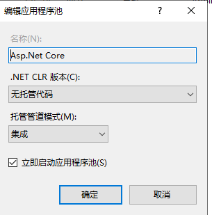
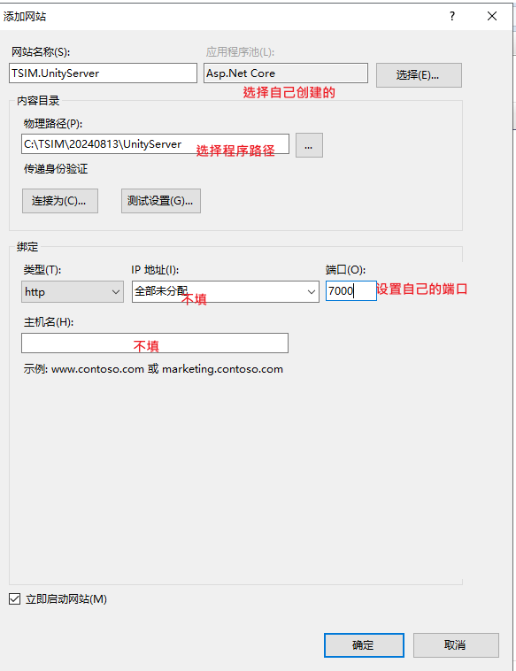

# Asp.Net

## 部署 IIS

> 说明：使用IIS部署，通常是 `http` 协议，后面要通过 **Nginx** 来代理访问，因为 **Nginx** 配置证书等比较方便

[官网手册](https://learn.microsoft.com/zh-cn/aspnet/core/tutorials/publish-to-iis?view=aspnetcore-8.0&tabs=visual-studio)

以 Windows Server 为例：

### 先决条件

- [NET Core SDK](https://learn.microsoft.com/zh-cn/dotnet/core/sdk) 安装在开发计算机上。如果发布的程序勾选了独立运行，可以不安装SDK。
- 安装IIS，自行网上查找资料。
- 在 IIS 服务器上安装 [.NET Core 托管捆绑包](https://dotnet.microsoft.com/permalink/dotnetcore-current-windows-runtime-bundle-installer)。 捆绑包可安装 .NET Core 运行时、.NET Core 库和 ASP.NET Core 模块。 该模块允许 ASP.NET Core 应用在 IIS 后面运行。
- 上面安装的托管捆绑包应该包含了 AspNetCoreModuleV2

### 发布Asp.NET程序

发布到文件夹。

不要发布单文件格式，好像无法运行。

### 创建站点

**创建应用程序池**：在IIS管理器中创建一个新的应用程序池，注意：

- 当部署Blazor项目时：设置.NET CLR版本为“No Managed Code”，正常运行
- 当部署 **Web API** 项目，并且从 Blazor 项目中跨域访问时(注：API项目中已经配置了跨域策略)，这里要选择一个版本，否则会因 **跨域问题** 无法访问。

**创建网站**：设置网站名称（仅显示作用），选择自己创建的应用程序池，选择程序目录，设置端口，IP地址和主机名不用填，默认就行

## 使用 Nginx部署

## 问题汇总

### 部署后有的浏览器不能访问

**环境**：

- 阿里云域名
- 阿里云免费云解析
- 阿里云服务器（带固定公网IP）
- 未备案

阿里云售后给出的答复是，网站未备案，详细回复如下：

您好，www.xxx.com看解析到阿里云大陆主机，未在阿里云备案导致备案拦截无法访问

网站托管在中国内地（大陆）的服务器上，您需根据所在省市的管局规则进行备案申请。当您使用阿里云中国内地（大陆）节点服务器时，您可以在PC端或移动端的阿里云ICP代备案系统中提交ICP备案申请，审核通过便可开通网站访问服务。
https://help.aliyun.com/document_detail/61819.html

**备案后**：

网站正常访问。
