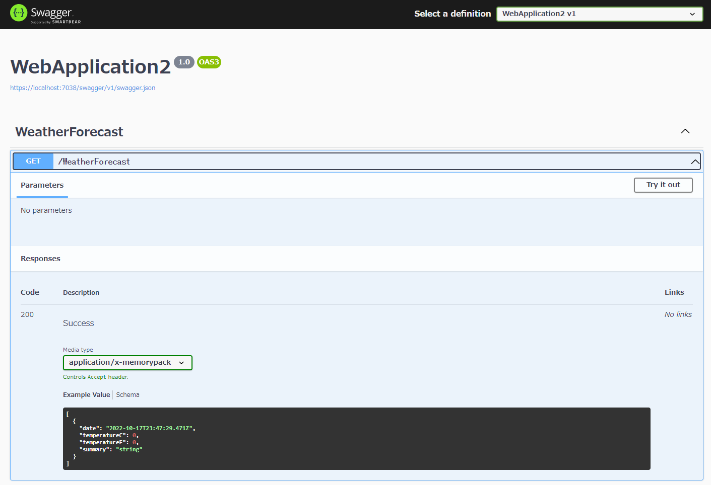
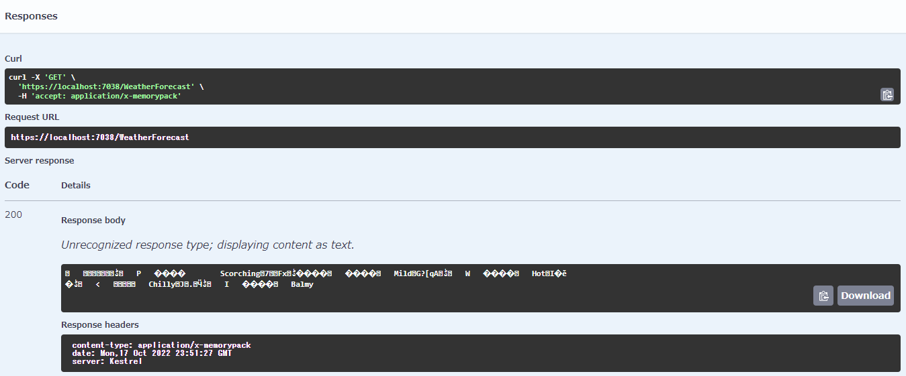

# MemoryPack 与 Asp.net core 一起使用

[Cysharp/内存包](https://github.com/Cysharp/MemoryPack)

[原文](https://spacekey.dev/memorypack-1)

使用序列化器最明显的方法是与 API 服务器通信。

自然，API服务器与应用程序等交换大量数据，序列化器工作的次数也相当可观。如果您可以使这部分更加高效，则可以减少服务器上的负载并提高感知响应。

如果你正在创建一个业务系统，你可能没有时间深入细节或研究各种技术，或者如果你最终实现了一些不太常见的东西，那么六个月后对其他人（或你自己）来说将会很困难）来理解，有些情况下我们别无选择，只能根据公约数做出选择，因为我们担心我们将不再能够触及它们。

那么，MemoryPack 可能是解决方案。

与 ASP.NET Core 一起使用
使用默认设置（还包括 OpenAPI）创建 ASP.NET Core Web API (.NET 6) 项目。除了安装 MemoryPack 之外，还包括 ASP.NET Core 的包。

```shell
PM> Install-Package MemoryPack.AspNetCoreMvcFormatter
```

如下所示更改 Program.cs 中的 AddControllers。

```
builder.Services.AddControllers(options =>
{
    options.InputFormatters.Insert(0, new MemoryPackInputFormatter());
    options.OutputFormatters.Insert(0, new MemoryPackOutputFormatter(true));
});
```

将 WeatherForecast 类设为部分类并添加 MemoryPackable 属性。

```
[MemoryPackable]
public partial class WeatherForecast
{
    public DateTime Date { get; set; }
    public int TemperatureC { get; set; }
    public int TemperatureF => 32 + (int)(TemperatureC / 0.5556);
    public string? Summary { get; set; }
}
```

我会做。



application/x-memorypack可以看到它已经被添加到 Media type 中了。

我们来调用该方法。



它作为 application/x-memorypack 返回。二进制数据按原样在响应正文中输出。 当然，如果将Media type改为JSON，也会返回可读的数据。

它可以很容易地转换成 MemoryPack。

顺便说一句，JSON 的主体大小约为 493 字节，MemoryPack 的主体大小约为 150 字节。


WeatherForecast 并不准确，因为数据是随机的，但它肯定更小。嗯，很自然，字段名字符串会随着记录数的减少而减少，所以如果有几十个字段，而且名称都很长，减少的效果会相当显着。

这是令人惊奇的，因为流经此过程的数据量减少了。

**笔记**

如上所述，接收方也必须使用具有相同类型和顺序的类定义进行反序列化，但在 C#-C# 的情况下，很容易在单独的项目中设置类定义并以两种方式引用它。是。

更改定义时，似乎可以通过 API 端的版本控制来处理它，但如果响应缓存为二进制或本地写入，则会中断，因此最好不要更改类型和顺序，请注意这一点。

至于细节，

```
new MemoryPackOutputFormatter(true)
```

如果未使用 checkContentType=true 生成 OutputFormatter，MemoryPack 将接管所有输出处理，因此即使您指定 JSON，也会返回二进制文件，您会感到失望。

**概括**

它很容易安装，因为它有一个可以与 ASP.NET Core 一起使用的格式化程序。通过改变Accept头的响应格式，可以在保持JSON等现有格式的同时引入它，因此我认为可以分阶段改进接收方。

提高序列化的效率也会对API服务器的响应产生影响，当然尺寸越小，通信所需的时间就越少，所以这也是如此。

不过，服务端是 ASP.NET Core，客户端却是 React 或 Vue。这样的模式还有很多，不过也没关系！令人惊讶的是，MemoryPack 有一个函数可以为 TypeScript 生成序列化器。