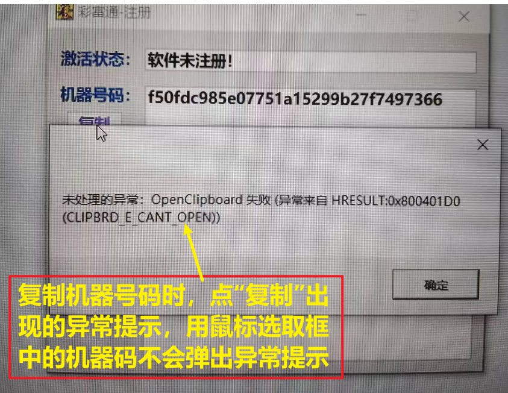

# WPF 剪切板

## 使用说明
在开发中，经常使用剪切板实现复制功能，但是当剪切板被其他程序占用的时候，WPF程序会报错，总结以下解决方案：

## 参考

[CSDN 博客文章](https://blog.csdn.net/weixin_30512089/article/details/96563265?spm=1001.2101.3001.6650.8&utm_medium=distribute.pc_relevant.none-task-blog-2~default~BlogCommendFromBaidu~Rate-8-96563265-blog-53981177.235^v39^pc_relevant_anti_t3&depth_1-utm_source=distribute.pc_relevant.none-task-blog-2~default~BlogCommendFromBaidu~Rate-8-96563265-blog-53981177.235^v39^pc_relevant_anti_t3&utm_relevant_index=9)