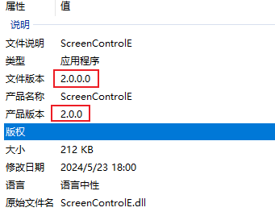

# 设置项目版本号

- 可以在项目属性面板上设置（一般在包选项卡下），这种方式没找到产品版本号的设置
- 可直接编辑项目文件，以下为编辑项目文件案例，这种方式可直接设置各种版本号

**框架：. net 6.0**

添加版本号，可以在测试的时候确定当前版本

1. 可以在属性面板中设置(只看到了文件版本和程序集版本号的设置)
2. 也可以直接在文件中编辑

```C#
<PropertyGroup>
  <OutputType>WinExe</OutputType>
  <TargetFramework>net6.0-windows</TargetFramework>
  <UseWPF>true</UseWPF>
  <ApplicationIcon>sc.ico</ApplicationIcon>
  <NeutralLanguage>zh-CN</NeutralLanguage>
  <Version>2.0.0</Version>
  <AssemblyVersion>2.0.0.0</AssemblyVersion>
  <FileVersion>2.0.0.0</FileVersion>
</PropertyGroup>
```
