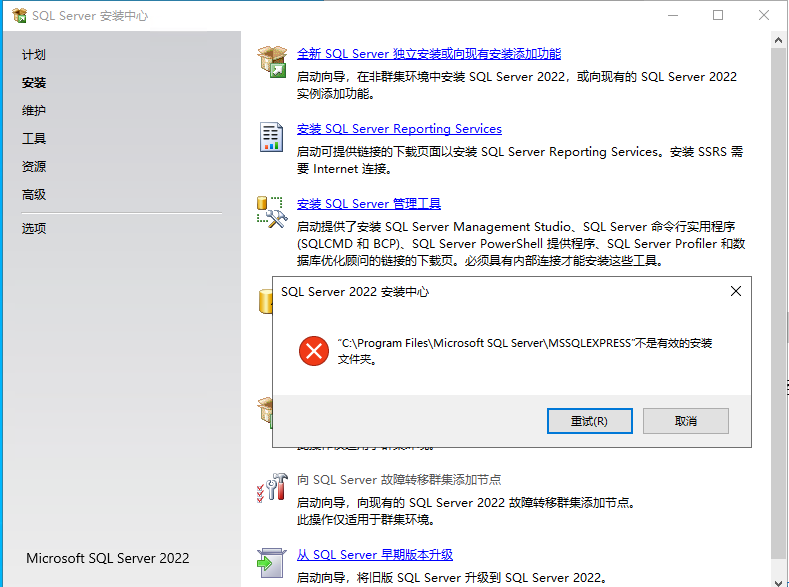
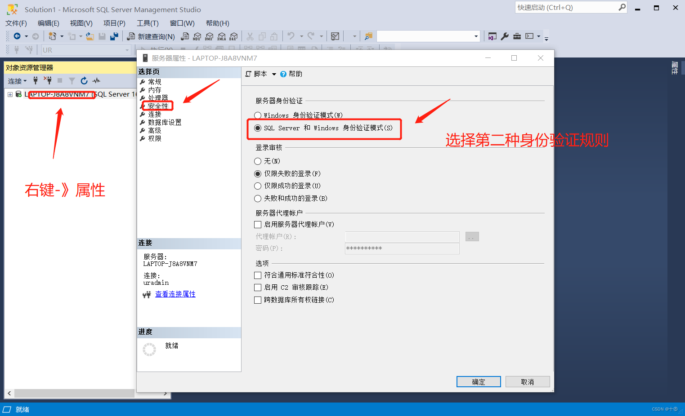
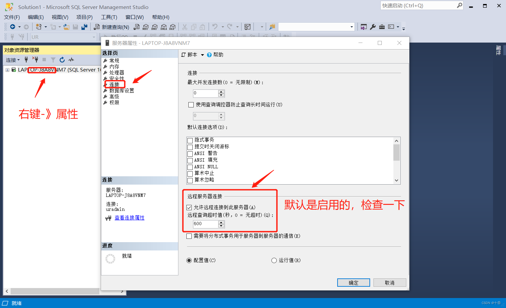
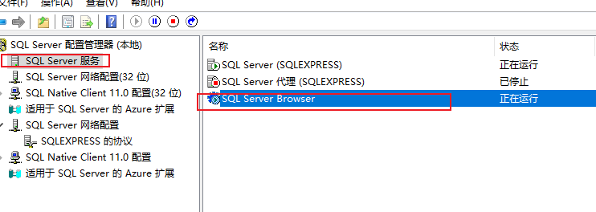
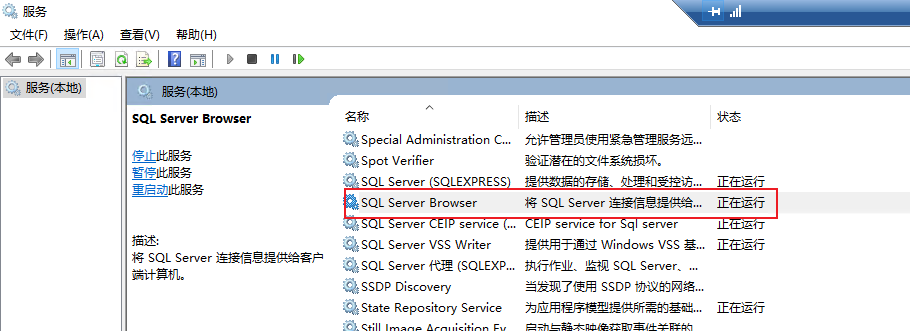
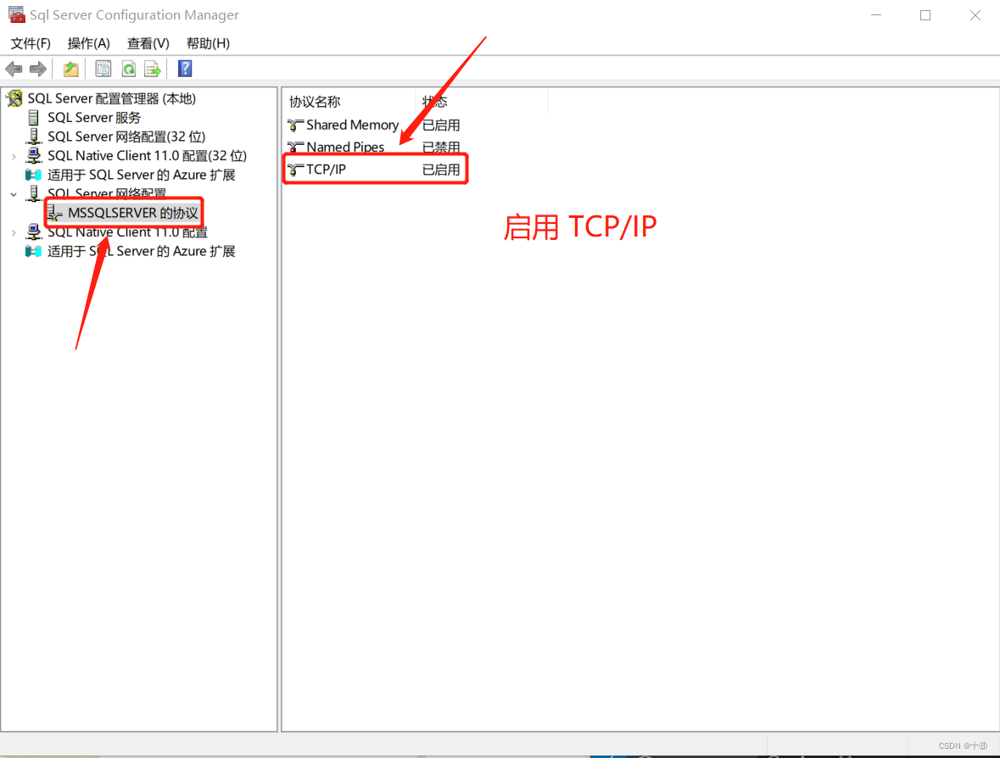
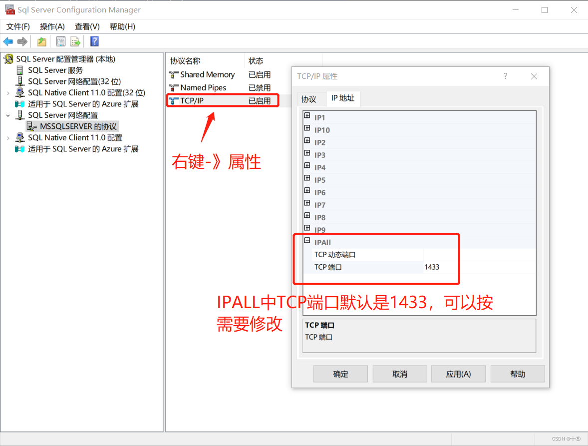
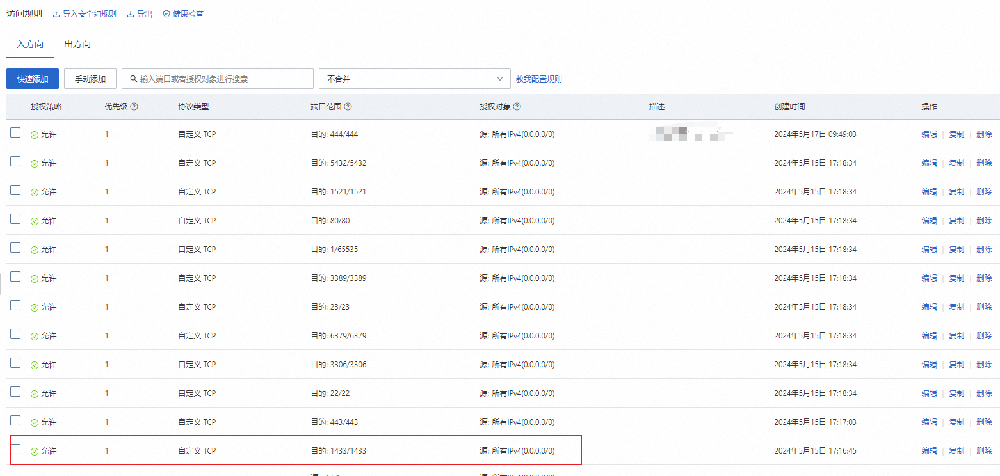

# SQL Server

## 不是有效的安装文件夹（未解决）

系统：Windows Server 2022 Datacenter

数据库版本：Sql Server 2022

下载安装的时，默认安装了命名示例，需要增加一个默认示例，通过安装中心-》安装-》向现有安装添加功能，选择安装文件夹后，出现：

## IP地址远程连接

### SQL Server相关配置

1. 启动**混合模式**登录：打开 `SQL Server Management Studio (SSMS)`，连接到 SQL Server 实例，在对象资源管理器中，右键点击服务器名称，选择“属性”。在“安全性”页面上，选择“SQL Server 和 Windows 身份验证模式”

    

2. 配置 SQL Server 允许远程连接：在“连接”页面上，'远程服务器连接’选择“允许远程连接到此服务器”。

    

3. 启动 SQL Server Browser 服务（必须启动）：SQL Server Browser 服务用于为 SQL Server 实例提供实例名称解析，确保此服务在 Windows Server 上是启动的，打开 SQL Server Configuration Manager(SQL Server 配置管理器)。

    

    如果此处无法启动，先到 **服务** 窗口中启动对应的服务，然后再启动

    

4. 配置网络和 TCP/IP，打开 **SQL Server Configuration Manager**，在左侧导航窗格中，展开 **SQL Server 网络配置**，再次点击对应的协议展开，如“**MSSQLSERVER** 的协议”。在“协议”页面上，确保“TCP/IP”是启用的。
    
    

5. 设置端口（默认1433，应该可忽略）：右键点击“TCP/IP”，选择“属性”。在“IP 地址”选项卡上，为 IPAll 设置 TCP 端口为 1433（或者设置为 SQL Server 配置的其他端口）。注意，使用了特定的 IP 地址，确保在 TCP 动态端口和 TCP 静态端口中没有设置冲突（默认的一般都没有冲突）。

    

6. 重启服务

    

###  设置防火墙（阿里云服务器忽略）

    基于 `1433` 端口，添加入站出站规则（具体操作略）。

    注：阿里云的防火墙是禁用的，通过安全组来配置。

### 阿里云添加安全组

在 云服务器 ECS -> 安全组 上，添加入方向和出方向的访问规则。

入方向规则（出方向相同）：

### 参考

[CSDN：阿里云 WindowsServer 使用之 配置 SQL Server 允许远程连接](https://blog.csdn.net/weixin_46766584/article/details/135489786)