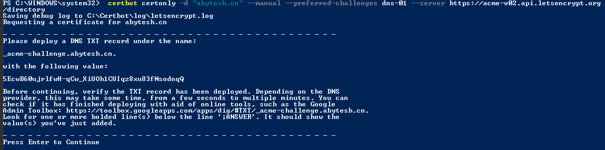

# Let's Encrypt 申请免费证书

[入门指南 - Let's Encrypt - 免费的SSL/TLS证书 (letsencrypt.org)](https://letsencrypt.org/zh-cn/getting-started/ "入门指南 - Let's Encrypt - 免费的SSL/TLS证书 (letsencrypt.org)")

## 安装

[https://certbot.eff.org/](https://certbot.eff.org/ "https://certbot.eff.org/")

1. 选择运行环境和操作系统，如下图，运行在Windows的Nginx 上，往下拉找到相关的下载链接


1. 安装说明：Windows 只能获取证书，而不能直接安装到服务器上，配置还需要自己来操作，安装和运行都需要管理员权限，如果开始没使用管理员权限，再使用管理员权限安装一遍。
2. cmd 和 power shell都支持运行
3. 可以在非运行我的服务器的其他电脑上 运行 Certbot，获取证书后，再拷贝过去即可

## 运行

- 管理员打开`PowerShell` 复制命令 ，将域名改为自己的，回车运行，这个命令是手动验证DNS，自动验证的方式经常失败，就按照这个来就好了

```powershell
 certbot certonly -d "域名例子.com" --manual --preferred-challenges dns-01 --server https://acme-v02.api.letsencrypt.org/directory
```

- 执行上面的，出现以下图示内容，需要添加 DNS TXT 记录，然后 回车继续，注意先要添加了才回车



- &#x20;阿里云给`域名解析` 添加记录，注意这里我们在网上找的那些 免费域名 （如：公云或者花生壳这些）无法添加记录，因为我们无法控制它门，需要进入控制台的&#x20;

[   https://dns.console.aliyun.com/#/dns/setting/](https://dns.console.aliyun.com/#/dns/setting/ "   https://dns.console.aliyun.com/#/dns/setting/")

- 点击添加记录


- 填写记录配置，这里要根据上面的信息来配置，下面两个图对应好即可，点击确定，然后再shell上点回车继续即可。当我们获取到证书后，这个记录值好像是可以删除的。


- 回车后应该准确的获取到证书了


证书位置：

c:\Certbot\live\abytesh.cn\下的对应两个文件。

## 待解决的问题

自动更新问题，因为上述的方式是手动的，所以不会自动更新，后续再研究。
