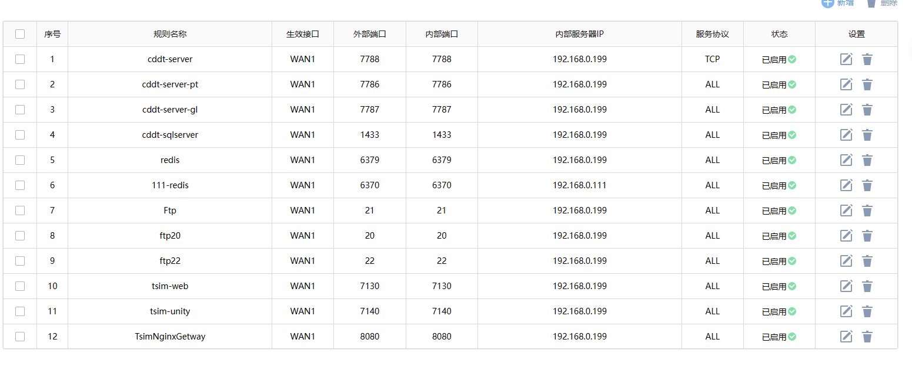

# 路由器配置

# 动态DNS

### 新增

根据使用的解析服务商，使用注册它们的用户，可以使用它们的免费域名，但是无法通过它们的域名生产证书，因为无法进入域名控制台配置解析记录

### 列表

# 虚拟服务器

### 虚拟服务器

配置端口映射，配置完成后需要 **重启**！

### NAT-DMZ

设置哪些主机（IP）对外开放

## UPnP

这个要打开，群晖Nas要使用到。
