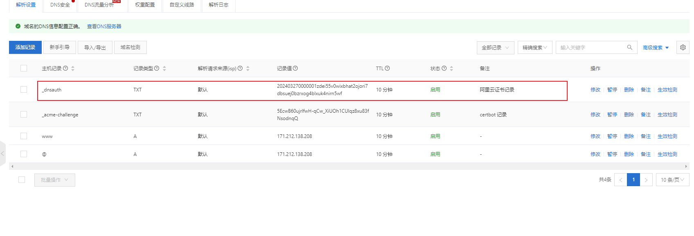
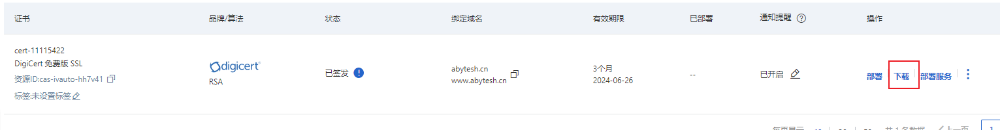

# 阿里云购买域名

## 购买域名

根据官网来操作

- 可以个人/企业方式购买
- 实名认知
- 购买域名后还需要认证（可能之前没认证过需要验证）

## 购买免费证书

- 先购买免费证书（一年20个免费的）
- 创建证书
- 填写域名，并根据提示设置，自动Dns验证等
- 提交审核，注意这里点击下验证，是否成功，可以看到 需要填写 TXT 记录（注意这里有可能是CNAME记录），在我们的云解析里面看下是否有相关的一条 记录，没有就加上，我第一次操作的时候没自动加上，审核失败，然后第二次看这里自动多了条记录。如下图：

- **审核通过** 后出现了下载按钮，可根据选项下载

- **证书的更新** ：免费证书仅3个月的有效期，在将要过期前，我们可以再申请一个证书，替换将要过期的证书。
