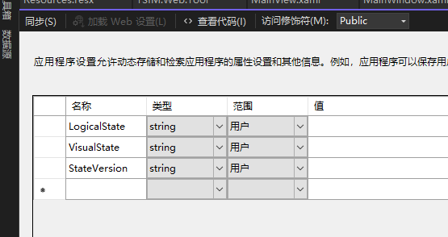

<style>
.table-container {
    display: flex;
    justify-content: center;
    width: 100%;
}

.excel-table {
    width: 100%;
    border-collapse: collapse;
    font-family: Arial, sans-serif;
    font-size: 15px; /* 设置字体大小 */
    table-layout: fixed; /* 固定表格布局 */
}

.excel-table th, .excel-table td {
    border: 1px solid #d0d7de;
    padding: 12px;
    text-align: left;
    vertical-align: top; 
}

.excel-table th {
    background-color: #f0f3f5;
    font-weight: bold;
}

.excel-table tr:nth-child(even), table tr:nth-child(odd) {
    background-color: transparent; /* 确保所有行背景色一致 */
}

.excel-table tr:hover {
    background-color: inherit;
}

.excel-table tr:hover {
    background-color: #e9e9e9;
}
.excel-table th:nth-child(1), .excel-table td:nth-child(1) {
    width:200px;
}

.excel-table th:nth-child(2), .excel-table td:nth-child(2) {
    width: 50%;
}
.excel-table th:nth-child(3), .excel-table td:nth-child(3) {
    width: 50%;
}

</style>

# CSharp

## 项目设置
### 应用程序设置（Settings.settings）

在WPF、Winform、Web项目中都有应用程序设置，以下以WPF为例。

**创建和打开配置文件**


**配置文件设计窗口**



* **名称**：变量名
* **类型**：字符串、整数、布尔值、集合等。
* **范围**：应用程序和用户
* **值**：默认值

程序发布后，设置的数据存储在：`程序集.exe.config` 文件中，如你的程序集为 `MyTool`，对应的文件名为：`MyTool.exe.config`，内容如下：

```xml
<?xml version="1.0" encoding="utf-8"?>
<configuration>
    //...
    <userSettings>
        <MyTool.Properties.Settings>
            <setting name="Number" serializeAs="String">
            <value>1</value>
            </setting>    
        </MyTool.Properties.Settings>
    </userSettings>
    <applicationSettings>
    <MyTool.Properties.Settings>
        <setting name="Count" serializeAs="String">
        <value>10</value>
        </setting>   
    </MyTool.Properties.Settings>
    </applicationSettings>
</configuration>
```

分别设置了用户范围的变量 `Number`，和应用程序范围的变量 `Count`，**注意这里面修改用户设置的数据无效，但是可以修改应用程序的设置**。

**用户范围设置**：默认情况下，用户特定的设置保存在用户配置文件目录下的 user.config 文件中。这个文件的位置因操作系统不同而有所不同，一般情况下会在以下路径中找到：

```
Windows 7/8/10: C:\Users\<用户名>\AppData\Local\<公司名>\<应用程序名>\<版本号>\user.config

Windows XP: C:\Documents and Settings\<用户名>\Local Settings\Application Data\<公司名>\<应用程序名>\<版本号>\user.config
```

**❕ 注：公司名通过项目属性查看。**

> ⚠️ `<span style="color:red;font-weight:bold;">`注：修改程序根目录下的 “MyTool.exe.config” 配置文件无效

**应用程序范围设置**：如果设置是应用程序范围的（而不是用户特定的），那么它们会保存在应用程序的配置文件中，通常是 `App.config(程序集.exe.config)` 或 `Web.config`（对于 Web 应用程序）。不过，这些文件中的设置是只读的，运行时的修改不会保存回这些文件。

**修改设置**：

```c#

// 读取设置值
int number = Properties.Settings.Default.Number;

// 修改设置值
Properties.Settings.Default.Number = 2;

// 保存设置值
Properties.Settings.Default.Save();
```

保存后，新的设置值会写入 user.config 文件中，下次启动应用程序时会读取这个值。

**总结**：

<div class="table-container">
    <table class="excel-table">
        <thead>
            <tr>
                <th>对比</th>
                <th>应用程序范围</th>
                <th>用户范围</th>
            </tr>
        </thead>
        <tbody>
            <tr>
                <td>存储位置</td>
                <td>程序根目录：<code>App.config(程序集.exe.config)</code> 或 <code>Web.config</code>（对于 Web 应用程序）</td>
                <td><code>C:\Users\<用户名>\AppData\Local\<公司名>\<应用程序名>\<版本号>\user.config</code></td>
            </tr>
            <tr>
                <td>修改 <code>App.config</code> 文件有效</td>
                <td>✔️</td>
                <td>❌</td>
            </tr>
             <tr>
                <td>可读</td>
                <td>✔️</td>
                <td>✔️</td>
            </tr>
              <tr>
                <td>可写</td>
                <td>❌</td>
                <td>✔️</td>
            </tr>
        </tbody>
    </table>
</div>

**使用场景** ：

动态配置数据，如用户偏好、应用程序配置参数等。

### 应用程序资源（Resources.resx）

**用途**：管理应用程序的静态资源和多语言资源。

**存储位置**：通常定义在 .resx 文件中，这些文件可以包含字符串、图像、图标、文件等资源。

**类型**：可以包含各种类型的资源，如字符串、图像、图标、文件等。

**使用场景**：

- 存储应用程序的静态文本，支持多语言本地化。
- 存储应用程序所需的图像、图标等静态资源。
- 组织和管理资源文件，方便维护和更新。

`.resx` 文件示例

**定义资源**

你可以在 Visual Studio 中添加 `.resx` 文件并定义资源。例如，添加一个名为 `Resources.resx` 的资源文件，然后添加一些字符串资源：

- `Greeting` -> `Hello`
- `Farewell` -> `Goodbye`

**生成资源类**

Visual Studio 会自动生成一个与 `.resx` 文件对应的资源类，你可以在代码中使用这些资源。假设你的命名空间是 MyApp，你可以这样使用：

```csharp
using MyApp.Properties;

// 读取资源值
string greeting = Resources.Greeting;//注：若文件名称为：Resources.xx.resx  那么读取时为：Resources_xx.Greeting
string farewell = Resources.Farewell;
```

**多语言支持（本地化）**
为了支持多语言，你可以创建多个 .resx 文件，每个文件对应一种语言。例如：

- `Resources.resx`（默认资源文件）
- `Resources.en-US.resx`（美国英语资源文件）
- `Resources.fr-FR.resx`（法国法语资源文件）

在不同语言的资源文件中，定义相同的键但值为对应语言的翻译。

运行时切换语言
通过更改应用程序的文化信息，可以在运行时切换语言：

```csharp
using System.Globalization;
using System.Threading;
using MyApp.Properties;

// 切换到法国法语
Thread.CurrentThread.CurrentUICulture = new CultureInfo("fr-FR");

// 读取资源值
string greeting = Resources.Greeting; // 将会返回法语的问候语
```

**应用程序资源与设置的区别总结**

应用程序资源（Resources）:

- 用途：管理静态资源和支持多语言。
- 存储位置：.resx 文件。
- 类型：字符串、图像、图标、文件等。
- 使用场景：静态文本、图像、图标、多语言支持等。

应用程序设置（Settings）：

- 用途：存储和管理应用程序配置数据和用户设置。
- 存储位置：配置文件（如 App.config 或 user.config）。
- 类型：字符串、整数、布尔值、集合等。
- 使用场景：动态配置数据，如用户偏好、应用程序配置参数等。
- 通过理解这些区别，你可以更好地管理和组织 WPF 应用程序中的资源和设置，确保应用程序的灵活性和可维护性。


## 时间格式化

**DateTime 格式化**

```C#
dateTime.ToString("yyyy-MM-DD hh:mm:ss");
```
**TimeSpan 格式化**

`常用：timeSpan.ToString(@"dd\.hh\:mm\:ss");` 或则 `timeSpan.ToString("dd\\.hh\\:mm\\:ss");`区别是否使用转义符号。

```C#
using System;

public class Example
{
   public static void Main()
   {
      TimeSpan duration = new TimeSpan(1, 12, 23, 62);

      string output = null;
      output = "Time of Travel: " + duration.ToString("%d") + " days";
      Console.WriteLine(output);
      output = "Time of Travel: " + duration.ToString(@"dd\.hh\:mm\:ss");
      Console.WriteLine(output);

      Console.WriteLine("Time of Travel: {0:%d} day(s)", duration);
      Console.WriteLine("Time of Travel: {0:dd\\.hh\\:mm\\:ss} days", duration);
   }
}
// The example displays the following output:
//       Time of Travel: 1 days
//       Time of Travel: 01.12:24:02
//       Time of Travel: 1 day(s)
//       Time of Travel: 01.12:24:02 days
```


## Linq

### 多个属性具有相同处理逻辑

使用 Expression 来实现

> Expression：将强类型lambda表达式表示为表达式树形式的数据结构。该类不能被继承，当一个对象存在多个相同类型的属性，且这些属性控制的功能相同时,可以使用 Expression 来实现


- 有一组 Person, 需要遍历每个person，根据属性  **A** 或者  **B**，判断是说 `Hello` 还是 `Bye`
- Person

```
    public class Person
    {
        public string Name { get; set; }
        public bool pA { get; set; }
        public bool pB { get; set; }
    }

```
- 创建 Person List

```
    class ExpressionTest
    {
        List<Person> persons = new List<Person>();
        public ExpressionTest()
        {
            persons.Add(new Person { Name = "Jerry", pA = true, pB = false });
            persons.Add(new Person { Name = "Shin", pA = true, pB = false });
        }
        ...
    }
```

#### 常规解法
- 分别写两个方法，根据属性A 或者 属性B 来判断

``` C#
  internal class ExpressionTest
    {
        List<Person> persons = new List<Person>();
        public ExpressionTest()
        {
            persons.Add(new Person { Name = "Jerry", pA = true, pB = false });
            persons.Add(new Person { Name = "Shin", pA = true, pB = false });
        }

        /* 需求： 遍历 persons， 根据 pA 或者 pB 的值，判断每个人是说 hello 还是 bye
         * 常规写法： 分别些两个方法遍历判断
         * Expression: 通过表达式实现通用写法
         * 
         */
        #region 常规写法

        private void SayHelloByA()
        {
            foreach (var p in persons)
            {
                if (p.pA)
                    Console.WriteLine($"[{p.Name}]\tSay Hello！");
                else
                    Console.WriteLine($"[{p.Name}]\tSay Bye！");
            }
           
        }
        private void SayHelloByB()
        {
            foreach (var p in persons)
            {
                if (p.pB)
                    Console.WriteLine($"[{p.Name}]\tSay Hello！");
                else
                    Console.WriteLine($"[{p.Name}]\tSay Bye！");
            }

        }

        #endregion
       // 测试
       public void Test()
        {
            SayHelloByA();// 输出: Say Hello!
            SayHelloByB();// 输出: Say Bye!
        }
    }
```

-  **存在的问题** ： 如果我们有多个属性 C D E F，那么我们就需要写多少方法，但是发现这些方法的逻辑都是一样的。总感觉很别扭，此时就要用到 **Expression** 

#### Expression 写法

```C#
 internal class ExpressionTest
    {
        List<Person> persons = new List<Person>();
        public ExpressionTest()
        {
            persons.Add(new Person { Name = "Jerry", pA = true, pB = false });
            persons.Add(new Person { Name = "Shin", pA = true, pB = false });
        }
       
        #region  Expression
        public void SayHello(Expression<Func<Person, bool>> expr)
        {
            var valProp = (PropertyInfo)(((MemberExpression)expr.Body).Member);
            foreach (var p in persons)
            {
                bool isShow = (bool)valProp.GetValue(p, null);
                if (isShow)
                    Console.WriteLine($"[{p.Name}]\tSay Hello！");
                else
                    Console.WriteLine($"[{p.Name}]\tSay Bye！");
            }
        }
        #endregion
       // 测试
       public void Test()
        {
            SayHello(x => x.pA);// 输出: Say Hello!
            SayHello(x => x.pB);// 输出: Say Bye!
        }
    }
```
- 通过表达式，让调用者来确定条件的值。


## 泛型基类

> 无法创建显示类型的基类问题
> 解决方案：将泛型参数作为构造函数的参数，调用的函数中不要包含泛型参数，同时将函数提升为接口（新增接口），转换为面向接口编程

**需求场景**：

有多个数据结构，它们继承同一个基类，需要创建不同的 'Handler' 来处理不同的数据结构。


基类：

```csharp
public class BaseClass{
    public string Name{get;set;}
}
```

子类A

```csharp
public class AClass：BaseClass{
}
```


子类B

```csharp
public class BClass：BaseClass{
}
```
Handler base

```csharp
public abstract class BaseHandler<T>{

    public abstract void DoSomthing(T data);
   

}
```


Handler A

```csharp
public class AHandler:BaseHandler<AClass>{

    public override void DoSomthing(T data)
    {
       Console.WriteLine($"A handel {data.Name}");
    }
}
```

Handler B

```csharp
public class BHandler:BaseHandler<BClass>{
     public override void DoSomthing(T data)
    {
          Console.WriteLine($"B handel {data.Name}");
    }
}
```

处理逻辑(失败)

```csharp
public void Handler(T data)
{
    //这里无法这样声明，因为泛型需要显示的指定类型，然后如果显示的指定类型，就无法使用到达我们多态的需求
    BaseHandler? = null;
    if(typeof(T) == typeof(AClass))
        return new AHandler();
    if(typeof(T) == typeof(BClass))
        return new BHandler();
    BaseHandler.DoSomthing(data);

}
```

**处理逻辑解读：** 无法这样声明，因为泛型需要显示的指定类型，然后如果显示的指定类型，就无法使用到达我们多态的需求

--- 

**解决办法**：

- 将多态的概念转变为面向接口编程
- 将调用的函数提升为接口，并且接口不要包含泛型参数
- 将参数放在构造函数中初始化
- 使用工厂创建处理器

接口定义

```csharp
public interface IHandler{
    void DoSomthing();
}

```


处理器基类实现接口，并定义包含泛型参数的构造函数

```csharp
public abstract class BaseHandler<T>:IHandler{

    public T Data{get;set;}
    public abstract void DoSomthing();
   

}
```


Handler A 新增 含泛型参数的构造函数

```csharp
public class AHandler:BaseHandler<AClass>{

    public AHandler(AClass data)
    {
        this.Data = data;
    }
    public override void DoSomthing(T data)
    {
       Console.WriteLine($"A handel {Data.Name}");
    }
}
```

Handler B 新增 含泛型参数的构造函数

```csharp
public class BHandler:BaseHandler<BClass>{
     public BHandler(BClass data)
    {
        this.Data = data;
    }
     public override void DoSomthing()
    {
          Console.WriteLine($"B handel {Data.Name}");
    }
}
```

增加创建工厂

```csharp
public class HandlerFactory
    {
        public static IHandler CreateHandler<T>(T data) where T : BaseClass 
        {
            if (typeof(T) == typeof(AClass))
            {
                return new AHandler(data as AClass);
            }
            if (typeof(T) == typeof(FlowPsdSingelOpen))
            {
               return new BHandler(data as BClass);
            }
            throw new ArgumentException("HandlerFactory: CreateHandler: Unsupported type: " + data.GetType());
        }
    }
```


处理逻辑(使用接口)

```csharp
public void Handler(T data)
{
    //使用工厂创建
    BaseHandler= HandlerFactory.CreateHandler(data);
    BaseHandler.DoSomthing();

}
```

## 代码混淆

[使用Obfuscar对.NET开发的程序进行混淆](https://www.jianshu.com/p/870fe350f4ce)


- NUGET 添加包 
- 配置文件, `<Module file="$(InPath)\ObfuscarTest.dll"` 中指定混淆的 dll ，这里好像不能为 exe 

```xml
<?xml version="1.0" encoding="UTF-8"?>
<Obfuscator>
	<Var name="InPath" value=".\bin\Release\net8.0" />
	<Var name="OutPath" value=".\bin\Release\net8.0\Obfuscar" />
	<Var name="KeepPublicApi" value="true" />
	<Var name="HidePrivateApi" value="true" />
	<Var name="HideStrings" value="true" />
	<Var name="UseUnicodeNames" value="true" />
	<Var name="ReuseNames" value="true" />
	<Var name="RenameFields" value="true" />
	<Var name="RegenerateDebugInfo" value="true" />
	<Module file="$(InPath)\ObfuscarTest.dll" />
	
</Obfuscator>
```
- 配置文件的属性设置为内容，较新复制
- 项目属性中，事件里面添加 生产后事件 `"$(Obfuscar)" Obfuscar.xml `
- 注意在 Release 目录下 ../ Obfuscar 中的 dll 就是混淆后的
- 将exe 和 其他文件拷贝过来即可。
- 

## .Net Reactor 加密

免费加密软件

[官网](https://www.eziriz.com/history.htm)

[慧都上提供的手册](https://www.evget.com/doclib/s/146/14909)

## 开源项目

1. [一款基于.Net WinForm的节点编辑器](https://github.com/DebugST/STNodeEditor)：纯GDI+绘制 使用方式非常简洁 提供了丰富的属性以及事件 可以非常方便的完成节点之间数据的交互及通知 大量的虚函数供开发者重写具有很高的自由性。

