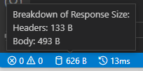

# MemoryPack

> 使用方式见官网，此处仅记录使用中出现的问题

[Cysharp](https://cysharp.co.jp/)发布了一个新的序列化器[Cysharp/内存包](https://github.com/Cysharp/MemoryPack)，日文：[memorypack：日文](https://spacekey.dev/memorypack-1)

## MemoryPackOrder

> 没有必要不要使用，当存在继承关系时，中途修改某个字段的 Order 将导致编号错乱，不易维护

默认序列化是按照定义的属性或者字段的顺序来序列化的，如果要自定义属性或者字段的序列化顺序，可以使用 `MemoryPackOrder` 

```c#
    /*
    使用 MemoryPackOrder
    */
    [MemoryPackable(generateType: GenerateType.VersionTolerant, SerializeLayout.Explicit)]
    public partial class TestData
    {
        [MemoryPack.MemoryPackOrder(1)]
        public int  Num { get; set; }
        [MemoryPack.MemoryPackOrder(0)]
        public string Name { get; set; }

        [MemoryPack.MemoryPackIgnore]
        public string NoSeriProp { get; set; }
    }
```

- **SerializeLayout.Explicit**： 标识自定义布局
- 先序列化 `Name` ，后序列化 `Num`

**注意事项：** 在 ASP.NET 中使用时（HttpClient 网络传输），上述的结构没问题，但是如果不使用 `MemoryPackOrder` 时会报错，后面找到原因是必须给标记了 `MemoryPackIgnore` 属性的字段一个默认值才正常


```c# 
    /*
    不使用 MemoryPackOrder
    */
    [MemoryPackable]
    public partial class TestData
    {
        public int  Num { get; set; }
        public string Name { get; set; }

        [MemoryPack.MemoryPackIgnore]
        public string NoSeriProp { get; set; } = string.Empty; //给定默认值
    }
```

## 与 Asp.net Core 一起使用

### 基础

**优点**：

- 支持多态
- 包小
- 可以嵌套等
- 支持AOT(for unity)


使用默认设置（还包括 OpenAPI）创建 ASP.NET Core Web API (.NET 6-8) 项目。除了安装 MemoryPack 之外，还包括 ASP.NET Core 的包。

```shell
PM> Install-Package MemoryPack.AspNetCoreMvcFormatter
```

如下所示更改 Program.cs 中的 AddControllers。

```
builder.Services.AddControllers(options =>
{
    options.InputFormatters.Insert(0, new MemoryPackInputFormatter());
    options.OutputFormatters.Insert(0, new MemoryPackOutputFormatter(true));
});
```

将 WeatherForecast 类设为部分类并添加 MemoryPackable 属性。

```
[MemoryPackable]
public partial class WeatherForecast
{
    public DateTime Date { get; set; }
    public int TemperatureC { get; set; }
    public int TemperatureF => 32 + (int)(TemperatureC / 0.5556);
    public string? Summary { get; set; }
}
```


application/x-memorypack可以看到它已经被添加到 Media type 中了。

**测试调用该方法**


它作为 `application/x-memorypack` 返回。二进制数据按原样在响应正文中输出。 当然，如果将Media type改为JSON，也会返回可读的数据。

它可以很容易地转换成 MemoryPack。

顺便说一句，JSON 的主体大小约为 493 字节，MemoryPack 的主体大小约为 150 字节。




WeatherForecast 并不准确，因为数据是随机的，但它肯定更小。嗯，很自然，字段名字符串会随着记录数的减少而减少，所以如果有几十个字段，而且名称都很长，减少的效果会相当显着。

这是令人惊奇的，因为流经此过程的数据量减少了。

**配置既可以接收Json和二进制文件**

```
new MemoryPackOutputFormatter(true)
```

如果未使用 checkContentType=true 生成 OutputFormatter，MemoryPack 将接管所有输出处理，因此即使您指定 JSON，也会返回二进制文件，您会感到失望。

### 支持客户端TypeScript

服务端是 ASP.NET Core，客户端却是 React 或 Vue。 使用 `GenerateTypeScript` 特性，详见官网。

```c#
[MemoryPackable]
[GenerateTypeScript]
public partial class Person
{
    public required Guid Id { get; init; }
    public required int Age { get; init; }
    public required string FirstName { get; init; }
    public required string LastName { get; init; }
    public required DateTime DateOfBirth { get; init; }
    public required Gender Gender { get; init; }
    public required string[] Emails { get; init; }
}

public enum Gender
{
    Male, Female, Other
}
```

### HttpClient 中解析异常


#### 给标记MemoryPackIgnore的属性指定默认值

在使用 `HttpClient` 网络传输时，出现以下情况

- 当使用 `MemoryPackOrder`　时，被标记 `MemoryPackIgnore` 的属性不给默认值，使用正常，如下：

```c#
    /*
    使用 MemoryPackOrder
    */
    [MemoryPackable(generateType: GenerateType.VersionTolerant, SerializeLayout.Explicit)]
    public partial class TestData
    {
        [MemoryPack.MemoryPackOrder(1)]
        public int  Num { get; set; }
        [MemoryPack.MemoryPackOrder(0)]
        public string Name { get; set; }

        [MemoryPack.MemoryPackIgnore]
        public string NoSeriProp { get; set; }
    }
```


- 不使用 `MemoryPackOrder` 时，被标记 `MemoryPackIgnore` 的属性不给默认值，使用异常，解析错误，必须如下给定一个默认值：


```c# 
    /*
    不使用 MemoryPackOrder
    */
    [MemoryPackable]
    public partial class TestData
    {
        public int  Num { get; set; }
        public string Name { get; set; }

        [MemoryPack.MemoryPackIgnore]
        public string NoSeriProp { get; set; } = string.Empty; //给定默认值
    }
```

#### List<T> 属性异常

> Ver 1.21.1

**现象描述** ：定义一个类 `A`，从服务器获取 `List<A>` 时正常，从客户端向服务器 **Post** `A` 时失败，（这里没有验证从服务器获取 单个 `A` 和从客户端向服务器Post `List<A>` 的情况）

**查找问题步骤** ：

1. 若类中存在被标记为 `MemoryPackIgnore` 的属性，确定给其指定了默认值
2. 逐步将属性设置为 null 进行测试，如果都还有问题进行下一步
3. 从新构建一个类，将原类中所有的属性拷贝过来，先进行一次测试，若存在问题，下一步
4. 在构建的新类中，逐步删除复杂结构（List<T>,[],枚举，其他类或者数据结构）的属性进行测试

**找到的原因** ：在 `A` 中类型为 `List<B>` 的属性，当存在数据时就会异常（根本原因不清楚），设置为null时就正常

**解决办法** ：

1. 看存在异常的属性在当前传中是否会使用到，如果未使用到将其设置为 `null`
2. 重新构建一个类，仅包含需要使用到的属性