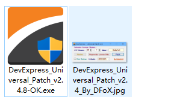
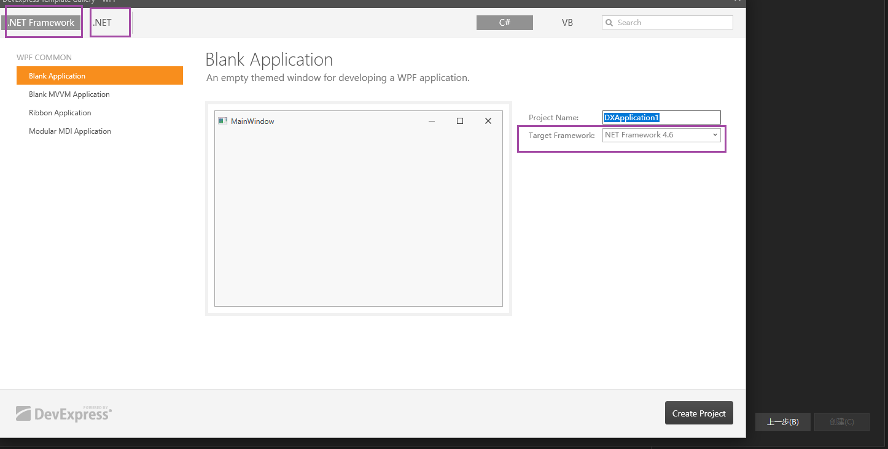
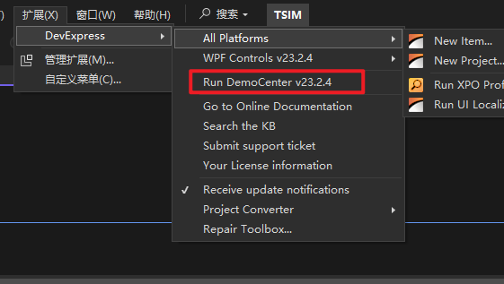
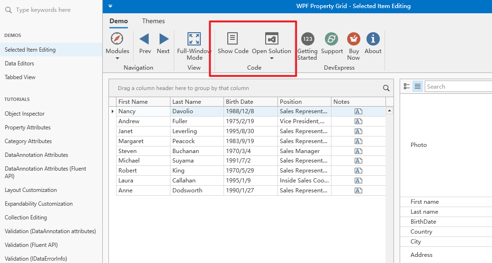
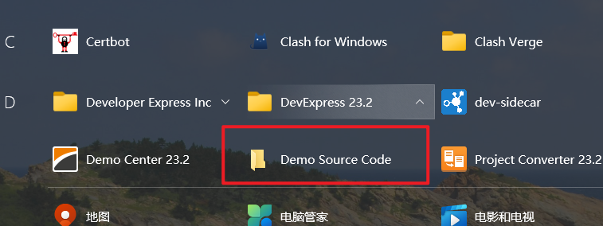
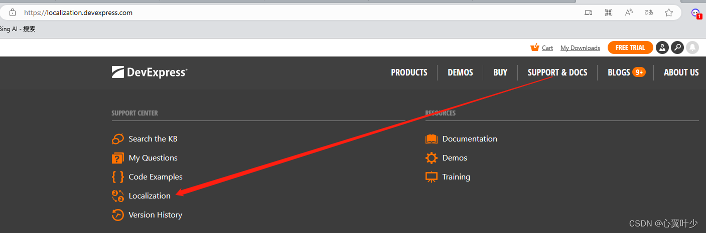
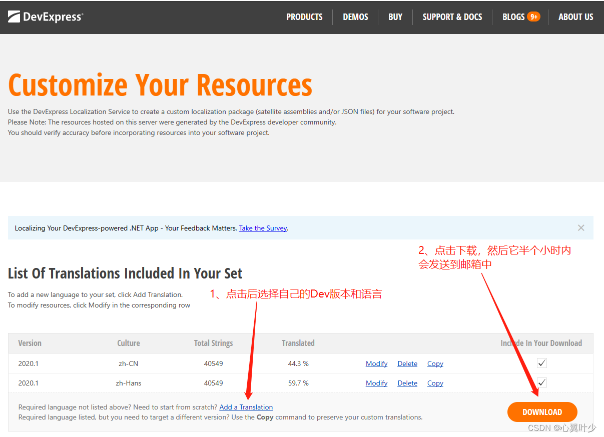
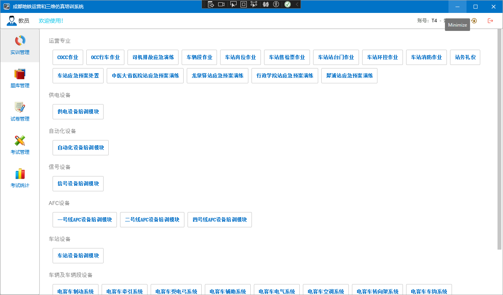
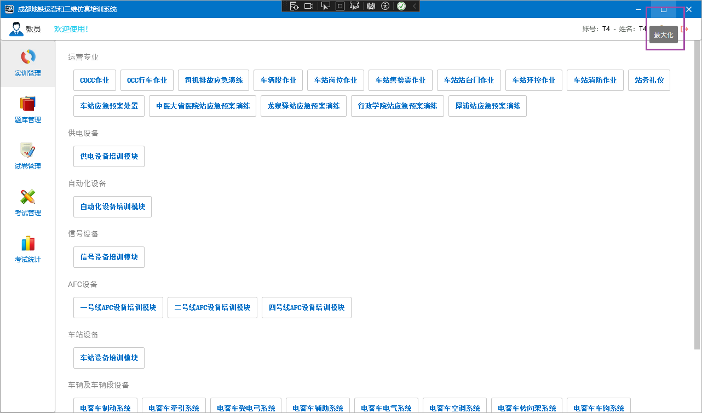
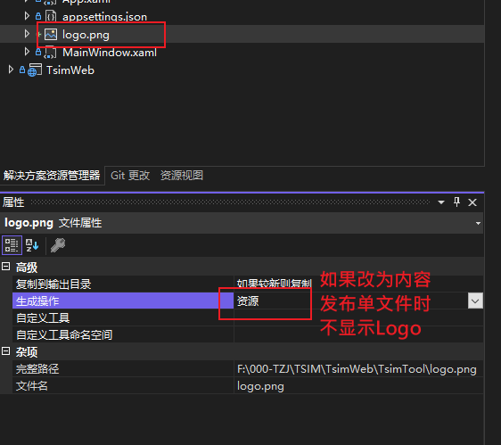

# DevExpress

[官网](https://www.devexpress.com/)

[文档手册](https://www.evget.com/doclib/s/129/16340)

## 版本记录

||||||
|-|-|-|-|-|
|DevExPress|Framework4.8|.net 7.0|.net 8.0||
|v23.1|√|√|×||
|v23.2(还未发布)|√|√|√||
||||||


## 安装和激活

官网下载进行安装，[国内慧都(代理商)下载地址](https://www.evget.com/product/2346/lastly) 上下载，目前为23.1版本，还不能支持 .net8.0，如果下面的网址打不开，直接在官网下载最新的即可。


下载（群晖下载）后使用科技进行解锁使用，运行下图中的程序，选择devexpress的版本和vs的版本




## 创建项目

vs中直接创建DevExpress的模板项目，可以选择使用的.net版本




## 案例

> DevExpress 安装时，提供了一系列案例（包含源码和编译好的exe）

**运行案例程序**

- 第一种：在 `VS` 中直接运行案例程序：



- 第二种：在开始菜单中运行案例exe程序（操作略）。

**查看案例源码**

每个案例窗口上可以查看源码或者直接打开源码解决方案，如下图：



同时也可以通过开始菜单，所有程序->DevExpress xx.x 中打开源码路径



路径默认在 **公共用户** 的文档目录下：

`C:\Users\Public\Documents\DevExpress Demos 23.2`

## 汉化 

**网络上教程**：[DevExpress：手把手教你用官方汉化资源做汉化](https://blog.csdn.net/weixin_45132755/article/details/132039135?spm=1001.2101.3001.6650.2&utm_medium=distribute.pc_relevant.none-task-blog-2~default~CTRLIST~Rate-2-132039135-blog-109551776.235^v43^pc_blog_bottom_relevance_base5&depth_1-utm_source=distribute.pc_relevant.none-task-blog-2~default~CTRLIST~Rate-2-132039135-blog-109551776.235^v43^pc_blog_bottom_relevance_base5&utm_relevant_index=5)

**防丢失记录**：

- 进入官网 [https://www.devexpress.com/MyAccount/](https://www.devexpress.com/MyAccount/)，使用账号登录

- 点击 支持（SUPPORT $ DOCS）

- 点击本地化 （Localization）

    
 
- 选择当前使用的 **DevExpress** 版本和对应的语言 

- 中文包相关说明
    - zh-CN：简体中文
    - zh-hans：简体中文，和zh-CN等价，在net 6.0中发布时，默认已经有一个 zh-hans包，我们只需要使用这个就可以了
    - zh-hant：繁体中文

    

- 点击下载，大概半个小时以邮件的方式发送连接给我们

- 收到邮件后下载（邮件中的附件地址有过期时间），解压后包含源码文件夹 `src` 和已经发布的汉化文件 `dll`, 拷贝需要的dll到自己的工程中，如：zh-hans

- 源码可自定义汉化，并且处理一些原本未汉化的内容。


**汉化失败处理**：

官方提供的汉化包，有些没有汉化，可以通过提供的源码自己更改汉化。


（1）通过邮件附件中附带的src源码工程添加缺少的汉化，注意工程中勾选了生产签名，取消签名即可。

（2）通过 资源设置 来配置汉化。


Windows 窗口，最小化按钮汉化失败处理对比：

版本：23.2.4 wpf

修改前



修改后




## 功能模块

### SplashScreen

> 软件启动时的加载界面

**模板自带的启动画面**

**版本：** 23.2

软件启动时的加载界面，使用官方主题模板创建项目，会有一个启动界面，但是不能修改界面上的公司、版权、版本以及logo等信息，原因是模板中使用的默认画面。


```C#
 static App()
 {
     CompatibilitySettings.UseLightweightThemes = true;
     ApplicationThemeHelper.UpdateApplicationThemeName();
     //SplashScreenManager.CreateThemed().ShowOnStartup(); //这里直接默认创建了，但是不能修改信息
 }
```

**自定义启动加载画面**

> 根据官方文档（失败）

自定义启动加载画面，根据官网文档以及下载github上的模板参考后还是没有成功，后续再研究

[SplashScreenManagerService | WPF Controls | DevExpress Documentation](https://docs.devexpress.com/WPF/401692/mvvm-framework/services/predefined-set/splashscreenmanagerservice)


**根据脚本中的说明**

**版本：**23.2

在创建`SplashScreen`后，在xaml脚本中有段说明

```XML
<!-- To show the splash screen on the application startup, add the following code to App.xaml.cs:

static App() {

  var splashScreenViewModel = new DXSplashScreenViewModel() { Title = "MyApplication" };

  SplashScreenManager.Create(() => new SplashScreen(), splashScreenViewModel).ShowOnStartup();

}

Refer to the following articles for more information:

  [docs.devexpress.com/WPF/401685/controls-and-libraries/windows-and-utility-controls/splash-screen-manager?v=20.1#show-splash-screen](http://docs.devexpress.com/WPF/401685/controls-and-libraries/windows-and-utility-controls/splash-screen-manager?v=20.1#show-splash-screen)

  [docs.devexpress.com/WPF/401692/mvvm-framework/services/predefined-set/splashscreenmanagerservice?v=20.1#show-splash-screen-from-view-model](http://docs.devexpress.com/WPF/401692/mvvm-framework/services/predefined-set/splashscreenmanagerservice?v=20.1#show-splash-screen-from-view-model)

NOTE: SplashScreenWindow uses its own theme mechanism to speed up initialization.

For this reason, the current theme will not be applied to any DevExpress or standard controls placed inside the splash screen.

To apply the default theme mechanism to the splash screen content, set AllowTheming="True" for SplashScreenWindow. -->
```

根据说明在App.cs中添加以下内容

```C#
   DefaultInterpolatedStringHandler defaultInterpolatedStringHandler = new DefaultInterpolatedStringHandler(47, 1);
   defaultInterpolatedStringHandler.AppendLiteral("Copyright © ");
   defaultInterpolatedStringHandler.AppendFormatted(DateTime.Today.Year);
   defaultInterpolatedStringHandler.AppendLiteral(" 上海田之金计算机科技有限公司.\nAll rights reserved.");
   string copyright = defaultInterpolatedStringHandler.ToStringAndClear();

   var splashScreenViewModel = new DXSplashScreenViewModel()
   {
       //Title = "维护工具",
       Status = "加载中...",
       //Logo = new Uri("pack://application:,,,/logo2.png"), //logo在模板中设置了
       //Logo = new Uri("../logo.png", UriKind.Relative),
       Copyright = copyright,
       //Subtitle = Application.ResourceAssembly.GetName().Version.ToString()
   };
   SplashScreenManager.Create(() => new Views.SplashScreen(), splashScreenViewModel).ShowOnStartup();
```

**注意**

- Logo 图片的属性要设置为 资源，设置为内容，发布后不显示
- 发布时，选择单文件发布，可减少文件数量，但是注意Logo图片要设置为 资源。



### GridControl 

**(1) 行模块中绑定按钮**

注意当我们点击行中的某个按钮，把当前行绑定的对象作为参数传递给命令函数时：

-  WPF 自带或者使用（PRISM）的写法 `CommandParameter="{Binding}"`，在 `DevExpress` 框架中要这样写  `CommandParameter="{Binding RowData.Row}"`

前端 `Items` 为 `Person` 集合

```xml
 <dxg:GridControl Grid.Row="1" Name="grid" ShowBorder="False" ItemsSource="{Binding Items}" AutoGenerateColumns="None">
     <dxg:GridControl.View>
         <dxg:TableView x:Name="view"
                        ShowHorizontalLines="True"
                        ShowGroupPanel="False"
                        AllowSorting="False"
                        AllowColumnFiltering="False"
                        AllowHorizontalScrollingVirtualization="True"
                     />
     </dxg:GridControl.View>
     <dxg:GridControl.Columns>
         <dxg:GridColumn FieldName="Id" Header="Id"/>
         <dxg:GridColumn FieldName="Name" Header="Name"/>
         <dxg:GridColumn FieldName="Age" Header="Age"/>
         <dxg:GridColumn  Header="操作" AllowEditing="False">
             <dxg:GridColumn.CellTemplate>
                 <DataTemplate>
                     <dx:SimpleButton Content="删除" Width="100" 
                                      Command="{Binding DataContext.DeleteCommand, RelativeSource={RelativeSource AncestorType=dxg:GridControl} }" 
                                      CommandParameter="{Binding RowData.Row}"/>
                 </DataTemplate>
             </dxg:GridColumn.CellTemplate>
         </dxg:GridColumn>
     </dxg:GridControl.Columns>
 </dxg:GridControl>
```

后端写法一、使用 `Command` 特性，注意：此时前端以 Command 结尾，但是后端不需要此结尾

```csharp
[Command]
 public async Task Delete(Persion data)
 {
    //todo
 }
```

后端写法二、使用 `DelegateCommand` ,和其他框架一致。

```csharp
public DelegateCommand<Person> DeleteCommand { get; set; }
public MainViewModel()
{
    DeleteCommand = new DelegateCommand<Person>((r) => { 

        //todo:

     });
}
```


### RichEditControl

富文本控件：可以渲染长文和图片。可以读取 mht/rtf/odt 等格式的文件，但是使用后，如下效果：

- rtf: 显示正常（注意段落中不要打空格，否则会直接换行）
- mht: 中文显示 ？号，英文和图片正常显示（未解决）
- odt：直接没有渲染出来

使用描述（RTF）：

1. 通过 **Word** 编辑好文本后,转化为 `tft` 格式
2. 后端加载文件

```c#
using DevExpress.Mvvm;
using DevExpress.Mvvm.POCO;
using Microsoft.Win32;
using System.Collections.ObjectModel;
using System;
using System.Diagnostics;
using System.Collections.Generic;
using System.Windows.Media;
using System.IO;
using System.Linq;
using TsimTool.Properties;
using System.Windows;

namespace TsimTool.ViewModels
{
    public class ToolDescriptionViewModel : ViewModelBase
    {
        private string _text;

        /// <summary>
        /// 
        /// </summary>
        public string Text
        {
            get { return _text; }
            set { _text = value; }
        }

        public ToolDescriptionViewModel() {

            Text = File.ReadAllText(Path.Combine(AppDomain.CurrentDomain.BaseDirectory,"Docs/工具说明.rtf"));
        }

    }
}

```

3. 前端绑定（注意要使用rtf转换器），感觉控件是根据绑定的文本内容格式来自动设定控件的内容格式，但是要手动指定转换器
```xml
<UserControl xmlns:dxe="http://schemas.devexpress.com/winfx/2008/xaml/editors"  
             xmlns:dxre="http://schemas.devexpress.com/winfx/2008/xaml/richedit"  
             xmlns:dx="http://schemas.devexpress.com/winfx/2008/xaml/core"
             xmlns="http://schemas.microsoft.com/winfx/2006/xaml/presentation"
             xmlns:x="http://schemas.microsoft.com/winfx/2006/xaml"
             xmlns:mc="http://schemas.openxmlformats.org/markup-compatibility/2006"
             xmlns:d="http://schemas.microsoft.com/expression/blend/2008"
             xmlns:dxmvvm="http://schemas.devexpress.com/winfx/2008/xaml/mvvm" 
             xmlns:ViewModels="clr-namespace:TsimTool.ViewModels" 
             xmlns:dxe1="http://schemas.devexpress.com/winfx/2008/xaml/docking/visualelements"
             xmlns:dxp="http://schemas.devexpress.com/winfx/2008/xaml/printing"  
             x:Class="TsimTool.Views.ToolDescriptionView"
             mc:Ignorable="d"
             d:DesignHeight="300" d:DesignWidth="1000">
    <UserControl.Resources>
        <dxre:MhtToContentConverter x:Key="MhtToContentConverter"/>
        <dxre:RtfToContentConverter x:Key="RtfToContentConverter"/>
    </UserControl.Resources>
    <UserControl.DataContext>
        <ViewModels:ToolDescriptionViewModel/>
    </UserControl.DataContext>
    <dxre:RichEditControl x:Name="richEditControl"  
    ReadOnly="True" ActiveViewType="Simple" ShowBorder="False" 
    HorizontalScrollBarVisibility="Collapsed" HorizontalAlignment="Stretch"
    Content="{Binding Path=Text, Converter={StaticResource RtfToContentConverter}}"/>

</UserControl>

```


