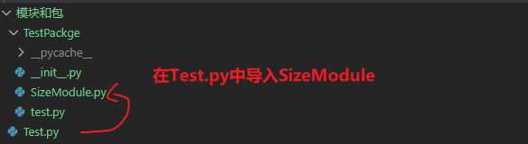

# Ptyhon

## 模块
一个.py文件就是一个模块，模块的作用是为了封装规范代码，创建模块就是创建一个.py文件，导入模块：`import 模块名； from 模块名 import member`。

导入模块时，程序搜索模块的顺序为：

1. 在当前目录（即执行Python脚本文件所在的目录）下查找

2. 到PYTHONPATH(环境变量）下的每个目录中查找

3. 到Python的默认安装目录查找

以上目录的具体位置保存在标准模块sys.path变量中，可以通过以下代码输出查看

```py
import sys
print(sys.path)
```

如果要导入的模块不在以上目录中，会报错：`ModuleNotFoundError: No module named 'xxxx'`


模块的目录结构



`SizeModule.py` 中的代码
```py
width = 100
height = 200
```
与 `SizeModule.py` 同目录的 `test.py` 调用方法（直接导入即可）

```py
import SizeModule
print(SizeModule.width)
print(SizeModule.height)
```

如果我们要在外层 `Test.py` 中导入 `TestPackge` 文件夹下的 `SizeModule.py` 模块，需要先将包的路径加入到 `sys.path` 中。

第一种方式：根据当前路径将包路径加入到`sys.path`

```py
import sys
import os

# 输出当前文件的绝对路径
current_dir = os.path.dirname(os.path.abspath(__file__))
# 将需要导入模块代码文件相对于当前文件目录的绝对路径加入到sys.path中
sys.path.append(os.path.join(current_dir, ".."))

from TestPackge import SizeModule
print(SizeModule.width)

```
第二种方式：将工作目录添加到`sys.path`中，然后根据层级关系导入

```py
import sys
import os
sys.path.append(os.getcwd()) # 工作目录，项目根目录
import 模块和包.TestPackge.SizeModule as size
print(size.width)
```

 

## 包

创建一个包就是创建一个文件夹，文件夹下创建 `__init__.py` 文件，里面可以为空，如果写了逻辑，导入包时会执行，在介绍模块的目录结构时，实际上就是一个包的目录结构，导入包中的模块（举例一种方式）

```py
from TestPackge import SizeModule # TestPackge: 包， SizeMoudle:模块
from TestPackge import SizeModule as newName  # TestPackge: 包， SizeMoudle:模块 ,导入为新的名称
```


