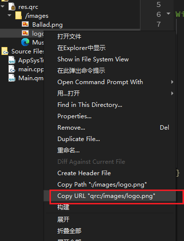

# Qt 开发笔记

## 资源文件

[官网 Qt 资源系统](https://doc.qt.io/qt-6/zh/resources.html)

**一、必须先配置 CMakeList.text**

必须 启用了CMAKE_AUTORCC ，才可以直接将.qrc 文件作为源代码添加到可执行文件或库中。然后，引用的资源文件就会嵌入到二进制文件中：
``` cpp
set(CMAKE_AUTORCC ON)

qt_add_executable(my_app
    application.qrc
    main.cpp
)
```


> AUTORCC 在多个项目中使用时，仅在根项目中添加rc资源文件有效（或者操作不对，未验证）

AUTORCC 的另一个替代方法是使用 Qt6Core 的 CMake 函数qt_add_resources，它对资源的创建提供了更多控制。例如，它允许您直接在项目文件中指定资源的内容，而无需先编写.qrc 文件：


```cpp
qt_add_resources(my_app "app_images"
    PREFIX "/"
    FILES
        images/copy.png
        images/cut.png
        images/new.png
        images/open.png
        images/paste.png
        images/save.png
)
```

**二、创建资源文件**

通过新建文件 Qt Resource File 创建

```xml
<RCC>
    <qresource prefix="/">
        <file>images/copy.png</file>
        <file>images/cut.png</file>
        <file>images/new.png</file>
        <file>images/open.png</file>
        <file>images/paste.png</file>
        <file>images/save.png</file>
    </qresource>
</RCC>
```


**三、赋值资源路径使用**



```qml
 Image {
        width: 200
        height: 200
        source: "qrc:/images/logo.png"
    }
```

## 设置应用程序图标

### 官方说明

- 设置应用程序图标官方手册： [https://doc.qt.io/qt-6/zh/appicon.html](https://doc.qt.io/qt-6/zh/appicon.html)
- 官方示例项目 `D:\Qt\Examples\Qt-6.10.0\demos\photosurface` ，注意这个示例项目在 Qt Creator 中没找到，直接添加项目，打开 CMakeList.txt 文件即可，可参照里面的配置

### 在 Windows 上设置应用程序图标

#### 创建ico图标

首先，创建一个包含图标图像的 ICO 格式位图文件。这可以使用 Microsoft Visual Studio 来完成：选择File >> New ，然后选择Icon File 。

注意： 您无需将应用程序加载到 Visual Studio IDE 中，因为您使用的只是图标编辑器。

另外，也可以使用 ImageMagick 的转换工具从一组图像中创建.ico 文件：

`magick.exe convert icon-16.png icon-32.png icon-256.png icon.ico`

将 ICO 文件保存在应用程序的源代码目录中，例如，文件名为appico.ico 。

#### 创建资源（.rc）

资源文件(.rc)是个文本文件，可以使用豆包之类AI中的创建（生成一个 CMake+qt+ qml 项目的 rc 文件），或者在官方示例中拷贝，格式如下:

app.rc
``` cpp
#include <windows.h>

// 应用程序图标
IDI_ICON1 ICON  "Icons/logo.ico"

// 版本信息
VS_VERSION_INFO VERSIONINFO
 FILEVERSION 1,0,0,0
 PRODUCTVERSION 1,0,0,0
 FILEFLAGSMASK 0x3fL
#ifdef _DEBUG
 FILEFLAGS VS_FF_DEBUG
#else
 FILEFLAGS 0x0L
#endif
 FILEOS VOS_NT_WINDOWS32
 FILETYPE VFT_APP
 FILESUBTYPE 0x0L
BEGIN
    BLOCK "StringFileInfo"
    BEGIN
        BLOCK "040904b0"
        BEGIN
            VALUE "CompanyName", "abyte"
            VALUE "FileDescription", "Mine Music"
            VALUE "FileVersion", "1.0.0.0"
            VALUE "InternalName", "Mine Music"
            VALUE "LegalCopyright", "abyte Copyright (C) 2024"
            VALUE "OriginalFilename", "MineMusic.exe"
            VALUE "ProductName", "Mine Music"
            VALUE "ProductVersion", "1.0.0.0"
        END
    END
    BLOCK "VarFileInfo"
    BEGIN
        VALUE "Translation", 0x409, 1200
    END
END


// 应用程序清单（可选，用于现代 Windows 样式）
// 1 24 "app.manifest"
```

#### 配置 CMakeLists.txt
应用资源文件: app.rc

``` txt
qt_standard_project_setup(REQUIRES 6.10)


# 平台特定图标设置
if(WIN32)
    # Windows: 使用 .rc 文件嵌入图标
    set(APP_ICON_RESOURCE_WINDOWS "${CMAKE_CURRENT_SOURCE_DIR}/app.rc")
    # add_executable(MineMusicApp WIN32 main.cpp ${APP_ICON_RESOURCE_WINDOWS})
    qt_add_executable(MineMusicApp
        main.cpp
        ${APP_ICON_RESOURCE_WINDOWS}
        filenameprovider.h
        doc/dev-note.md
        Icons/logo.ico
    )

    # 注意：使用 qt_add_executable 时，直接在 add_executable 中包含 .rc 文件
elseif(APPLE)
    # macOS: 设置 .icns 文件
    set(MACOSX_BUNDLE_ICON_FILE myapp.icns)
    set(APP_ICON_MACOSX "${CMAKE_CURRENT_SOURCE_DIR}/resources/myapp.icns")
    set_source_files_properties(${APP_ICON_MACOSX} PROPERTIES
        MACOSX_PACKAGE_LOCATION "Resources")
    set_target_properties(MineMusicApp PROPERTIES
        MACOSX_BUNDLE TRUE
        MACOSX_BUNDLE_GUI_IDENTIFIER com.example.myqmlapp
        MACOSX_BUNDLE_BUNDLE_VERSION ${PROJECT_VERSION}
        MACOSX_BUNDLE_SHORT_VERSION_STRING ${PROJECT_VERSION_MAJOR}.${PROJECT_VERSION_MINOR}
    )
    qt_add_executable(MyQMLApp MACOSX_BUNDLE main.cpp ${APP_ICON_MACOSX})
else()
    # Linux: 设置 .desktop 文件和窗口图标
    set_target_properties(MyQMLApp PROPERTIES
        WIN32_EXECUTABLE TRUE  # 隐藏控制台窗口（可选）
    )
endif()
```

**注意事项：**

1. 添加在 `qt_standard_project_setup(REQUIRES 6.10)` 语句后，否可能出现问题
2. 将之前的 `qt_add_executable` 语句移动到对应平台下，并添加对应的资源变量


#### 应用程序清单（可选，用于现代 Windows 样式）

 创建 "app.manifest" 文件，上架微软商店需要，winui3 项目中就会自动创建，格式如下：

(未验证，AI生成)

``` xml
<?xml version="1.0" encoding="UTF-8" standalone="yes"?>
<assembly xmlns="urn:schemas-microsoft-com:asm.v1" manifestVersion="1.0">
  <assemblyIdentity
    type="win32"
    name="YourCompany.YourApp"
    version="1.0.0.0"
    processorArchitecture="*"
  />
  
  <description>Your Qt QML Application</description>
  
  <dependency>
    <dependentAssembly>
      <assemblyIdentity
        type="win32"
        name="Microsoft.Windows.Common-Controls"
        version="6.0.0.0"
        processorArchitecture="*"
        publicKeyToken="6595b64144ccf1df"
        language="*"
      />
    </dependentAssembly>
  </dependency>
  
  <compatibility xmlns="urn:schemas-microsoft-com:compatibility.v1">
    <application>
      <!-- Windows 10 and Windows 11 -->
      <supportedOS Id="{8e0f7a12-bfb3-4fe8-b9a5-48fd50a15a9a}"/>
      <!-- Windows 8.1 -->
      <supportedOS Id="{1f676c76-80e1-4239-95bb-83d0f6d0da78}"/>
      <!-- Windows 8 -->
      <supportedOS Id="{4a2f28e3-53b9-4441-ba9c-d69d4a4a6e38}"/>
      <!-- Windows 7 -->
      <supportedOS Id="{35138b9a-5d96-4fbd-8e2d-a2440225f93a}"/>
    </application>
  </compatibility>
</assembly>
```

## 发布可执行文件

在 `Qt Creator` 中，构建的exe 无法点击运行，需要打包

### 构建

1. 切换到 release (若无Release， 点击项目，添加Release),构建
2. 将 所有C++服务的Dll（如 `Services` 服务对应生成的为  `libServices.dll`） 和 主应用程序 `exe` 文件 拷贝到一个新文件夹下 （或者直接在Release 文件夹下指向发布命令操作，这样可能存在冗余文件）

### 发布

- 使用 `windeployqt6` 来部署，是安装 qt 的时候一起安装的，如： `D:\Qt\6.9.1\mingw_64\bin\windeployqt6.exe`
- `qmldir` : 指定项目中的qml资源目录，有多少个就配置多少个，用于打包使用到的资源
- `Minemusic.exe`  主程序exe

示例：

在新文件中运行命令行窗口，并允许以下命令

```shell

D:\Qt\6.9.1\mingw_64\bin\windeployqt6.exe --qmldir=F:\000-Labyte\Projects\mine-music\Config --qmldir=F:\000-Labyte\Projects\mine-music\Controls --qmldir=F:\000-Labyte\Projects\mine-music\Player Minemusic.exe
```


## 系统托盘图标


[官网：SystemTrayIcon](https://doc.qt.io/qt-6/zh/qml-qt-labs-platform-systemtrayicon.html)