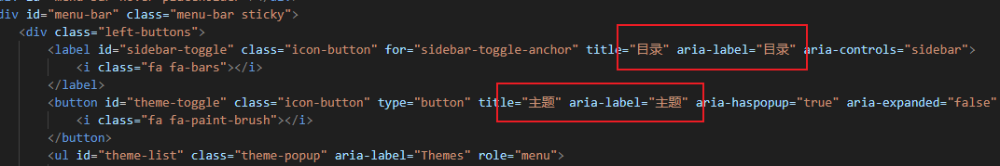
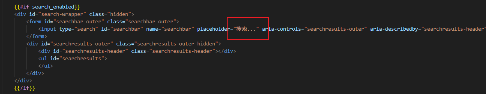

# mdBook


- 将markdown 文件转换为html的工具

- [仓库地址](https://github.com/rust-lang/mdBook)

- [官方文档](https://rust-lang.github.io/mdBook)


注意：国内有很多个人翻译的中文版本，时间比较久远，还是看官网的英文版本或者翻译为中文来查看。


## 常用命令

执行构建：即编译生产网站静态文件，不支持实时更新，`--open` 可选：自动打开浏览器

```
mdbook build --open
```
运行服务：即当在编辑器中改动后，浏览器实时更新，`--open` 可选：自动打开浏览器

```
mdbook serve --open
```

## 渲染器

### 章节折叠渲染器配置

在book.toml中配置

```
[output.html.fold]
enable = true # 启用
level = 0  # 0：打开网站时，全部关闭，1：所有第一层级的展开，2：第二层级的展开...

```

## 预处理

## 主题

### 设置界面字体

- `theme/css/general.css` 中的 `:root` 和 `Body` 可整体调整左侧章节目录和整文的字体大小

- `theme/css/chrome.css` 中的 `.sidebar` 可整体调整左侧章节目录字体大小，两者结合，可满足相关需求


### 设置整文行间距

theme/css/general.css:

```css
.content p { line-height: 1.5em; }
.content ol { line-height: 1.5em; }
.content ul { line-height: 1.5em; }

```


### 目录插件PageToc

**PageToc**：比较简单容易配置的目录插件，但是显示感觉怪怪的，在加上目录后，文章内容还是居中，就导致布局不合理

**[可自定义标题目录，未配置成功](https://github.com/zjp-CN/mdbook-theme?tab=readme-ov-file)**，该主题在Pagetoc的基础上添加了自定义功能，可配置文章内容全屏显示，但是配置后运行不起来，即使克隆作者的仓库也运行不起来。


### 直接使用开源仓库

可以直接克隆一些开源的仓库，作为模板进行编写。

[Rust语言圣经](https://course.rs/about-book.html)：

- 支持章节收缩
- 支持较好的目录
- 支持评论
- 不支持中文搜索，本仓库也使用了它的上述功能，自己实现了中文搜索。


## 中文支持

网页的工具栏等都是英文显示，在国内使用需要更改为中文。

1. 设置网页为中文

在国内使用应该使用中文

- 在 `book.toml`中设置为中文 `language = "zh-CN"`，这仅仅是说明我们的网页使用的是中文

```C#
[book]
authors = ["LIXINGJUN"]
language = "zh-CN"
multilingual = false
src = "src"
title = "成都轨道学院培训楼使用指南"
description = "该文档仅用于成都轨道学院培训楼使用，禁止外传。"
```

2. 设置工具栏为中文

- 工具栏默认提示为英文，如下图中的目录切换：


- 这需要通过修改主题来实现，在默认创建的书中没有主题的配置，根据官网文档，通过执行命令 `mdbook init --theme` 来创建默认的主题文件，然后通过修改文件中内容来修改.
- 通过修改 ` index.hbs` 文件中的对应内容






3. 支持中文搜索

**说明**： 默认不支持中文搜索，也就是在搜索框总输入中文，搜索不到结果，具体见社区： [Rust社区支持中文说明](https://rustcc.cn/article?id=fd75c670-4e8a-40be-855c-4a5ad1da350a)，总结以下的处理方式：

1. 安装指定插件


```shell
cargo install mdbook-mermaid
cargo install mdbook-plantuml
```

2. 本地创建 `assets`，在社区中指示的仓库下载指定的文件到 `assets`中
3. 配置 `book.toml`

  ```Toml
[output.html]
mathjax-support = true
additional-css = ["assets/mermaid.css", "assets/print.css", "assets/all-page.css"]
additional-js = ["assets/fzf.umd.js", "assets/elasticlunr.js", "assets/mermaid.min.js", "assets/import-html.js","assets/searcher.js"]
```

4.  配置成功案例 [https://gitee.com/shtzj/userguide.git](https://gitee.com/shtzj/userguide.git) 项目设置。

### 搜索结果描述的修改

如下图显示，我们搜索到内容后提示有多少个结果，默认是英文显示的，要改为中文，这里通过 ` index.hbs`无法修改，因为这个数据是动态显示的，在后端实现。


通过在渲染输出中，通过字符串查找，在 `seracher.js` 文件中找到了响应的代码位置，简单的操作，就是每次我们只要将对应的地方改为中文即可，但是存在一个问题，每次构建都会覆盖改好的内容。

**原代码**

```JavaScript
    function formatSearchMetric(count, searchterm) {
        if (count == 1) {
            return count + " search result for '" + searchterm + "':";
        } else if (count == 0) {
            return "No search results for '" + searchterm + "'.";
        } else {
            return count + " search results for '" + searchterm + "':";
        }
    }
```

**希望的代码**

```JavaScript
    function formatSearchMetric(count, searchterm) {
        if (count == 1) {
            return count + " 个搜索结果 '" + searchterm + "':";
        } else if (count == 0) {
            return "无搜索结果 '" + searchterm + "'.";
        } else {
            return count + " 个搜索结果 '" + searchterm + "':";
        }
    }
```

**临时解决方式（不理想）**

1. 将 `seracher.js`  先改好，拷贝到 `assets `文件夹下；
2. 配置 ` book.toml` 文件，如下图增加 `searcher.js` 的引用

```Toml
[output.html]
mathjax-support = true
additional-css = ["assets/mermaid.css", "assets/print.css", "assets/all-page.css"]
additional-js = ["assets/fzf.umd.js", "assets/elasticlunr.js", "assets/mermaid.min.js", "assets/import-html.js","assets/searcher.js"]
```

3. 每次构建后，会在输出目录的assts下，创建 `searcher.js`文件，但是同时根目也有相同的文件，需要删除根目下的 `searcher.js` 文件，否则导致点击 搜索按钮无效。


## 章节跳转

### 本页跳转


```markdown
[跳转到章节](#chapter-1)
 
...
 
<a name="chapter-1"></a>
# 章节1
这里是章节1的内容。
```

### 跨页跳转

假设 `a.md` 和 `b.md` 在同一个目录下

a内容：

```markdown
<a name="chapter-1"></a>
# 章节1
这里是章节1的内容。

<a name="chapter-2"></a>
# 章节2
这里是章节2的内容。
```

在 `b` 中跳转到 `a` 的章节2

```markdown
[跳转到 a 的章节2](a.md#chapter-2)
```

## 在一个全新的电脑上搭建Mdbook环境
> 若要运行此仓库为例
### 安装
1. [下载rust](https://www.rust-lang.org/tools/install)
2. 安装 `mdbook`, 命令 `cargo install mdbook`
3. 安装预处理器： 命令 `cargo install mdbook-mermaid`
4. 安装预处理器： 命令 `cargo install mdbook-plantuml`

### 去除评论

- `\theme\index.hbs` 中删除 218 行 `   <div id="giscus-container"></div>`
- custom3.js 中删除 82行到157行

## 注意事项

- 章节的节点不要关联两个相同的文档，特别是两个相邻的，会导致点击下一章节无法跳转到下一章节（因为下一章节的链接和当前一样）

## 异常汇总

 **(1)部署github章节显示空白**

1. 在本地测试所有内容正常，部署到Github上后， `csharp` 文件夹下的所有章节都显示空白，将`csharp`改为 `c-sharp` 后显示正常。


