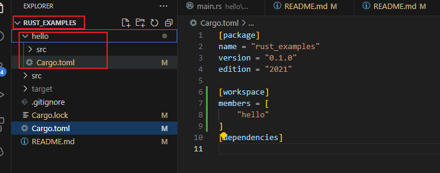

<style>
.table-container {
    display: flex;
    justify-content: center;
    width: 100%;
}

.excel-table {
    width: 100%;
    border-collapse: collapse;
    font-family: Arial, sans-serif;
    font-size: 15px; /* 设置字体大小 */
    table-layout: fixed; /* 固定表格布局 */
}

.excel-table th, .excel-table td {
    border: 1px solid #d0d7de;
    padding: 12px;
    text-align: left;
    vertical-align: top; 
}

.excel-table th {
    background-color: #f0f3f5;
    font-weight: bold;
}

.excel-table tr:nth-child(even), table tr:nth-child(odd) {
    background-color: transparent; /* 确保所有行背景色一致 */
}

.excel-table tr:hover {
    background-color: inherit;
}

.excel-table tr:hover {
    background-color: #e9e9e9;
}
.excel-table th:nth-child(1), .excel-table td:nth-child(1) {
    width:200px;
}

.excel-table th:nth-child(2), .excel-table td:nth-child(2) {
    width: 100%;
}

</style>

# Rust


## 教程

- [官方 Rust](https://www.rust-lang.org/zh-CN/)

- [官方 Rust程序设计员](https://kaisery.github.io/trpl-zh-cn/)

- [官方 RUSTLINGS 课程](https://github.com/rust-lang/rustlings/) ： 包含很多练习，可以指引学习
  
- [官方 通过例子学习Rust](https://rustwiki.org/zh-CN/rust-by-example/)


- [非官方 Rust语言圣经](https://course.rs/about-book.html)


## 安装

[Rust 编程语言](https://doc.rust-lang.org/book/ch01-01-installation.html)

**Windows上安装**

下载安装文件进行安装：[rustup-init.exe](https://static.rust-lang.org/rustup/dist/x86_64-pc-windows-msvc/rustup-init.exe)


**Linux Mac上安装**

```bash
curl --proto '=https' --tlsv1.2 -sSf https://sh.rustup.rs | sh
```

## 更新和卸载
通过 安装 Rust 后rustup，更新到新发布的版本就很容易了。从 shell 运行以下更新脚本：

```
rustup update
```

要卸载 Rust 和rustup，请从 shell 运行以下卸载脚本：

```
rustup self uninstall
```

## Cargo

[Cargo Book](https://doc.rust-lang.org/stable/cargo/index.html)

### 常用命令

注意命令全是小写，错误示范：Cargo run hello❌

<div class="table-container">
    <table class="excel-table">
        <thead>
            <tr>
                <th>功能/命令</th>
                <th>说明</th>
            </tr>
        </thead>
        <tbody>
            <tr>
                <td>创建项目<br><br><code>cargo new hello_cargo</code></td>
                <td>创建项目</td>
            </tr>
             <tr>
                <td>构建项目<br><br><code>cargo build --release</code></td>
                <td>此命令在`target/debug/hello_cargo（或 Windows 上的target\debug\hello_cargo.exe ）`中创建一个可执行文件，而不是在当前目录中。由于默认构建是调试构建，因此 Cargo 将二进制文件放在名为debug的目录中。</td>
            </tr>
              <tr>
                <td>构建发布<br><br><code>cargo build</code></td>
                <td>当您的项目最终准备好发布时，您可以使用cargo build --release优化来编译它。此命令将在target/release而不是target/debug中创建可执行文件。</td>
            </tr>
              <tr>
                <td>运行项目<br><br><code>cargo run</code></td>
                <td>编译和运行一键执行
                </td>
            </tr>
             <tr>
                <td>检查项目<br><br><code>cargo check</code></td>
                <td>此命令可以快速检查您的代码，以确保它可以编译但不会产生可执行文件</td>
            </tr>
            <tr>
                <td>测试<br><br><code>cargo test</code></td>
                <td>测试</td>
            </tr>
        </tbody>
    </table>
</div>


## 项目结构文件夹(目标表)

### examples 目录

[官网 exampels 目录](https://doc.rust-lang.org/cargo/reference/cargo-targets.html#examples)

- 在项目根目创建 `examples` 
- 在此文件中只能包含 rs 脚本文件，且包含 `main` 函数
- 示例：`examples/hello.rs`， 运行示例 `cargo run --example hello`
- 可以指定crate-type字段以将示例编译为库（没研究）：

[[example]]
name = "foo"
crate-type = ["staticlib"]

注：这里仅能实现一些简单的脚本功能，如果要编写一些完整的项目示例，使用 [工作区](#工作区)

### tests 目录

[集成测试](https://doc.rust-lang.org/cargo/reference/cargo-targets.html#tests)

没研究

### benches 目录

[集成测试](https://doc.rust-lang.org/cargo/reference/cargo-targets.html#benchmarks)

基准测试

## 工作区

通过配置工作区来实现，[官方文档](https://doc.rust-lang.org/cargo/reference/workspaces.html)

详细功能见官网，此处介绍使用工作区配置子项目，使用场景为：在学习rust的适合，使用的一个仓库，但是中途很多练习项目，此时就可以通过工作区来配置。

首先创建父级项目：

``` 
cargo new rust_examples
```

然后在 rust_examples 下创建 hello 等其他一系列子项目，

切换到 rust_examples
```
cd rust_examples

```

创建hello
```
cargo new hello
```

项目目录结构如下：



**配置方式：**

首先在 rust_examples 项目的 `Cargo.toml` 文件中配置 `workspace` 工作区成员，

```toml
[package]
name = "rust_examples"
version = "0.1.0"
edition = "2021"

[workspace]
members = [
    "hello","projects/hello1",,"projects/*"
]
[dependencies]
```

- hello: 代表在根目(Cargo.toam 所在目录)下
- projects/hello1： 在 projects 下的hello1
- projects/* : 在 projects 下的所有

运行hello项目：

```
cargo run --package hello
```

其他命令如 `build` 均可以用，但是构建的文件在 rust_examples 的 target文件夹下。


## 问题汇总

### Cargo config deprecated

当构建或者运行时，显示警告：

```
warning: `C:\Users\ABYTE\.cargo\config` is deprecated in favor of `config.toml`
note: if you need to support cargo 1.38 or earlier, you can symlink `config` to `config.toml`
```

### 构建的GUI程序，运行时会出现控制台窗口

当使用 `iced` 来构建GUI程序，启动时出现控制台窗口，可以在`main.rs`文件的顶部添加以下代码来去除该控制台窗口：

```
#![windows_subsystem = "windows"]
```


## 国内源

[子节跳动镜像](https://rsproxy.cn)


## .cargo 迁移到D盘

> C 盘瘦身

.cargo 包含了我们下载的很多库文件，后期会越来越大。

在 Windows 系统上，将 .cargo 文件夹从默认位置（例如 C:\Users\ABYTE\.cargo）移动到 D 盘后，需要调整环境变量以让 Rust 工具链（如 rustup）能够找到新的路径。请按照以下步骤操作：

移动 .cargo 文件夹：将 .cargo 文件夹从 C:\Users\ABYTE\ 移动到 D 盘，例如 D:\.cargo。

设置环境变量：将新的 .cargo 路径添加到环境变量中。

打开“系统属性”窗口：右键点击“此电脑” → “属性” → “高级系统设置” → “环境变量”。
在“用户变量”或“系统变量”中找到 CARGO_HOME。如果没有此变量，点击“新建”添加一个，名称为 CARGO_HOME，值为 D:\.cargo。
如果已经存在 CARGO_HOME，将其路径修改为 D:\.cargo。
检查并更新路径：在同一窗口下检查 Path 变量，确保 D:\.cargo\bin 被添加到了 Path 中。如果没有，则添加一个新条目 D:\.cargo\bin。

验证配置：打开新的命令提示符（cmd）或 PowerShell，运行以下命令确认 rustup 已识别新的路径：

```sh

rustup --version
cargo --version
```

如果一切配置正确，这些命令应能够正常工作。


**相关文章**

- [.nuget-迁移到D盘](../dotnet/nuget.md#nuget-迁移到d盘)