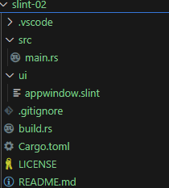

# Slint

>UI 框架

[Slint 官网首页](https://slint.dev/ "slint")

[.slint 和 rust 分离](https://releases.slint.dev/1.7.0/docs/rust/slint/index.html)

[国内B站UP主代码，比较详细](https://github.com/syf20020816/slint_learn)

## 快速开始

### 手动创建项目

创建项目：

```bash
cargo new slint_component
```

在  `Cargo.toml` 中添加依赖 `slint `和 `slint-build`，两者的版本号相同

```toml
[package]
name = "slint_component"
version = "0.1.0"
edition = "2021"

[dependencies]
slint = "1.7.0"

[build-dependencies]
slint-build = "1.7.0"
```

创建组件文件夹 `ui(或者命名为 component)`，用于放置 `slint`文件，在文件中创建 `Window.slint` 文件，

```slint
import { AboutSlint, Button, VerticalBox } from "std-widgets.slint";
component Demo {

    VerticalBox {
        alignment: center;
    

        Text {
            text: "Hello World!";
            font-size: 24px;
            horizontal-alignment: center;
        }
        AboutSlint {
            preferred-height: 150px;
        }
        HorizontalLayout { alignment: LayoutAlignment.center; Button { text: "O1K!"; } }
    }
}

export component MainWindow inherits Window {
    width: 800px;
    height: 600px;
    title: "slint 测试";
    Demo{
    }
}
```

在根目（与src同层级）创建 `build.rs` 文件：

```rust
fn main(){
    slint_build::compile("src/ui/Window.slint").unwrap();
}

```

在 src/main.rs 中添加如下代码：

⚠️`slint::include_modules!();` 提示错误 `failed to load file UNRESOLVED_ENV_VAR`，但是不影响运行

```rust
slint::include_modules!();
fn main() {
    MainWindow::new().unwrap().run().unwrap();
}

```
### 使用 Slint Rust 模板

类似于WPF中的 prim 框架模板一样，自动创建项目文件结构

首先确保安装了 `cargo-generate`

```shell
cargo install cargo-generate
```

使用模板创建

```shell
cargo generate --git https://github.com/slint-ui/slint-rust-template
```

稍等下，提示输入项目名称：

```shell
PS F:\000-SHING\Rust\rust_examples> cargo generate --git https://github.com/slint-ui/slint-rust-template
 Project Name: slint-02
 project-name: slint-02 ...
 Generating template ...
 Moving generated files into: `F:\000-SHING\Rust\rust_examples\slint-02`...
 Initializing a fresh Git repository
 Done! New project created F:\000-SHING\Rust\rust_examples\slint-02
PS F:\000-SHING\Rust\rust_examples> cargo run --package slint-02
```

创建后文档结构：



✅ 使用模板方式创建后： `slint::include_modules!();` 提示错误 `failed to load file UNRESOLVED_ENV_VAR` 问题修复了，前面手动创建的项目的错误也消除了。