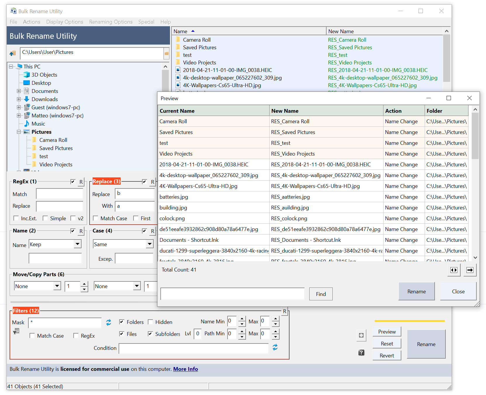

# Bulk Rename Utility

批量文件重命名工具

[官网](https://www.bulkrenameutility.co.uk/)

完全免费！！！

命令行版本的 Bulk Rename Utiltiy (例如用于脚本)，请到我们的网站下载 Bulk Rename Command

64 位版本的 WIndows (XP/2003/Vista)，那么你将受益于 64 位版本的 Bulk Rename Utility

如果你扫描一个很大的文件夹遇到错误时想取消，请按 escape 键。

批量重命名实用程序允许您根据极其灵活的标准轻松重命名文件和整个文件夹，添加日期/时间戳、替换数字、插入文本、转换大小写、添加自动编号、处理文件夹和子文件夹......还有更多！

