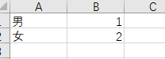
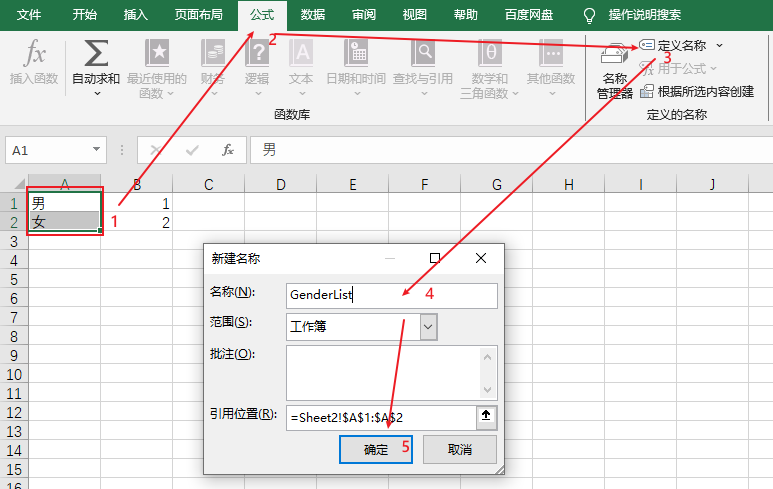
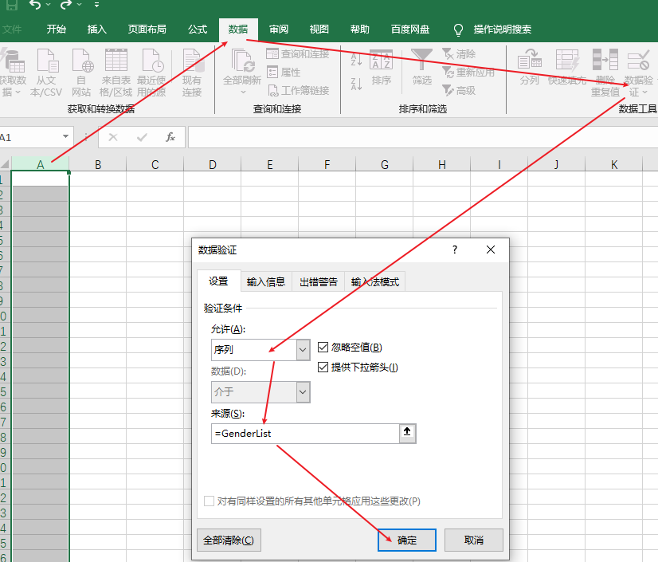
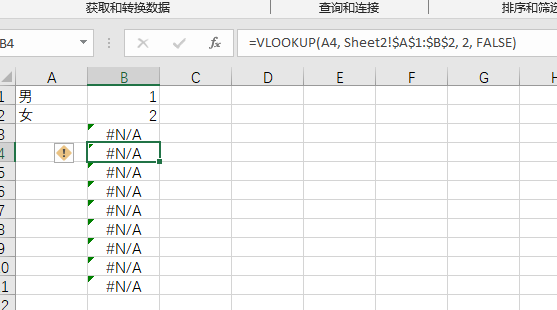

# Excel

## 定义选项列表

需要配置一个用户表，并导入数据库，在用户表中，“性别列” 希望通过下拉组合框来选取，当选择 “男” 和 “女” 选项，导入数据库时将其转换为对应的ID（1或2）。

### 使用隐藏列（推荐）

当前两个工作表 `Sheet1` 和 `Sheet2`，在 `Sheet2` 中定义序列，在 `Sheet1`中使用。

在 `Sheet2` 中定义序列



选中 `A1` 到 `A2` (不要选中 `B` 列)，工具栏：选择 **公式**->**定义名称**，输入 `GenderList`，然后点击**确定**



回到 `Sheet1` ，选中整个 `A` 列，工具栏：**数据**->**数据验证**->在 “允许” 下拉菜单中选择 “序列”，在 “来源” 框中输入 =GenderList，点击 “确定”。



为了将选项转换为ID，可以使用 `VLOOKUP` 公式。假设你在 `Sheet1` 中使用下拉选项在 `A1:A10`，你可以在 `B1` 输入以下公式：

```vbnet
=VLOOKUP(A1, Sheet2!$A$1:$B$2, 2, FALSE) //注意这里因为只有“男”、“女”两个选项，如果有5个选项，应该为 =VLOOKUP(A1, Sheet2!$A$1:$B$5, 2, FALSE)
```

`B` 列的其他项通过复制 `B1` 单元格（鼠标按住下拉），然后将 **B** 列隐藏，在配置时比较简洁



导入数据库，导入数据库时使用 **B** 列数据，不要使用 A 列数据。

### 使用宏进行转换

你可以使用VBA宏在导入数据库前将“男”和“女”转换为对应的ID。

打开VBA编辑器

按 `Alt + F11` 打开VBA编辑器，在VBA编辑器中，点击 "插入" > "模块"。

输入宏代码

```vbnet
Sub ConvertGenderToID()
    Dim ws As Worksheet
    Dim lastRow As Long
    Dim i As Long
  
    Set ws = ThisWorkbook.Sheets("Sheet1") ' 替换为你的工作表名称
    lastRow = ws.Cells(ws.Rows.Count, "B").End(xlUp).Row
  
    For i = 1 To lastRow
        Select Case ws.Cells(i, "B").Value
            Case "男"
                ws.Cells(i, "C").Value = 1
            Case "女"
                ws.Cells(i, "C").Value = 2
        End Select
    Next i
End Sub
```

运行宏，按 `F5` 运行宏，它会将B列中的性别选项转换为C列中的ID。

导入数据库，导入 **C** 列中的数据到数据库。这样，你可以在Excel中显示“男”和“女”，但在导入数据库时将其转换为对应的ID。
