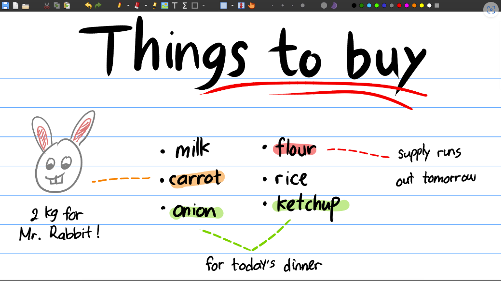

# 软件

## 文本编辑

    <table class="excel-table" id="example-table">
        <thead>
            <tr>
                <th>编号</th>
                <th>软件</th>
                <th>图示</th>
                <th>说明</th>
            </tr>
        </thead>
        <tbody>
            <tr>
                <td>1</td>
                <td><a href="typora.md">Typora</a></td>
                <td><iamge ref="" ></td>
                <td>MarkDown 编辑器，早期开源免费，后期开始收费</td>
            </tr>
            <tr>
                <td>2</td>
                <td><a target="_blank" href="https://xournalpp.github.io/">Xournal++</a></td>
                <td></td>
                <td>MarkDown 编辑器，早期开源免费，后期开始收费</td>
            </tr>
        </tbody>
    </table>

## 开发IDE

    <table class="excel-table" id="example-table">
        <thead>
            <tr>
                <th>编号</th>
                <th>软件</th>
                <th>图示</th>
                <th>说明</th>
            </tr>
        </thead>
        <tbody>
            <tr>
                <td>1</td>
                <td><a href="visual-studio.md">Visual Studio</a></td>
                <td><iamge ref="" ></td>
                <td></td>
            </tr>
            <tr>
                <td>2</td>
                <td><a href="visual-studio-code.md">Visual Studio Code</a></td>
                <td><iamge ref="" ></td>
                <td></td>
            </tr>
             <tr>
                <td>3</td>
                <td><a href="etbrains-rider.md">JetBrains Rider</a></td>
                <td><iamge ref="" ></td>
                <td></td>
            </tr>
        </tbody>
    </table>

