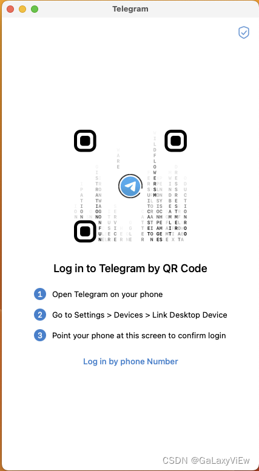
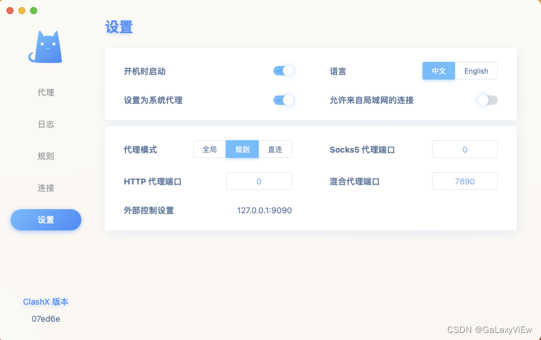
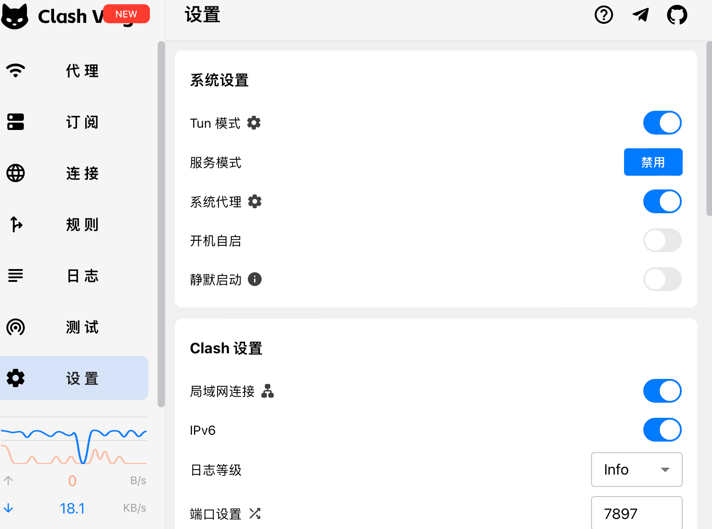
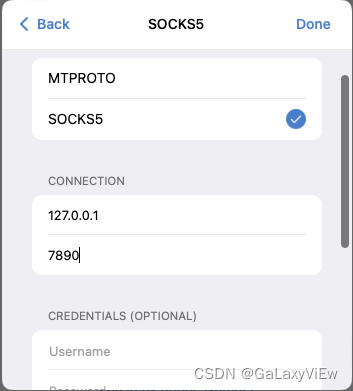

# Telegram

## 在Mac上无法登录问题

电脑端的应用在登录时二维码一直刷新，且代理已经开启了全局模式，仍然无法连接，点Log in by phone Number也显示连接失败。

打开蓝猫软件的控制台，在设置中找到端口号（一般是7890，若是Verge，端口为：7897）。

Clash X

Clash Verge

打开TG，点击扫码登录界面的右上角的盾牌标签

点击 `Done`后，等待连接成功，若代理一直再转圈，调整下Clash的相关设置看看

最后返回登录界面进行登录。

[参考文章](https://blog.csdn.net/galaxyview/article/details/132487680)