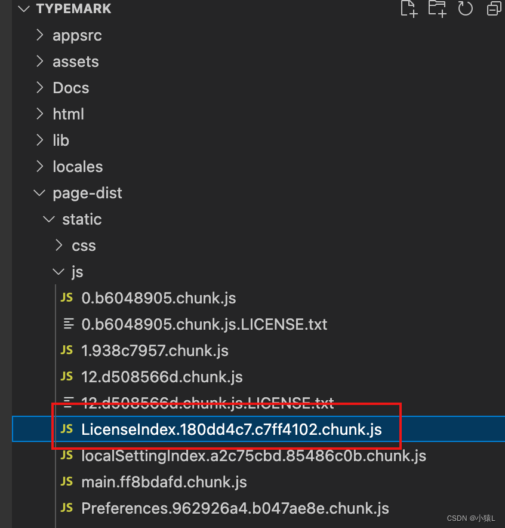

# Typora

## Mac版本激活

[csdn博客](https://blog.csdn.net/enhenglhm/article/details/128980979)

- 首先去官网选择mac版本下载安装 [typora下载 ](https://www.typoraio.cn/)
 
- 然后打开typora包内容找到 ` /Applications/Typora.app/Contents/Resources/TypeMark/ `
  
- 编辑器打开上面文件夹，这里我拉到vscode，找到 `page-dist/static/js/Licen..` 如下图 
  

- 输入 `hasActivated="true"==e.hasActivated` 搜索，将它改为 `hasActivated="true"=="true"`
  
- 重新打开typora，看到成功激活：

  
