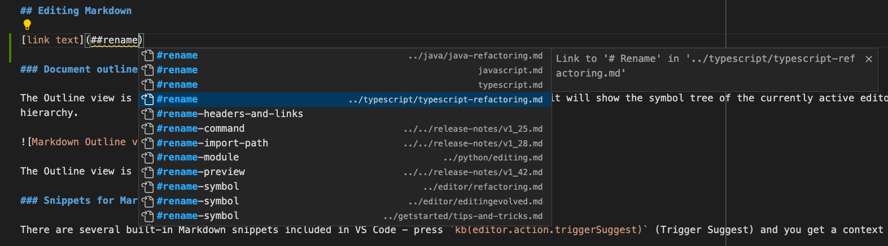

# VS CODE

[VS CODE 各语言的使用支持](https://code.visualstudio.com/docs/languages)

## 下载

* 下载地址：[https://code.visualstudio.com/Download](https://code.visualstudio.com/Download)
* 选择下载的版本，最好下载system版本
* 国内加速下载方法，在浏览器中打开下载内容页面，选中下载的VsCode，右键选择复制下载地址，将地址中的 `vscode.cdn.azure.cn` 替换 `az764295.vo.msecnd.net`，使用新地址下载。

## 插件

### GBKtoUTF8

自动将 GBK格式转化为UTF-8格式。进行Unity开发，开始用的VS，VS强大，但是太臃肿，用起来自身就占用了7-8个G，每次编译Uniyt 很耗时，换成 vscode,但是出现中文乱码，此插件解决此问题。

## Markdown

### 边界和预览切换

`ctrl+shift+v`

### 设置 Markdown 中粘贴图片的位置

- 在 **VS Code** 中，按下 `Ctrl + ,` ，打开设置界面。

- 在搜索框中输入 `markdown.copy` , 找到 `Markdown> Copy Files:Destination`

- 新增配置项 key 为 `**/*.md` , value 为 你的目标路径,比如我想将图片放在 `assets` 目录下markdown文件同名的目录下，那么我就可以设置为 `assets/${documentBaseName}/${fileName}`， 其中 `${documentBaseName}`代表markdown文件的文件名，`${fileName}` 代表图片的文件名。

- 可选择要为 **当前用户** 设置还是为 **当前工作空间** 设置 保存设置即可

### 创建指向另一个文件中的标题的链接
需要链接到另一个 Markdown 文档中的标题，但不记得或不想输入完整的文件路径？尝试使用工作区标题补全！首先，只需输入##Markdown 链接即可查看当前工作区中所有 Markdown 标题的列表：

接受以下某个补全操作即可插入该标题的完整链接，即使该链接位于另一个文件中：

