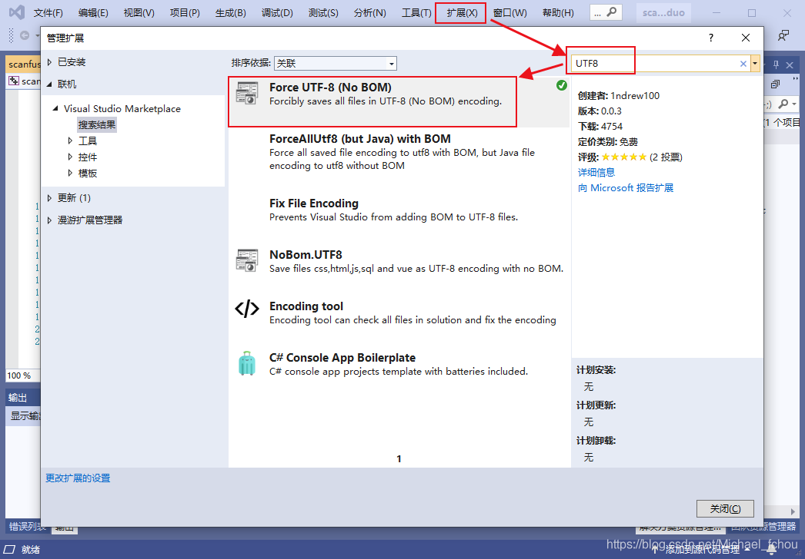

# 包管理器控制台

## Entity Framework

### 安装

在VS包控制台执行 `dotnet ef`错误

```text
dotnet : 无法执行，因为找不到指定的命令或文件。
所在位置 行:1 字符: 1
+ dotnet ef dbcontext scaffold "server=192.168.1.236;database=JzErp;uid ...
+ ~~~~~~~~~~~~~~~~~~~~~~~~~~~~~~~~~~~~~~~~~~~~~~~~~~~~~~~~~~~~~~~~~~~~~
    + CategoryInfo          : NotSpecified: (无法执行，因为找不到指定的命令或文件。:String) [], RemoteException
    + FullyQualifiedErrorId : NativeCommandError
 
可能的原因包括:
  *内置的 dotnet 命令拼写错误。
  *你打算执行 .NET 程序，但 dotnet-ef 不存在。
  *你打算运行全局工具，但在路径上找不到具有此名称且前缀为 dotnet 的可执行文件。

```

原因：

从 3.0 起，EF Core 命令列工具 (dotnet ef) 不在 .NET Core SDK 里面，需另装。命令如下：

```text
dotnet tool install --global dotnet-ef

```

安装成功如下

```text
PM> dotnet tool install --global dotnet-ef
可使用以下命令调用工具: dotnet-ef
已成功安装工具“dotnet-ef”(版本“6.0.2”)

```

参考：[http://www.manongjc.com/detail/28-rmfcuflorcnbrte.html](http://www.manongjc.com/detail/28-rmfcuflorcnbrte.html)

### 迁移

1. 先创建迁移文件

```text
dotnet ef migrations add xxxx
```

然后更新数据库

```text
dotnet ef database update
```

## 中文乱码

CSDN：[https://blog.csdn.net/Michael_fchou/article/details/104349977](https://gitee.com/link?target=https://blog.csdn.net/Michael_fchou/article/details/104349977)

第一种情况：VS的输出编码更改为UTF-8，按照图示安装UTF-8插件，若未解决问题，进行第二种操作



第二种情况：如果已经装了UTF-8插件但是控制台输出的中文仍然是乱码。

1. **打开电脑的控制面板，然后打开时钟和区域**


2. **打开区域**


1. **打开管理**


1. **打开更改系统区域设置**


1. **把下面的选项打勾**


1. **最后重启电脑就ok了。**

# 查找替换无效

删除“C：\Program Files\Microsoft Visual Studio\2022[Enterprise/Pro/Community]\Common7\IDE\CommonExtensions\Microsoft\Editor\ServiceHub\Indexing.servicehub.service.json”文件并重新启动Visual Studio
