# Synology (群晖)

## Putty 连接

### 登录群晖

1. 使用SSH，输入地址，端口（22） 打开命令窗口
2. 输入群晖账户和密码
3. 输入 sudo -i 切换到root 下，提供权限，此时，再次输入账号的密
4. 输入: cd /volume1 切换到容器1，这里根据你的容器名称
5. 然后使用 ls 查看内容列表

### 运行Python 程序

需要先安装Python，直接在套件中安装即可。

运行python，切换到对应文件夹下，python3 test.py

## PowerShell 连接

群晖上启动 SSH 功能，并设置一个可以访问的端口默认22如果不能访问，设置其他端口

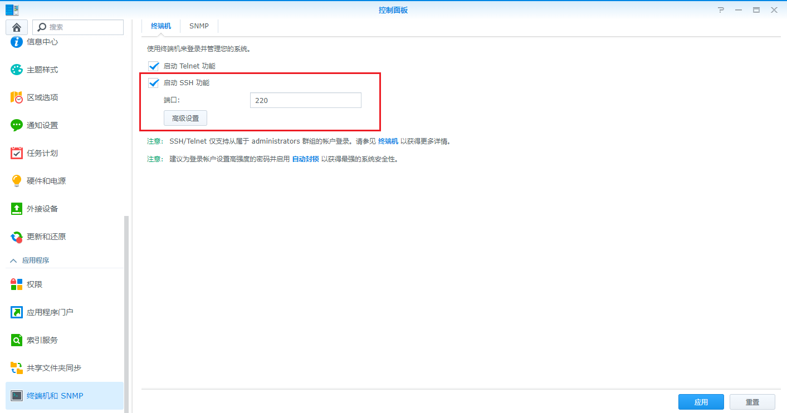

使用 PowerShell 登录，输入 `ssh username@domain -p port`，账号和地址真确，会提示 `ECDSA host key for ip address 否则提示： not in list of known hosts` ，然后提示输入密码，输入密码不可见，输入成功后显示账号和主机名称。

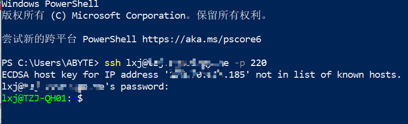

切换到root账户，可以看到当前是 `$` 符号，表示非root账号，输入：`sudo -i`， 再次输入密码，此时变为 `#` ，表示 root 账户

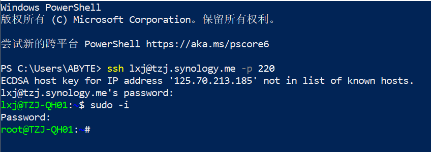

切换到根目录 `cd ..`,将 ~# 变为 /#，并用 `ls` ,查看目录

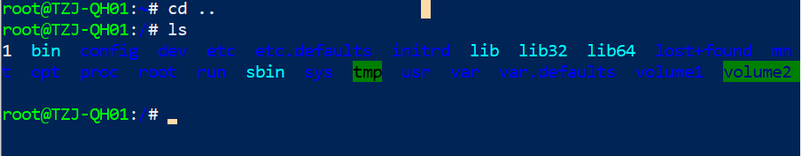

`/` : 表示根节点

`~` : 表示当前登录用户的 home 目录

如果以 `root `账号登陆，`~` 代表 `/root/` 目录，当你任何环境下输入： `#cd ~` 会进入到 `/root` 目录。

## Docker 操作

### 查询镜像

docker 安装在 `lib64` 里面 ，输入 `cd lib64`

**列出容器**：`docker ps`，[命令手册](https://www.runoob.com/docker/docker-ps-command.html)

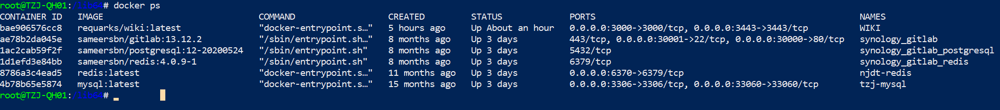

**获取容器**/镜像的元数据：`docker inspect`，如：查看WIKI这个容器的所有挂载信息：

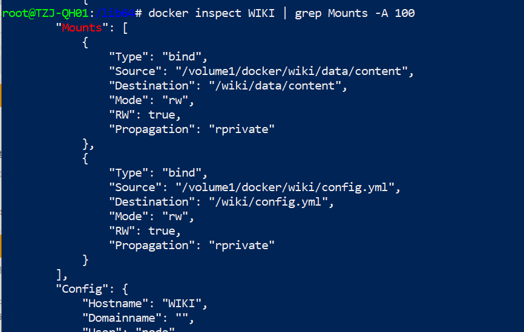

命令说明：

- `grep`: 表示全局正则表达式
- `Mounts`: 匹配挂载开始
- `-A` : 所有
- `100` : 返回的行数
- `Source`: 宿主的目录，也就是我们看得见的目录
- `Destination`: 容器目录

### 拉取镜像

现在的群晖在 `Docker hub` 里面显示查询镜像失败，获取不到镜像，使用命令行获取

[B站视频](https://www.bilibili.com/video/BV1ns4y1q79g/?spm_id_from=333.337.search-card.all.click&vd_source=ae505290000a9de26b4d6c8111c5e5dd)

参照命令行章节，连接群晖

`sudo -i` 获取到超级用户权限

搜索镜像，如: mongo，如数命令：

```shell
docker search mongo
```

搜索结果：

```shell
NAME                              DESCRIPTION                      STARS     OFFICIAL   AUTOMATED
mongo                             MongoDB document databases ...   1989      [OK]     
mongo-express                     Web-based MongoDB admin int...   22        [OK]     
mvertes/alpine-mongo              light MongoDB container          19                   [OK]
mongooseim/mongooseim-docker      MongooseIM server the lates...   9                    [OK]
torusware/speedus-mongo           Always updated official Mon...   9                    [OK]
jacksoncage/mongo                 Instant MongoDB sharded cluster  6                    [OK]
mongoclient/mongoclient           Official docker image for M...   4                    [OK]
jadsonlourenco/mongo-rocks        Percona Mongodb with Rocksd...   4                    [OK]
asteris/apache-php-mongo          Apache2.4 + PHP + Mongo + m...   2                    [OK]
19hz/mongo-container              Mongodb replicaset for coreos    1                    [OK]
nitra/mongo                       Mongo3 centos7                   1                    [OK]
ackee/mongo                       MongoDB with fixed Bluemix p...  1                    [OK]
kobotoolbox/mongo                 https://github.com/kobotoolb...  1                    [OK]
valtlfelipe/mongo                 Docker Image based on the la...  1                    [OK]
```

拉取镜像：` docker pull mongo:latest`，冒号后面需要跟版本号（latest：表示最新的版本号）

使用中转加速拉取，在群晖里面配置加速

**本期涉及的一些网站和链接**：

- [Dockerhub仓库1](https://hub.docker.com/)
- [Dockerhub仓库2](https://registry.hub.docker.com)
- [镜像代理加速网站](https://dockerproxy.com/)
- [镜像加速器地址](https://gist.github.com/y0ngb1n/7e8f16af3242c7815e7ca2f0833d3ea6)
- [putty官网](https://www.putty.be/latest.html)

## MySQL

`<a name="mysql-install"></a>`

### 安装

下载镜像后启动安装，仅需要设置下端口映射和环境变量，其他保持默认。


### 操作

浏览器登录 `DSM`，进入 `Mysql` 容器，选择终端机，点击新增，选择新增的 `bash`（不能使用默认的控制台，需要新增一个控制台）

```bash
#这里不知道为什么不能输入123，是复制的
mysql -uroot -ptzj123
```

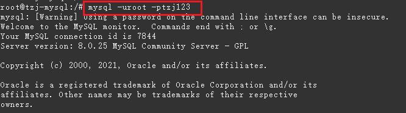

使用 `help` 命令查看

## Wiki

### 安装

**环境需求说明**：2核 1G内存

打开Dcoker，在注册表搜索 `wiki`,找到 `requarks/wiki` ，选中后点击下载

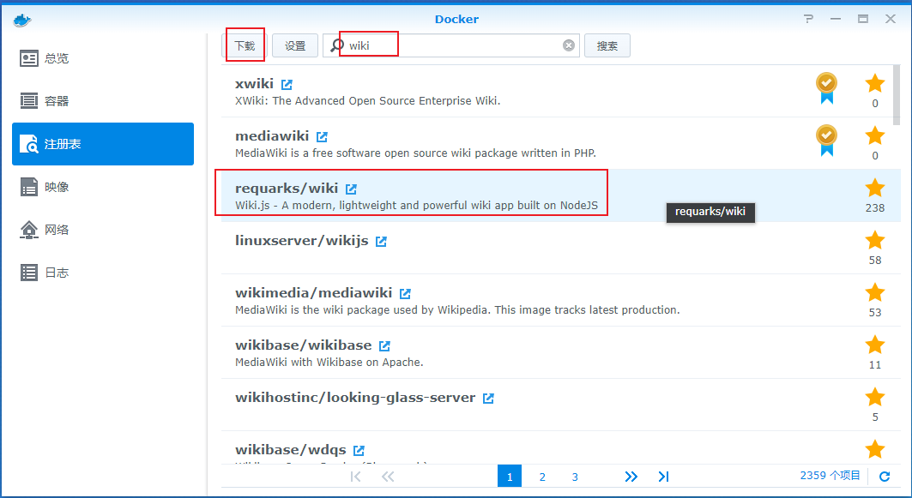

下载后在映像如图

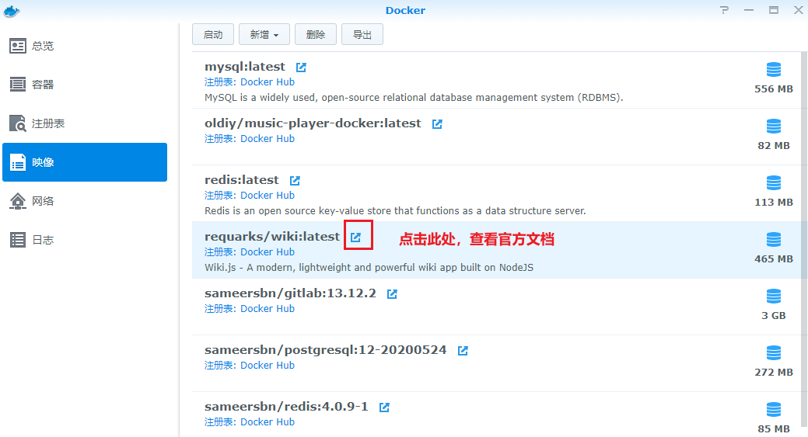

### 配置mysql数据库

Mysql容器的安装参考: [MySQL 安装](#mysql-install)

在数据库里面创建好数据库，如:wiki

### 配置环境变量

[官方手册](https://docs.requarks.io/install/docker)

**启动镜像**：在镜像列表中选中 `wiki` ，点击**启动**：

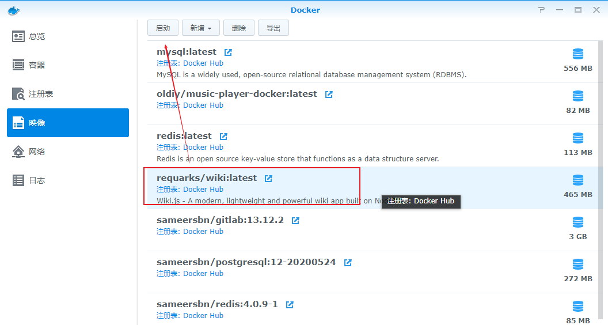

**常规设置**:填写容器名称，然后点击 **高级设置**

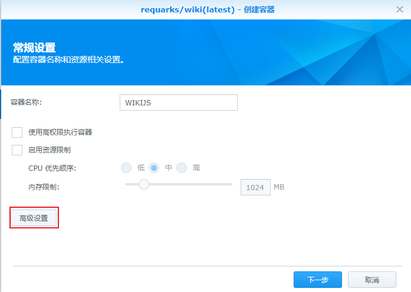

**高级设置**：启用自动重新启动，可勾选

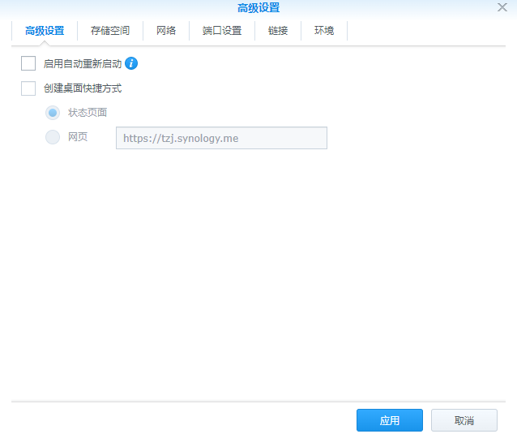

**端口配置**，`http：3000`，`https：3443`（但是目前无法使用）

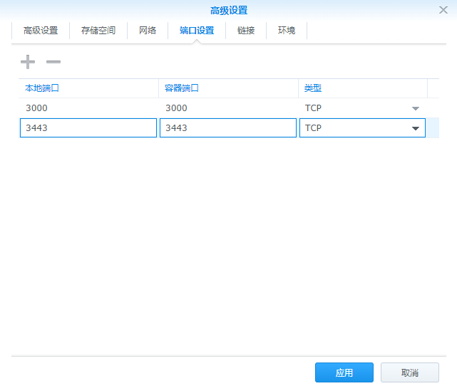

**配置环境变量，根据官方手册如下**：

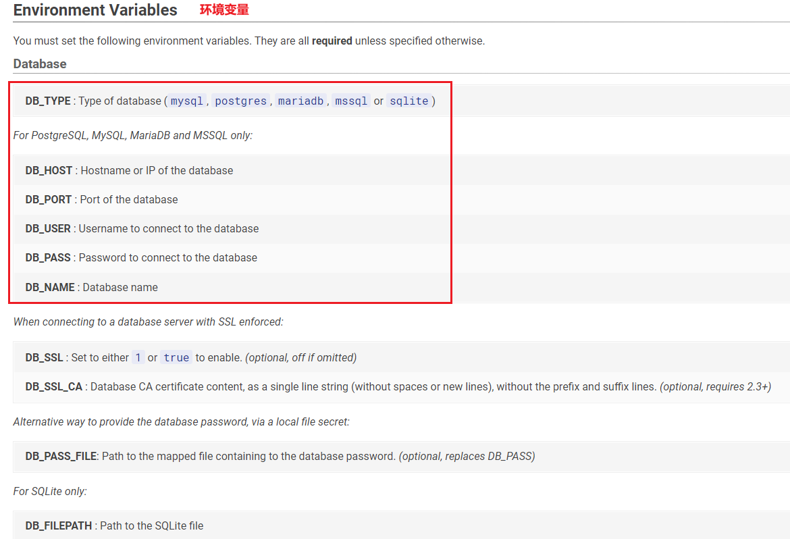

**对应配置如下**：

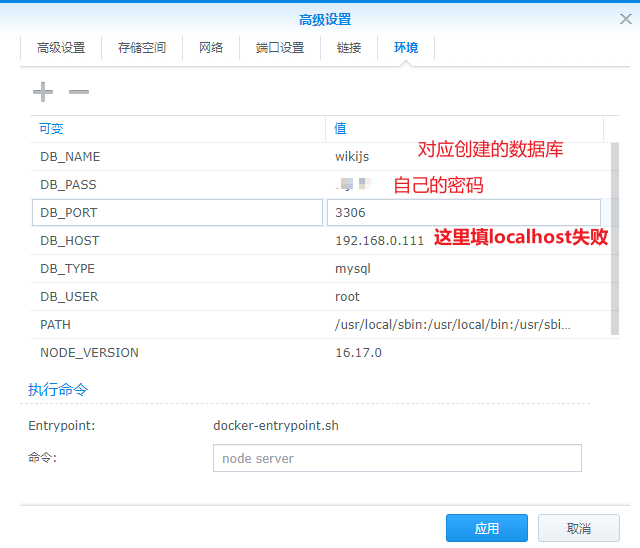

### 配置文件启动

使用配置文件启动，需要存储空间进行挂载，让容器加载我们挂载的配置文件。

官网上对挂载配置文件说明，看到容器会读取 /wiki/config.yml配置文件，[配置文件模板](https://github.com/Requarks/wiki/blob/main/config.sample.yml)

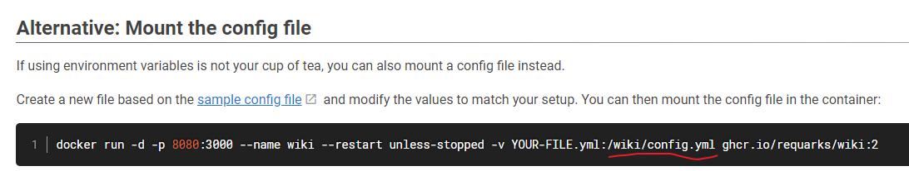

群晖上的目录

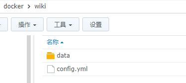

编辑好配置文件后，按照下图挂载，忽略 content 的挂载


配置文件主要内容：

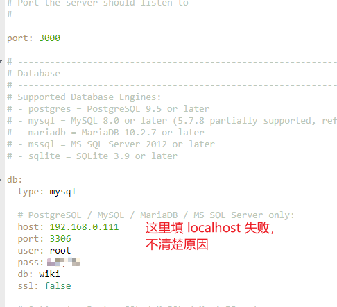

启动容器，使用 ` http://你的IP地址或者域名:3000`访问

注意还不能使用https访问，这是个问题，后面会讲

### HTTPS访问

**停止容器**

**注**：官网上说可以简单配置 `LETSENCRPT` 实现 `Https`，但是没成功，还是使用自定义密钥的方式来做

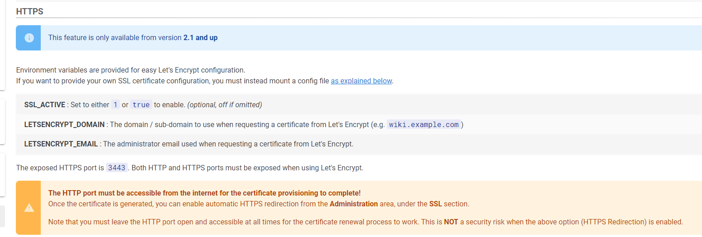

**创建证书**，参看 [创建证书](drive.md)

**挂载证书目录**，还是看下图，我们会将证书拷贝到 docker/wiki/data/content中

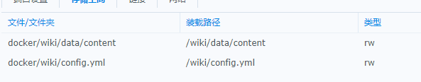

 **为什么是这个目录？**  首先，通过 `docker inspect wiki` 查看这个目录是容器本身存在的，并且可以挂载的，我们也可以挂载其他的目录，但是必须是/wiki/...这样的。

 **！！！不能直接挂载/wiki/data ！！！**

**下载证书**，创建后下载下来，解压拷贝到群晖的文件夹下

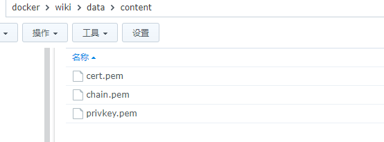

**修改配置文件**

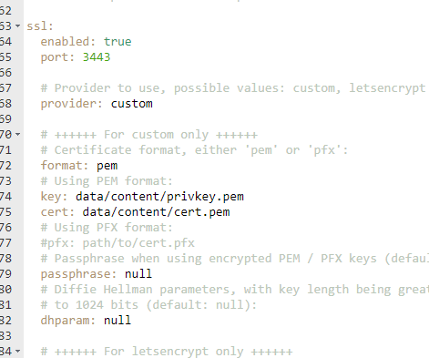

**启动容器**，使用 `https://你的ip或者域名:3443` 访问
