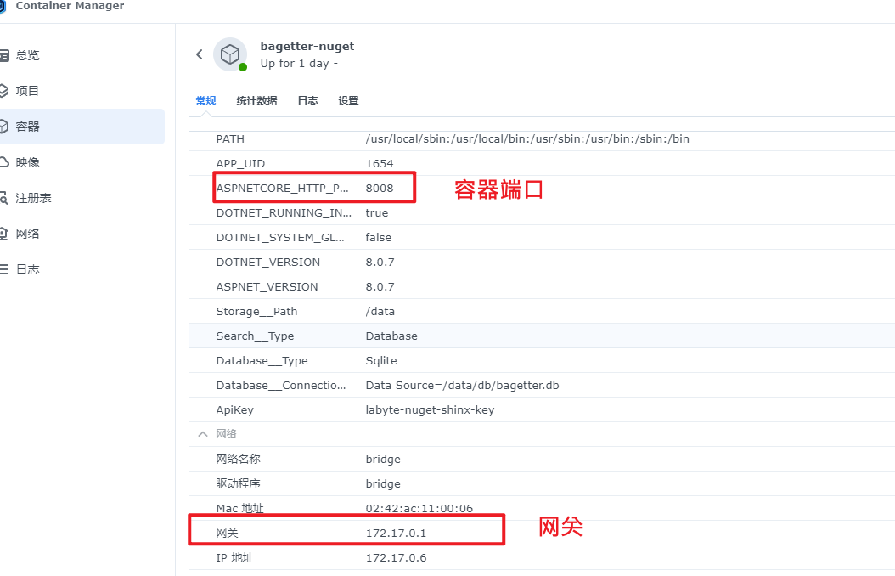
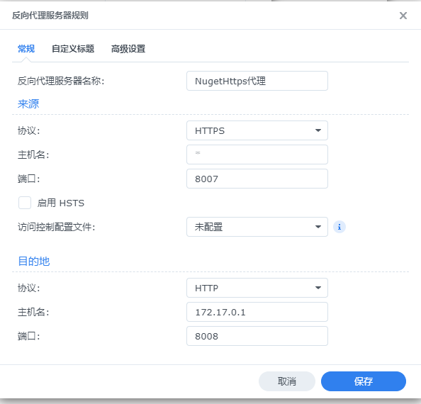

# 反向代理服务器

最好用的地方是群晖可以使用 `https` 访问，而当前很多地方都是强制要使用 `https` ，但是在 `docker` 中 部署的某些容易仅提供了 `http` 访问，此时可以通过反向代理解决。

以下描述将访问Nas的端口代理到容器中的端口

1. 点击DSM控制面板->登录门户->高级->反向代理服务器
2. 添加**反向代理服务器**按钮，弹出窗口，点击新增
3. 填写名称
4. 来源协议：选择 https
5. 来源主机名：*，代表说有来源
6. 来源端口：填写一个Nas未使用的端口
7. 目的地协议：http
8. 目的地主机名：这里填写容器所在的网关，一般为 `172.17.0.1`

9.  目的地端口：容器的端口，注意这里不是容器绑定的本机端口

配置完整截图

10.   自定义标题和高级设置默认，点击保存
11.   控制面板->外部访问->路由器配置中，新增->内置配置，选择反向代理（端口为8007）添加，即可访问