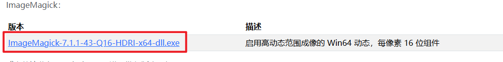

# 文件转换

## MarkitDown

[Markitdown](https://github.com/microsoft/markitdown?tab=readme-ov-file)


### 介绍

MarkItDown 是一款将各种文件转换为 Markdown 的实用程序（例如，用于索引、文本分析等）。它支持：

PDF
微软幻灯片软件
单词
Excel
图像（EXIF 元数据和 OCR）
音频（EXIF 元数据和语音转录）
HTML
基于文本的格式（CSV、JSON、XML）
ZIP 文件（迭代内容）

要安装 MarkItDown，请使用 pip: pip install markitdown。或者，您可以从源代码安装它：pip install -e .

### 使用总结

> world 转 md

- 能够很好的保留原文件的表格格式
- 图片转为base64占位符，也就是丢失了，不晓得是不是需要使用大模型来转


### 在Python中使用

Python中的基本用法：

```python
from markitdown import MarkItDown

md = MarkItDown()
result = md.convert("test.xlsx")
print(result.text_content)
# 输出文件
with open("output.md", "w") as file:
    file.write(result.text_content)
```


```python
from markitdown import MarkItDown
from openai import OpenAI

client = OpenAI(api_key= "你的api_key")
md = MarkItDown(llm_client=client, llm_model="gpt-4o-mini") # 你拥有的模型
result = md.convert("11.png")

# 打印
print(result.text_content)

# 输出文件
with open("output.md", "w") as file:
    file.write(result.text_content)

```

### 命令行使用

> 根据官网的说法命令行使用失败，提示 `markitdown` 不是命令

通过使用 `Python` 来调用解决

```bash
python.exe -m markitdown test.docx > test.md
```

## Pandoc

[Pandoc](https://github.com/jgm/pandoc/tree/3.6.1)

[下载](https://pandoc.org/installing.html)

### 介绍

各种格式的相互转换

### 使用总结

> world 转 md

- 表格的格式混乱
- 图片能够很好的提取出来

### 使用方式

安装好后，重新打开终端输入下面命令

`pandoc .\test.docx -o test.md --extract-media=./`


注意：如果不加上 `--extract-media=./` ，不提取图片


## Imagemagick

> 图片格式转换

[官网](https://imagemagick.org/script/download.php)

### 安装

- 按下图下载
  

- 安装过程中，确保勾选了 “Install legacy utilities (e.g., convert)” 选项。这个选项确保你可以使用命令行工具（如 convert）进行操作。
- 在安装时，还可以选择将 ImageMagick 添加到系统的 PATH 环境变量，这样你就可以在任何地方直接运行命令。
- 如果在安装时没有选择将 ImageMagick 添加到 PATH 环境变量，或者你不确定是否已经配置，可以手动添加它：路径一般为: `C:\Program Files\ImageMagick-x.x.x-Q16`，其中 x.x.x 是你安装的版本号

### 使用

注意：7版本和之前的版本有很大的不同，下面以最新7版本为例

转换webp图片为JPG图片(PowerShell)：

```shell
magick input.webp output.jpg
```
或

```shell
convert input.webp output.jpg
```

批量转换当前目录webp图片为JPG图片(PowerShell)：

```shell
magick mogrify -format JPEG *.webp
```

批量转换并且删除源文件(PowerShell)

```shell
foreach ($file in Get-ChildItem -Filter *.emf) {
    # 定义输出文件路径
    $outputPath = "$($file.DirectoryName)\$($file.BaseName).png"

    # 转换文件为 PNG 格式
    magick $file.FullName $outputPath

    # 删除原始 EMF 文件
    Remove-Item $file.FullName -Force
}

```

指定源文件路径批量转换：

```shell
magick mogrify -format JPEG -path /path/to/dir *.webp
```

在cmd中使用for批量转换(使用失败)

``` 
for /r %f in (*.emf) do magick "%f" "%~dpnf.png"

```