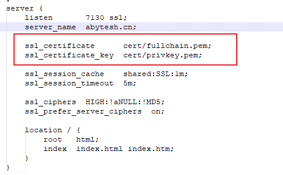

# Nginx

## 说明

一个证书对应一个域名，即可以所有的代理端口都可以使用同一个证书。

## 配置UnityWebGL服务器

根据目录名称，访问unity 内容时，定位到 指定位置，配置和文件目录结构对比


访问001的Unity项目（443端口省略）：[https://www.11training.com/unisim/001/?](http://192.168.0.199/unisim/001/?NjUyNTA5N2ZmYjU1OTU1ODNlYzA2NzE4KzErNjVlMTliYjgzNjU2N2YyMjRhMjZmNjRmKzY1ZTE5YjhiMzY1NjdmMjI0YTI2ZjY0ZQ==)参数


## 配置证书

- 配置文件：这里的7130需要在路由器上配置映射到主机，并且要重启，然后更改防火墙设置，开发7130的进出规则



- **证书的路径**：相对于配置文件的，这里的cert文件夹就是和配置文件同目录的，当然可以放在外边去；
- 重启生效。

## 命令行重启（勿用）

**Windows**:

> ❌不知道什么原因，使用命令行来进行重启，要么，就是启动了多个进程，要么就是关掉了进程没重启。
>
> 老老实实在任务管理器中 结束任务，再重启比较靠谱

```重启
chcp 65001 > nul
@echo off
cd /d %~dp0

nginx -s reload

echo Nginx 已重启
pause

```

关闭（有效）

```shell
@echo off
cd C:/TSIM/nginx-1.25.4
nginx -s stop
timeout /t 2 /nobreak >nul
pause

```


## 实现浏览器播放音视频

默认情况下，将音视频放在Nginx中，在浏览器上打开触发的是下载操作

修改配置文件（支持单格式）

```conf
server {
        listen       80;
        server_name  localhost;

        #charset koi8-r;

        #access_log  logs/host.access.log  main;

        location / {
            root   html;
			# autoindex off; # 好像不能写这个
			expires 30d;
			add_header Content-Type audio/wav; # 这里配置支持wav文件，其他格式相应调整
			add_header Cache-Control "public";
            index  index.html index.htm;
        }
}
```

修改配置文件（支持多格式）

```conf
server {
  listen       80;
        server_name  localhost;

        #charset koi8-r;

        #access_log  logs/host.access.log  main;

        location / {
            root   html;
			# autoindex off;
			expires 30d;
			# add_header Content-Type audio/wav; # 这里配置支持wav文件，其他格式相应调整
			# add_header Cache-Control "public";
			
			types {
				# 添加音频MIME类型
				audio/mpeg mp3;
				audio/ogg ogg;
				audio/wav wav;
				audio/x-aac aac;
				audio/x-ms-wma wma;
				audio/webm webm;
			}

			# 设置默认类型为octet-stream可作为通用后备
			default_type application/octet-stream;		
            index  index.html index.htm;
        }      
}
```