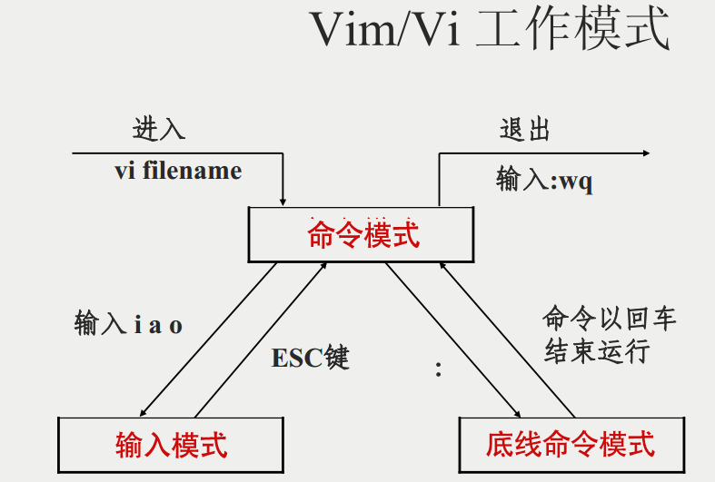

<style>
.table-container {
    display: flex;
    justify-content: center;
    width: 100%;
}

.excel-table {
    width: 100%;
    border-collapse: collapse;
    font-family: Arial, sans-serif;
    font-size: 15px; /* 设置字体大小 */
    table-layout: fixed; /* 固定表格布局 */
}

.excel-table th, .excel-table td {
    border: 1px solid #d0d7de;
    padding: 12px;
    text-align: left;
    vertical-align: top; 
}

.excel-table th {
    background-color: #f0f3f5;
    font-weight: bold;
}

.key-cell {
    background-color: #df7400;
}

/* .excel-table tr:nth-child(even) {
    background-color: #f9f9f9;
} */
/* 禁用隔行背景色不同的功能 */
.excel-table tr:nth-child(even), table tr:nth-child(odd) {
    background-color: transparent; /* 确保所有行背景色一致 */
}

.excel-table tr:hover {
    background-color: inherit;
}


.bold-first-column {
    font-weight: bold;
}
.excel-table th:nth-child(1), .excel-table td:nth-child(1) {
    /* width: 30%; */
    width:60px;
 
}

.excel-table th:nth-child(2), .excel-table td:nth-child(2) {
    width: 25%;
}
.excel-table th:nth-child(3), .excel-table td:nth-child(3) {
    width:80px;
}

.excel-table th:nth-child(4), .excel-table td:nth-child(4) {
    width: 75%;
}
</style>


# Vim


## 安装

### Windows 安装


通过下载执行文件 安装 [下载地址](https://www.vim.org/download.php)

下载后添加环境变量，即可使用 `vim`


### MacOS

```shell
brew install vim
```


## 快速使用

### Vim 的基本概念
Vim 是一种强大的文本编辑器，以其高效的编辑功能而著名。它有三种主要模式：

- **命令模式**：这是默认模式，用于导航和执行命令。
- **插入模式**：用于输入文本。
- **末行模式**：用于执行复杂命令。


### 操作指令
在终端中输入 vim，然后回车。你会看到一个新的 Vim 窗口。


<div class="table-container">
    <table class="excel-table" id="example-table">
        <thead>
            <tr>
                <th>模式</th>
                <th>类型</th>
                <th>命令</th>
                <th>说明</th>
            </tr>
        </thead>
        <tbody>
            <tr>
                <td class="bold-first-column" rowspan=12>命令模式</td>
                <td rowspan=4>移动光标</td>
                <td><code>h</td>
                <td>向左移动光标</td>
            </tr>
             <tr>
                <td><code>j</td>
                <td>向下移动光标</td>
            </tr>
            <tr>
                <td><code>k</td>
                <td>向上移动光标</td>
            </tr>
            <tr>
                <td><code>l</td>
                <td>向右移动光标</td>
            </tr>           
             <tr>
                <td rowspan="2">删除文本</td>
                <td><code>x</td>
                <td>删除光标所在的字符</td>
            </tr>
            <tr>
                <td><code>dd</td>
                <td>删除整行</td>
            </tr>
             <tr>
                <td rowspan="2">撤销和重做</td>
                <td><code>u</td>
                <td>撤销上一个操作</td>
            </tr>
            <tr>
                <td><code>Ctrl + r</td>
                <td>重做上一个操作</td>
            </tr>
             <tr>
                <td rowspan=3>进入插入模式</td>
                <td><code>i</td>
                <td>在光标前插入，进入插入模式</td>
            </tr>
             <tr>
                <td><code>a</td>
                <td>在光标后插入，进入插入模式</td>
            </tr>
             <tr>
                <td class="key-cell"><code>o</td>
                <td class="key-cell">在当前行下方打开新行并插入，进入插入模式</td>
            </tr>   
             <tr>
                <td >进入末行模式</td>
                <td class="key-cell"><code>:</td>
                <td class="key-cell">进入末行模式，并且底线输入里面显示 <code>:</code></td>
            </tr>         
              <tr>
                <td class="bold-first-column" rowspan="1">插入模式</td>
                <td>返回命令模式</td>
                <td><code>Esc</td>
                <td>返回命令模式。<br>插入模式下和普通的文本编辑一样，但是不能使用<b>Ctr + z</b> 等进行撤销，可退回到命令模式使用相关命令</td>
            </tr>
             <tr>
                <td class="bold-first-column" rowspan="6">末行模式</td>
               <td>返回命令模式</td>
                <td><code>Esc</td>
                <td>返回命令模式，注意不是退出Vim</td>
            </tr>
            <tr>
                <td>保存文件</td>
                <td><code>:w</td>
                <td>按下 <code>enter</code> 键，保存当前更改并返回命令模式</td>
            </tr>
             <tr>
                <td>另存为</td>
                <td><code>:w 文件名</td>
                <td>按下 <code>enter</code> 键，另存为指定文件名，并返回命令模式</td>
            </tr>
             <tr>
                <td>退出Vim</td>
                <td><code>:q</td>
                <td>按下 <code>enter</code> 键，退出Vim，注意如果更改了会提示执行保存操作</td>
            </tr>
             <tr>
                <td>强制退出Vim</td>
                <td><code>:q!</td>
                <td>按下 <code>enter</code> 键，强制退出</td>
            </tr>
             <tr>
                <td>保存并退出Vim</td>
                <td class="key-cell"><code>:wq</td>
                <td class="key-cell">按下 <code>enter</code> 键，保存并退出Vim <b>常用</b></td>
            </tr>
        </tbody>
    </table>
</div>


##  什么是 vim？

Vim是从 vi 发展出来的一个文本编辑器。代码补完、编译及错误跳转等方便编程的功能特别丰富，在程序员中被广泛使用。

简单的来说， vi 是老式的字处理器，不过功能已经很齐全了，但是还是有可以进步的地方。 vim 则可以说是程序开发者的一项很好用的工具。

连 vim 的官方网站 ([http://www.vim.org](http://www.vim.org/)) 自己也说 vim 是一个程序开发工具而不是文字处理软件。

vim 键盘图：


## vim 的使用

基本上 vi/vim 共分为三种模式，分别是**命令模式（Command mode）**，**输入模式（Insert mode）**和**底线命令模式（Last line mode）**。 这三种模式的作用分别是：

### 命令模式：

用户刚刚启动 vi/vim，便进入了命令模式。

此状态下敲击键盘动作会被Vim识别为命令，而非输入字符。比如我们此时按下i，并不会输入一个字符，i被当作了一个命令。

以下是常用的几个命令：

- **i** 切换到输入模式，以输入字符。
- **x** 删除当前光标所在处的字符。
- **:** 切换到底线命令模式，以在最底一行输入命令。

若想要编辑文本：启动Vim，进入了命令模式，按下i，切换到输入模式。

命令模式只有一些最基本的命令，因此仍要依靠底线命令模式输入更多命令。

### 输入模式

在命令模式下按下i就进入了输入模式。

在输入模式中，可以使用以下按键：

- **字符按键以及Shift组合**，输入字符
- **ENTER**，回车键，换行
- **BACK SPACE**，退格键，删除光标前一个字符
- **DEL**，删除键，删除光标后一个字符
- **方向键**，在文本中移动光标
- **HOME**/**END**，移动光标到行首/行尾
- **Page Up**/**Page Down**，上/下翻页
- **Insert**，切换光标为输入/替换模式，光标将变成竖线/下划线
- **ESC**，退出输入模式，切换到命令模式

### 底线命令模式

在命令模式下按下:（英文冒号）就进入了底线命令模式。

底线命令模式可以输入单个或多个字符的命令，可用的命令非常多。

在底线命令模式中，基本的命令有（已经省略了冒号）：

- q 退出程序
- w 保存文件

按ESC键可随时退出底线命令模式。

简单的说，我们可以将这三个模式想成底下的图标来表示：



## vim 使用实例

### 使用 vi/vim 进入一般模式
如果你想要使用 vi 来建立一个名为 runoob.txt 的文件时，你可以这样做：

``` bash
vim runoob.txt

```

直接输入 **vi 文件名** 就能够进入 vi 的一般模式了。请注意，记得 vi 后面一定要加文件名，不管该文件存在与否！


### 按下 i 进入输入模式(也称为编辑模式)，开始编辑文字

在一般模式之中，只要按下 i, o, a 等字符就可以进入输入模式了！

在编辑模式当中，你可以发现在左下角状态栏中会出现 –INSERT- 的字样，那就是可以输入任意字符的提示。

这个时候，键盘上除了 Esc 这个按键之外，其他的按键都可以视作为一般的输入按钮了，所以你可以进行任何的编辑。


### 按下 ESC 按钮回到一般模式

好了，假设我已经按照上面的样式给他编辑完毕了，那么应该要如何退出呢？是的！没错！就是给他按下 Esc 这个按钮即可！马上你就会发现画面左下角的 – INSERT – 不见了！

### 在一般模式中按下 :wq 储存后离开 vi

OK，我们要存档了，存盘并离开的指令很简单，输入 :wq 即可保存离开！


OK! 这样我们就成功创建了一个 runoob.txt 的文件。