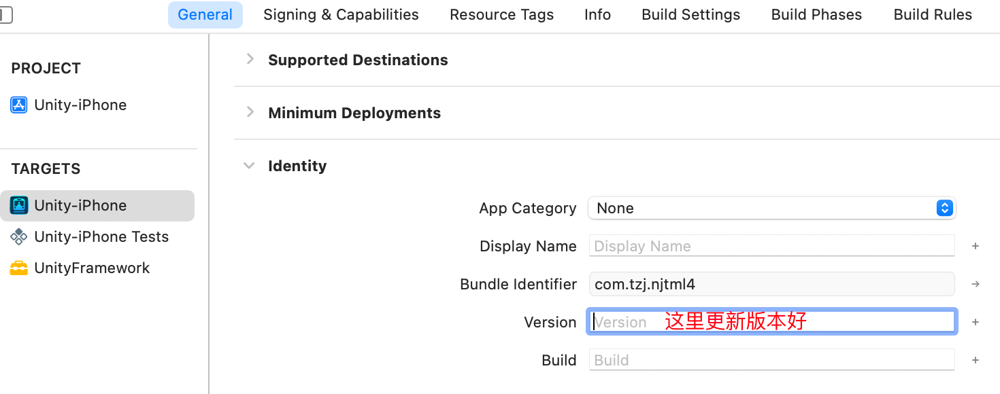
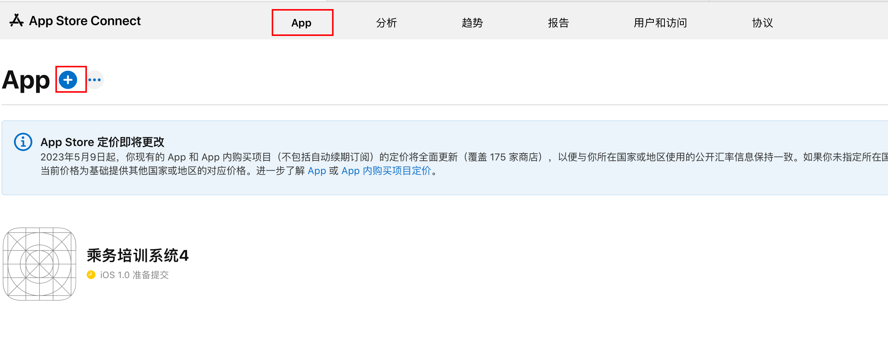
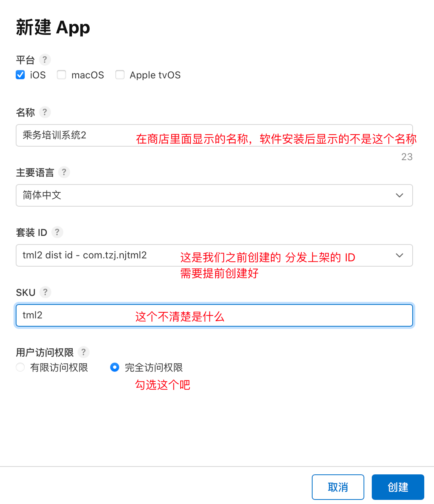
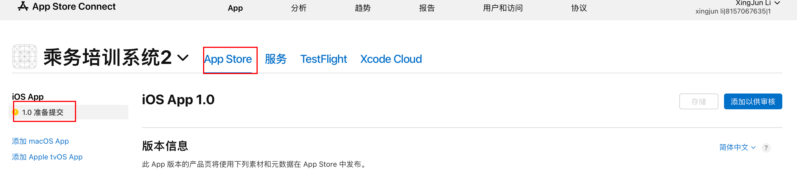

# 发布 IOS 平台

[Unity官方文档 - iOS 构建过程详解](https://docs.unity.cn/cn/2021.1/Manual/iphone-BuildProcess.html)

## 上架说明

1. 注册一个苹果开发者账号，可以个人注册，或者公司注册，公司比较复杂，个人比较简单，个人的年费为688

2. 需要一个Mac，主要用于申请一些证书和使用Xcode软件（上架必备）

3. 请求证书，以及制作配置文件

3. Unity Build IOS, 此过程在 windows上和mac上都可以进行，结果是得到一个 Xcode项目工程

4. 在 mac 上使用xcode 打开 上一步的项目设置分发

5. 测试分发：发布测试版本，就是不用上架审核，但是有限制

6. 上架分发，需要审核，终极目标。

## 苹果开发者账号

### 注册

首先需要开发者账号，且按年付费，具体注册流程如下：

1. 手机下载 developer app 进行注册申请，在手机上下载app安装

1. 注意填写信息时，完全按照身份证上的填写，按照英文的格式填写，最好就是找个已经注册好的看下格式来填写（我还是失败了，最后是人工客服完成的，使用电话的方式，她帮你解决；使用邮件会来回折腾，还是不行）

1. 客户帮你解决后，回到app,退出再登录，才能继续注册流程，选择个人注册，直到付完费用688，订阅后，马上取消订阅，避免到时候忘了（若上架的账号没有继续订阅，未安装过此app的无法在商店找到此应用，安装过的还是可以找打）

1. 此时，在app上显示一个灰色的注册，说是我即将收到一个邮件

1. 收到邮件，上传身份证，正反面都要上传，完成激活，此时应该才是注册完成（给的邮件说是带有照片的，我就只上传照片的，最后人工后，说两面都要上传）

1. 总结：注册很狗屎，每次错也不晓得哪里错，不停的试，最后都是人工处理。
 

>**注意事项（坑）**：
>
>1. 看siki学院的视频，以为付费完就注册完了，实际上还要上传身份证
>
>1. 我也的确收到邮件了，叫我上传身份证，但是我以为是之前注册失败，叫我上传，有几次失败就是叫上传，结果还是不行，所以我也没理
>
>1. 我就还在等其他的邮件，在网页端登录，叫我继续注册流程，很郁闷。

### 续费

订阅续费在手机上操作：设置/账号头像（名称）/订阅。即可看到已经停用的 **Apple Developer** ，点击续订即可。

网上（ChatGpt）说的在开发者官网上的会员详情里面续订不行，就没有续订按钮。

## 证书和配置文件

### Certificates

#### 通过钥匙串请求证书

1. 在 mac 上 打开钥匙串app
1. 钥匙串访问-》证书助理-》从证书颁发机构请求证书，保存到桌面上就可以了，后面在添加证书的时候使用
1. 注意这个证书，只能在本设备上使用，若其他电脑要使用这个证书，需要转换，方法待补充

#### 证书类型说明(Certificates)

1. Apple Development: 苹果所有终端的开发测试证书，包含 mac ios
2. Apple Distribution: 苹果所有终端的上架发布测试证书，包含 mac ios
3. iOS App Development：仅 ios 端的开发测试证书
4. iOS Distribution (App Store and Ad Hoc)：ios 端 的 上架商店证书
5. 其他同理

#### 添加证书

1. 开发者网站上，进行添加，若是测试

### Identifiers

### Profiles

配置文件添加后下载下来，备后面使用。

### Devices

作用，收集需要参见测试收集的UDID好，添加到这里，在打包测试的时候，只有添加了的设备才能安装测试
上架商店就不需要这个

获取设备UDID
通过下面的地址，在浏览器打开后，提示下载配置文件，然后安装，获取，发送给指定邮箱
https://www.pgyer.com/tools/udid

### Unity项目设置

1. 可以在window上或者mac上进行
2. 设置公司名称
3. 设置product name：上架审核时，这个名称必须 app store connect上创建的app 名称相同，否审核不过
4. 设置version：只能包含"数字"和“.”，其他都是非法的
5. 设置bundle identifier： 这个必须和后面创建的证书，app id 等相同
6. 设置 Target device: 根据你的实际需求来，如果仅在iphone上运行，那么就选 iPhone only，否则在上架审核时，需要你上传其他设备的分辨率截图，多出很多事情
7. 目标最小ios版本，这个根据情况设置

### Xcode项目设置

1. 将Unity工程打包成Xcode工程，可以在Windows打包，也可以在mac上打包（未知原因：在mac上无法打开工程，一致卡在fbx的导入）
2. 设置 `app icon` ,这个在上架的时候必须有
3. 设置 `bundle identifier` ,这个需要记住，在上架时，需要使用相同的id
4. 设置 `version` , 这个只能包含 “数字”、“.”, 如 “1.0.1”， 不能有字母或者空格，如果发布的是测试版本，版本号可以不变，如果是上架审核，版本号增加比较好，不增加不会报错
5. 设置好后，就可以打包了

### xcode构建ipa

1. 将windows上导出的 Xcode 的项目拷贝到Mac上
1. 双击Xcode文件，打开工程
1. 选中TARGETS 下的 第一个

#### Geneeral页面

1. 设置支持的设备，这里删除掉ipad的设备，如果这里支持iPad,上架审核的时候，会叫你整ipad的截图，多很多事情

1. 设置版本号，一种方式就是在unity里面设置好，另外一种方式就是在xcode 里面设置，如下图。

#### Signing&Capabilities 页面

1. 设置 bundle id,同unity 里面的 bundle ID 一致

2. 选择profile，这里如果是构建测试的就import 测试的 配置，就是前面下载下来的，同理选择分发上架类型的

#### info.plist 页面

1. 不加密设置，避免苹果强制使用https，导致http访问失败，设置 ATS 下的 allow ，设置为 true （这样就允许了http 未加密的方式访问网站，否则会报错

2. 设置不使用出口合规证明 (仅在上架审核的时候需要)  <key>ITSAppUsesNonExemptEncryption</key><false/>

#### Buildsettings 页面

- Eenable Bitcode : 设置为 false (打包的时候说是不赞成这个，不让通过)

#### 构建ipa 

- 测试版本，有两种方式：

    - 方式一：直接打包到手机上，点击菜单栏 product -> run: 直接将app安装到手机上，确保连接了手机
    - 方式二：构建 ipa 出来，通过分发平台来进行分发，注意ipa文件不能直接通过苹果手机安装，和安卓的apk 不同。操作方式通分发版本，只是使用证书不同

- 分发版本（上架商店），点击菜单栏product -> Archive: 发布ipa包中间不要勾选 ，bitcode ，否则比较慢

#### 构建失败汇总

- https://www.likecs.com/show-203846296.html
提示禁用 bitcode : Xcode 里面 选择 buildsettings, 搜索 bitcode,设置

### 分发测试包

将ipa通过蒲公英分发平台分发app
注意 ipa 文件不同于安卓的 apk ，不可以直接安装，必须借助于其他方式，软件或者分发平台，这里使用蒲公英分发平台
打开蒲公英分发平台网站
注册账号
上传ipa（名字最短那个文件） 

## 上架商店

该章节讲介绍目从开发到上架到苹果商店的过程，让用户能够自由下载使用。
上传的主要过程就是使用xcode将 ipa 上传到 app store connect 上，然后经过审核，上传到 商店。

### 流程说明

在app store connect 上创建app-》项目开发导出xcode工程-〉上传到connect上-》提交审核

### APP stroe connect 上创建app

1. 进入 app store connect平台创建app

2. 填写app信息，注意这里的名称和unity里面的名称最好一样，两个名称不同或者相差很大，导致审核不通过，这里写的名称是商店里软件显示的名称，unity里面的名称，是安装后在手机桌面显示的名称，提交后，苹果会提示里两个名称不一样，会导致用户找不到下载的软件。

3. 创建完成后显示

### 上传ipa

1. 在 xcode 里面调整好项目 Archive,然后上传
2. 上传完成后，在 App store connect 里的TestFlight 标签页查看，这个时候还不能在app store 页查看，因为还没提交

### 分发类型

https://support.apple.com/zh-cn/guide/deployment/depe1553f932/web

### 提交审核

1. 提交构建版本，多个版本的时候选择最新的版本

2. 除了可选填的，都是必须填写的

3. 隐私项填写完成后需要发布

4. 各种网址（技术网址，隐私网址），填写公司网址，或者个人网址即可

5. 截图这里，用一个手机截图后，ps处理成对应方便率的，上传失败会提示里，应该上传什么分辨率

6. 只要你有登录界面，那么再需要在testflight -》 测试信息中，勾选 “需要登录”，且输入 供登录审核的账号信息，及时你的设计是输入任何账号和密码，就可以，也需要勾选需求要登录，否者审核不过。 

使用非公开发方式发布：https://developer.apple.com/contact/request/unlisted-app/