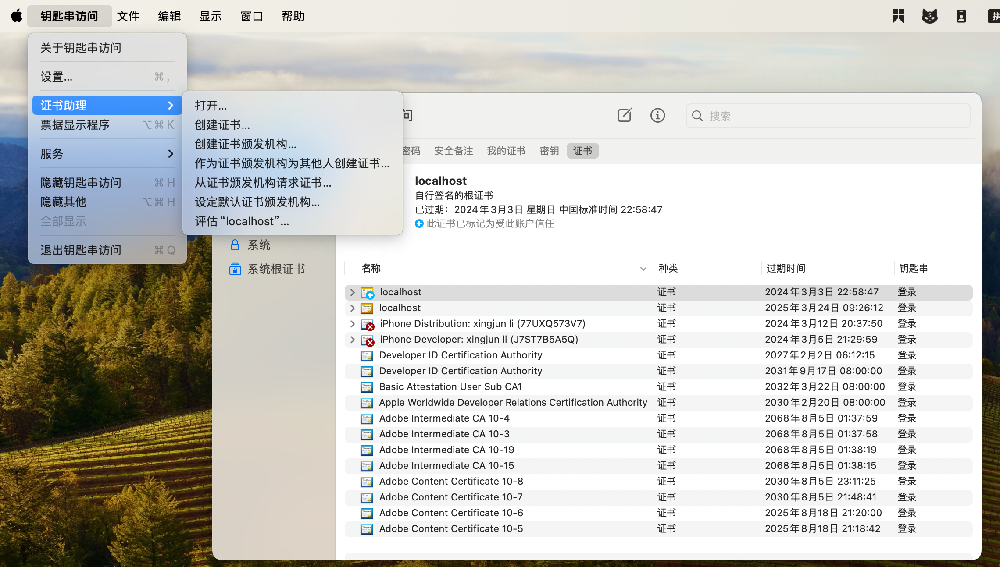
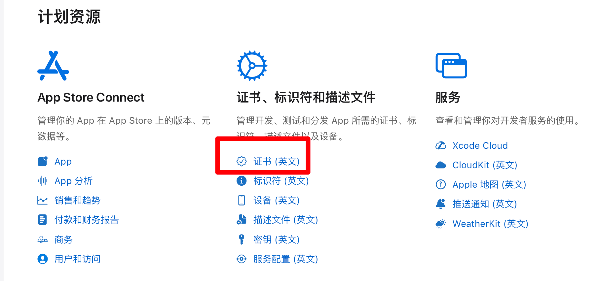
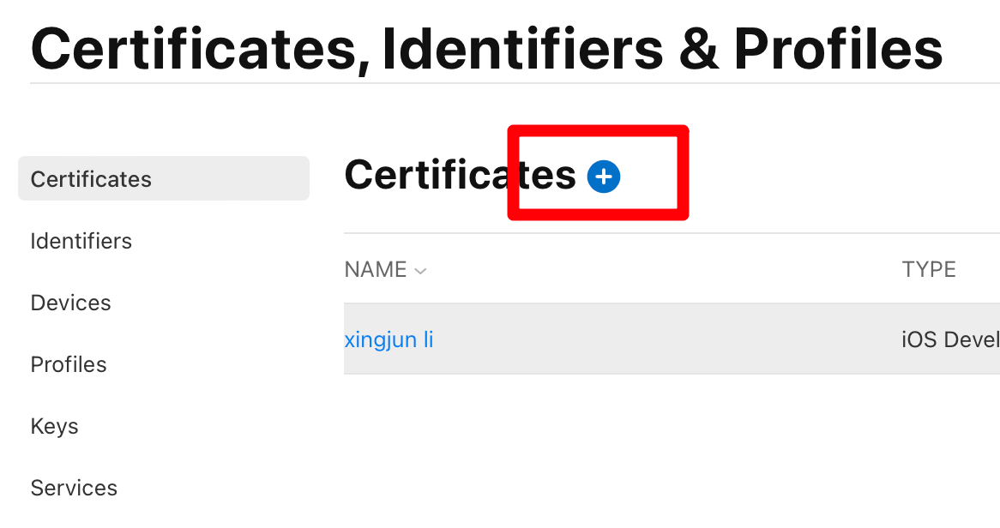
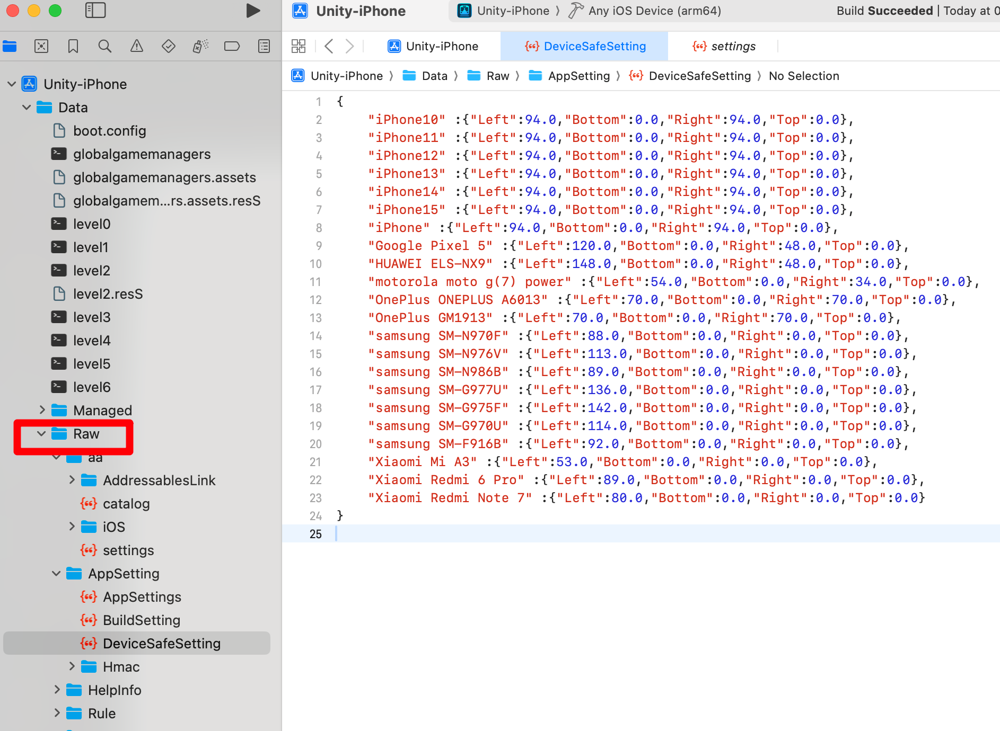

# 发布 IOS 平台

[Unity官方文档 - iOS 构建过程详解](https://docs.unity.cn/cn/2021.1/Manual/iphone-BuildProcess.html)

## 上架说明

1. 注册一个苹果开发者账号，可以个人注册，或者公司注册，公司比较复杂，个人比较简单，个人的年费为688

2. 需要一个Mac，主要用于申请一些证书和使用Xcode软件（上架必备）

3. 请求证书，以及制作配置文件

3. Unity Build IOS, 此过程在 windows上和mac上都可以进行，结果是得到一个 Xcode项目工程

4. 在 mac 上使用xcode 打开 上一步的项目设置分发

5. 测试分发：发布测试版本，就是不用上架审核，但是有限制

6. 上架分发，需要审核，终极目标。

## 苹果开发者账号

### 注册

首先需要开发者账号，且按年付费，具体注册流程如下：

1. 手机下载 developer app 进行注册申请，在手机上下载app安装

1. 注意填写信息时，完全按照身份证上的填写，按照英文的格式填写，最好就是找个已经注册好的看下格式来填写（我还是失败了，最后是人工客服完成的，使用电话的方式，她帮你解决；使用邮件会来回折腾，还是不行）

1. 客户帮你解决后，回到app,退出再登录，才能继续注册流程，选择个人注册，直到付完费用688，订阅后，马上取消订阅，避免到时候忘了（若上架的账号没有继续订阅，未安装过此app的无法在商店找到此应用，安装过的还是可以找打）

1. 此时，在app上显示一个灰色的注册，说是我即将收到一个邮件

1. 收到邮件，上传身份证，正反面都要上传，完成激活，此时应该才是注册完成（给的邮件说是带有照片的，我就只上传照片的，最后人工后，说两面都要上传）

1. 总结：注册很狗屎，每次错也不晓得哪里错，不停的试，最后都是人工处理。
 

>**注意事项（坑）**：
>
>1. 看siki学院的视频，以为付费完就注册完了，实际上还要上传身份证
>
>1. 我也的确收到邮件了，叫我上传身份证，但是我以为是之前注册失败，叫我上传，有几次失败就是叫上传，结果还是不行，所以我也没理
>
>1. 我就还在等其他的邮件，在网页端登录，叫我继续注册流程，很郁闷。

### 续费

订阅续费在手机上操作：设置/账号头像（名称）/订阅。即可看到已经停用的 **Apple Developer** ，点击续订即可。

网上（ChatGpt）说的在开发者官网上的会员详情里面续订不行，就没有续订按钮。

## 一、钥匙串创建证书

> 先创建好后面步骤要使用。

1. 在 mac 上 打开钥匙串app
   
2. 在屏幕左上角：钥匙串访问-》证书助理-》从证书颁发机构请求证书

    

3. 请求是：选择“存储到磁盘”，点击继续，保存即可

4. 注意这个证书，只能在本设备上使用，若其他电脑要使用这个证书，需要转换，方法待补充

## 二、证书

1. 登录开发者网站，进入[Developer-账户](https://developer.apple.com/account)。
2. 选择证书（注意：如果官网存在协议更新，需要重新查看协议，并同意后，才能出现证书的相关操作，否者证书下没有可选操作）。
    
3. 点击 `+`。
    
   
4. 在 `Software` 下选择证书类型，在 `Services` 下选择需要的服务，点击继续。
   -  `Apple Development`: 苹果所有终端的开发测试证书，包含 mac ios
   -  `Apple Distribution`: 苹果所有终端的上架发布测试证书，包含 mac ios
   -  `IOS App Development`：仅 ios 端的开发测试证书
   -  `IOS Distribution (App Store and Ad Hoc)`：ios 端 的 上架商店证书
   -  其他同理
5. 上传之前使用钥匙串申请的证书，点击继续。
6. 下载申请好的证书，然后**双击**后安装到钥匙串中。
7. 最后我们在证书列表里面可以看到当前生气的证书，注：钥匙串申请的证书可以创建测试证书和分发证书。
8. 证书会过期（当开发者账号订阅过期时，证书也会过期）

## 三、Identifiers（标识符）

1. 在证书、标识符和描述文件页面，左侧选择 Identifers ,点击 `Identifiers +`
2. 选择 `App IDs`
3. 选择 APP
4. Regieste an App ID, 输入 bundle identifier，这个需要记住，后面在Unity工程设置中需要使用
6. 设置 App Services，这个根据需要选择，比如推送、支付等，点击 continue
7. 点击 register，注册完成
8. 在 Identifers 列表里面可以看到当前注册的 App ID，注：这个 App ID 会在后面的描述文件中使用到

## 四、Devices（设备）

作用，收集需要参加测试手机的UDID号，添加到这里，在打包测试的时候，只有添加了的设备才能安装测试
上架商店就不需要这个

获取设备UDID
通过下面的地址，在浏览器打开后，提示下载配置文件，然后安装，获取，发送给指定邮箱
[https://www.pgyer.com/tools/udid](https://www.pgyer.com/tools/udid)

## 五、Profiles（描述文件）

1. 点击 + 。
2. Register a New Provisioning Profile：选择类型，根据当前的测试设备和类型（测试/分发）来选择。
3. Generate a Provisioning Profile：选择 App ID，Provisioning Profile Configuration 默认 选择 No,点击 continue. 
4. 选择一个证书，点击继续。
5. 选择测试的设备，点击继续。
6. 填写描述文件名称，点击生成。
7. 下载描述文件，备用。
8. 在 Profiles 列表里面可以看到当前生成的描述文件，注：这个描述文件会在后面的打包中使用到。

## 六、Unity项目设置

此处的设置可以在xcode里面修改，所以如果填写错误，不用再重新发布。

1. 可以在window上或者mac上进行
2. 设置公司名称
3. 设置product name：上架审核时，这个名称必须 app store connect上创建的app 名称相同，否审核不过
4. 设置version：只能包含"数字"和“.”，其他都是非法的，可以在xcode里面修改。
5. 设置bundle identifier： 这个必须和后面创建的证书时一致，可以在xcode里面修改。
6. 设置 Target device: 根据你的实际需求来，如果仅在iphone上运行，那么就选 iPhone only，否则在上架审核时，需要你上传其他设备的分辨率截图，多出很多事情，可以在xcode里面修改。
7. 目标最小ios版本，这个根据情况设置，可以在xcode里面修改。

## 七、Xcode项目设置

> version: 15.4

[官网文档](https://developer.apple.com/documentation/xcode/preparing-your-app-for-distribution)

1. 将Unity工程打包成Xcode工程，可以在Windows打包，也可以在mac上打包（未知原因：在mac上无法打开工程，一致卡在fbx的导入）
1. 双击Xcode文件，打开工程
1. 选中TARGETS 下的 第一个

### （1）Geneeral

1. `Suported Destinations`：设置支持的设备，这里删除掉ipad的设备，如果这里支持iPad,上架审核的时候，会叫你整ipad的截图，很多事情。
2. `Minimum Deployments`：设置最小的IOS版本。
3. `Identity`：主要设置下面两个选项
   - `Bundle Identifier`：证书里面填写的id，unity 中配置的一致。
   - `Version`：设置版本号，一种方式就是在unity里面设置好，另外一种方式就是在xcode 里面设置，这个只能包含 “数字”、“.”, 如 “1.0.1”， 不能有字母或者空格，如果发布的是测试版本，版本号可以不变，如果是上架审核，版本号增加比较好，不增加不会报错。

4. 设置 `app icon` ,这个在上架的时候必须有

### （2）Signing&Capabilities

Bundle Identifiers: 同创建证书时的一致

在 all 标签下，选择profile，这里如果是构建测试的就import 测试的 配置，就是前面下载下来的，同理选择分发上架类型的，如果找不到文件，重启下xcode.

  错误信息：

  

  解决(根据提示，xcode 11 及之后都要 apple distribution)：

  

### （3）Resources Tages

暂无配置

### （4）Info

**Custom iOS Target Properties:**

- `App Transport Securiy Settings`：
  - `Allow Arbitrary Loads`：`Yes`,（这样就允许了http 未加密的方式访问网站，否则会报错）

- 【新版xcode 没有这个】设置不使用出口合规证明 (仅在上架审核的时候需要)  `<key>ITSAppUsesNonExemptEncryption</key><false/>`

### （5）Build Settings

- User-Defined

  - Eenable Bitcode : 设置为 false (打包的时候说是不赞成这个，不让通过)

### （6）连接手机测试
- 需要手机和电脑连接，直接将app安装到手机上，适用于调试方式。
- 在xcode上点击菜单：Product->Run。

### （7）Xcode 操作

#### 菜单

1. 菜单：Produr/Run: 直接连接手机，安装到手机运行
1. 菜单：ProdurArechive: 归档，用于构建 ipa 文件、上架商店，通过Testflight 测试
3. 菜单：Window/Organizer: 打开归档的窗口 

#### Navigator

左侧导航栏。

1. Unity 中的 `StreamingAssets` 下的资源对应 `Data/Raw`，当需要修改这些资源时，不需要重新打包
    
2. 

## 八、分发APP

该章节说明怎么进行 Testflight 测试、第三方分发Ipa包测试、以及最终上架苹果商店。

ipa文件不能直接通过苹果手机安装，需要通过分发平台进行分发安装。

[Xcode 操作文档（英文）](https://developer.apple.com/documentation/xcode/distributing-your-app-for-beta-testing-and-releases)

[App Store Connect 帮助 - 中文文档： add app,](https://developer.apple.com/cn/help/app-store-connect/test-a-beta-version/testflight-overview/)

**各种运行方式**

    <table class="excel-table">
        <thead>
            <tr>
                <th>运行方式</th>
                <th>分发类型</th>
                <th>说明</th>
            </tr>
        </thead>
        <tbody>
            <tr>
                <td>手机直接连接</td>
                <td>无</td>
                <td>调试</td>
            </tr>
              <tr>
                <td>分发ipa</td>
                <td>app store connect/testfliht only/ad hoc 都可以，仅是在中途将ipa 文件导出保存下来</td>
                <td>构建之前要获取目标设备udid号进行注册 可以使用蒲公英云平台分发 不适合非注册人员安装 这种方式似乎不需要支付688费用，未确定</td>
            </tr>
              <tr>
                <td>testflight</td>
                <td>app store connect/testfliht only都可以</td>
                <td>要运行的手机首先要在构建之前手机设备udid号进行注册 可以使用蒲公英云平台分发</td>
            </tr>
             <tr>
                <td>app store</td>
                <td>app store connect</td>
                <td>正常用户使用</td>
            </tr>
        </tbody>
    </table>

### （1）创建您的应用程序的存档
要使用任何分发方法，请先创建应用程序的存档。存档是应用程序的构建，包括调试信息，Xcode存储在捆绑包中。Xcode根据您为分发选择的分发配置重新打包存档的内容。

在Xcode项目的主窗口中，从Scheme工具栏菜单中选择要构建的方案和运行目标。然后，选择 `Produnct>Archive` ，为您选择的设备类构建该方案中包含的目标，并创建出现在档案管理器中的存档。

您可以通过选择 `Window>Organizer` 直接打开档案管理器。如果您想确认您的应用程序已准备好在未提交的情况下提交到TestFlight或App Store，请选择您的存档，然后单击 `Validate App` 。Xcode将对应用程序执行有限的自动初始验证并提供反馈。
对于使用Mac Catalyst构建的Mac应用程序，请为iPad和Mac版本创建单独的存档。为Mac版本创建存档时，请选择“我的Mac”作为运行目标。

### （2）选择一种分发方法

您可以导出存档或将其上传到App Store Connect。如果您导出存档，您可以在App Store之外分发（通过第三方平台分发Ipa）。否则，将存档上传到App Store Connect，以通过TestFlight或App Store分发。

从Xcode的 **Organizer** 窗口中，在边栏中选择“存档”，然后单击“分发应用程序”。

选择以下选项之一，使用推荐的设置进行分发：

TestFlight & App Store

  通过TestFlight分发并提交到App Store的默认设置。使用此选项更新存档中内容的构建号，执行自动代码签名，并使用符号上传应用程序。

TestFlight Internal Only

  通过TestFlight分发的默认设置，并限制对团队的访问。使用此选项可防止应用程序的开发构建被提交到App Store。

Release Testing 发布测试

  默认设置是在发布前分发要测试的版本。使用此选项执行类似于App Store分发选项的自动代码签名，并导出以安装在您的团队在App Store Connect注册的设备上。这种分发方法不适用于为Mac构建的应用程序。

Enterprise（企业）

  分配给组织成员的默认设置。如果您是Apple Developer企业计划的一部分，请使用此选项。这种分发方法不适用于为Mac构建的应用程序。

Direct Distribution（直接分销）

  直接分发macOS应用程序的默认设置。使用此选项对开发人员ID应用程序进行公证，以便直接分发。这种分发方法仅适用于为Mac构建的应用程序。

Debugging 调试

  分发版本进行调试的默认设置。使用此选项导出版本，在您的团队在App Store Connect注册的设备上安装和调试。这使沙盒测试环境能够为一些支持它们的功能提供支持。

选择分发选项后，单击分发按钮。Xcode开始处理、打包和上传。单击末尾的链接以访问App Store Connect上应用程序的构建页面，或单击导出按钮以在本地访问资产。

> 笔记
> 在您首次将应用程序上传到App Store之前，请创建一个应用程序记录以在App Store Connect中注册您的应用程序。如果您还没有这样做，Xcode会要求您提> 供为您创建此记录所需的信息。有关更多信息，请参阅[创建应用程序记录](https://developer.apple.com/help/app-store-connect/create-an-app-record/add-a-new-app)。

### （3）创建自定义发行版
要开始自定义分发，允许您配置自己的设置，请单击自定义选项。

从以下分发方法中选择：

App Store Connect

  使用TestFlight或通过App Store进行分发。

Ad Hoc（临时）

  分发到您在App Store Connect中注册的有限数量的设备。有关分发到您注册的设备的更多信息，请参阅[将应用程序分发到注册设备](https://developer.apple.com/documentation/xcode/distributing-your-app-to-registered-devices)。

Enterprise（企业）

  如果您是Apple Developer Enterprise Program的一部分，并准备将应用程序发布给组织中的用户，请分发给您的组织成员。

Developer ID（开发人员ID）

  在App Store之外分发由苹果公证或使用开发人员ID签名的macOS应用程序。这种分发方法仅适用于为Mac构建的应用程序。

Development（开发）

  分发到您在App Store Connect中注册的有限数量的设备。有关分发到您注册的设备的更多信息，请参阅[将应用程序分发到注册设备](https://developer.apple.com/documentation/xcode/distributing-your-app-to-registered-devices)。

Copy App（复制应用程序）

  在没有代码签名的情况下分发macOS应用程序。这种分发方法仅适用于为Mac构建的应用程序。

如果您选择App Store Connect或Developer ID作为分发方法，您也会选择一个目标选项。您可以选择将构建版本上传到App Store，或将构建版本导出到本地以稍后上传。

在TestFlight或App Store上分发应用程序时，请选择如何管理符号和构建数字：

Strip Swift symbols 剥离Swift符号

  通过从Swift标准库中剥离符号来减小应用程序的大小。仅当您的项目嵌入了swift库时，此设置才可用。

Upload your app’s symbols 上传您的应用程序的符号

  允许苹果为您提供符号崩溃日志和其他诊断信息。符号日志将日志中的内存地址替换为人类可读的函数名和行号。这些符号在测试您的应用程序与苹果产品和服务的兼容性方面也很有用。

Manage version and build number 管理版本和构建号

  允许Xcode更新存档中所有内容的构建号。

TestFlight internal testing only 仅限TestFlight内部测试

  准备通过TestFlight分发应用程序，并限制对您团队的访问。使用此选项可防止应用程序的开发构建被提交到App Store。

在选择涉及代码签名的分发方法时，请选择代码签名方法。

选择“自动管理签名”允许Xcode为您管理签名。要手动对应用程序进行签名，您可以使用签名证书。有关共享签名证书的信息，请参阅将您的代码签名身份与Apple Developer Portal同步。

当使用Ad Hoc或Development选项进行自我分发打包时，请选择是启用还是禁用App Thinning并配置按需资源设置。有关应用程序稀薄和按需资源的更多信息，请参阅减少应用程序的大小和进行高级优化以进一步减少应用程序的大小。

### （4）分发测试版

要分发应用程序的测试版，以提供即将发布的版本的预览，请选择与您的测试资源一致的分发方法：

- 使用TestFlight将应用程序的测试版分发给内部和外部测试人员。TestFlight应用程序允许受邀用户安装、测试版测试、提供反馈并获取应用程序的更新。苹果为您分发测试版，您可以在App Store Connect中管理构建版本和用户。要了解更多信息，请参阅[TestFlight概述](https://developer.apple.com/cn/help/app-store-connect/test-a-beta-version/overview-of-testflight)。

  在 Xcode 上传后，在网站上查看状态，如下图

  

- 将测试版分发到开发人员帐户中的注册设备。仅当您可以保留部分有限的开发设备用于beta测试时，才选择此选项。要了解更多信息，请参阅[将应用程序分发到注册设备](https://developer.apple.com/documentation/xcode/distributing-your-app-to-registered-devices)。

- 对于macOS应用程序，在通过App Store分发应用程序之前，先将经过苹果公证的构建版本分发给测试人员。要了解更多信息，请参阅[在分发前对macOS软件进行公证](https://developer.apple.com/documentation/xcode/distributing-your-app-to-registered-devices)。

### （5）在App Store上发布

测试最终版本后，将其提交到App Review，然后在App Store上提供。有关发布过程的更多信息，请参阅[发布应用程序的概述](https://developer.apple.com/cn/help/app-store-connect/manage-your-apps-availability/overview-of-publishing-your-app)。

转到App Review查看App Store和人机界面指南。有关特定平台的指导，请参阅[立即提交您的应用程序](https://developer.apple.com/cn/app-store/submitting)。

您可能需要在App Store Connect中输入其他信息，然后才能将应用程序提交到App Review。在您的应用程序上传或发布后，您无法更改其中一些元数据，因此仔细选择设置很重要。有关此元数据的更多信息，请转到App Store Connect帮助中的必需、可本地化和可编辑属性。

如果您使用TestFlight分发测试版，并输入了App Store发布所需的其他信息，只需将App Store Connect中显示的最后一个版本提交到App Review即可。
App Store Connect的屏幕截图，显示版本信息和提交以供审核。

如果您没有使用TestFlight分发最终构建版本，请准备应用程序分发并创建应用程序的存档。在继续之前验证存档并修复任何验证错误。然后，将其上传到App Store Connect，并等待它通过App Store Connect验证测试。

要将构建提交到App Review，请转到Submit for Review。

### （6）注意事项

有关注意事项可参考：[官方文档](https://developer.apple.com/cn/help/app-store-connect/reference/app-information)

1. [添加App](https://developer.apple.com/cn/help/app-store-connect/create-an-app-record/add-a-new-app)时，填写app名称和unity里面的名称最好一样，两个名称不同或者相差很大，导致审核不通过，这里写的名称是商店里软件显示的名称，unity里面的名称，是安装后在手机桌面显示的名称，提交后，苹果会提示里两个名称不一样，会导致用户找不到下载的软件。

  

2. 上传完成后，在 App store connect 里的TestFlight 标签页查看，这个时候还不能在app store 页查看，因为还没提交

3. 在xcode 上传后，并不能立即进行testflight 测试，一般要显示“已批准/通知测试人员”才可以开始测试。
   

4. 管理 APP ID 不能参加测试，也就是开发者账户不能参加测试。

1. 提交构建版本，多个版本的时候选择最新的版本

2. 除了可选填的，都是必须填写的

3. 隐审核流程：私项填写完成后需要 **发布**

4. 审核流程：各种网址（技术网址，隐私网址），填写公司网址，或者个人网址即可

5. [构建版本大小要求](https://developer.apple.com/cn/help/app-store-connect/reference/maximum-build-file-sizes)

6. 审核流程：[截屏规范](https://developer.apple.com/cn/help/app-store-connect/reference/screenshot-specifications)，用一个手机截图后，ps处理成对应分辨率的，上传失败会提示里，应该上传什么分辨率

7. 审核流程：只要你有登录界面，那么需要在testflight -》 测试信息中，勾选 “需要登录”，且输入登录审核的账号信息，即使输入任何账号和密码都可以，也需要勾选需求要登录，然后明确的输入一个账号和密码，否者审核不过。 

若是企业定制版本的软件，不需要上架商店，而是希望通过内部分发的方式，参考：[分发类型](https://support.apple.com/zh-cn/guide/deployment/depe1553f932/web)

[使用非公开发方式发布](https://developer.apple.com/contact/request/unlisted-app/)

### （7）问题汇总

1. 提示邀请已被撤销或无效,请要求开发者发出新的邀请。
   
   > 看是否使用的是管理 APP ID。

2. 此Beta 版本现在不接受任何新的测试人员
   
   > 应该是该APP还未被批准使用TestFlight测试，首次提交一般上传后需要1天（头天下午上传，第二天10点可以）左右的时间，会收到一封邮件提示已批准使用TestFlight测试，然后可以发送邀请链接了，后面提交很快，基本上提交等待几分钟就可以测试。

3. 构建时提示禁用 bitcode
  
    > [参考文章](https://www.likecs.com/show-203846296.html):在 Xcode中 选择 buildsettings, 搜索 bitcode,设置为 `false`。

## 九、蒲公英分发

ipa文件不能直接通过苹果手机安装，需要通过分发平台进行分发安装。

1. Product->Archive，等待编译完成
2. 编译完成后，Xcode会自动打开“Organizer”窗口
3. 你可以选择导出的配置文件和导出选项，然后点击“Export”按钮，选择“Save for Ad Hoc Deployment”或“Save for Enterprise Deployment”
4. 最后选择保存路径和文件名，完成IPA文件的生成。
5. 将ipa通过[蒲公英分发平台](https://www.pgyer.com/)分发app
6. 打开蒲公英分发平台网站，注册账号上传ipa（名字最短那个文件） 分发app

若提示需要钥匙串的密码，输入开机密码。并非用户账户密码。

