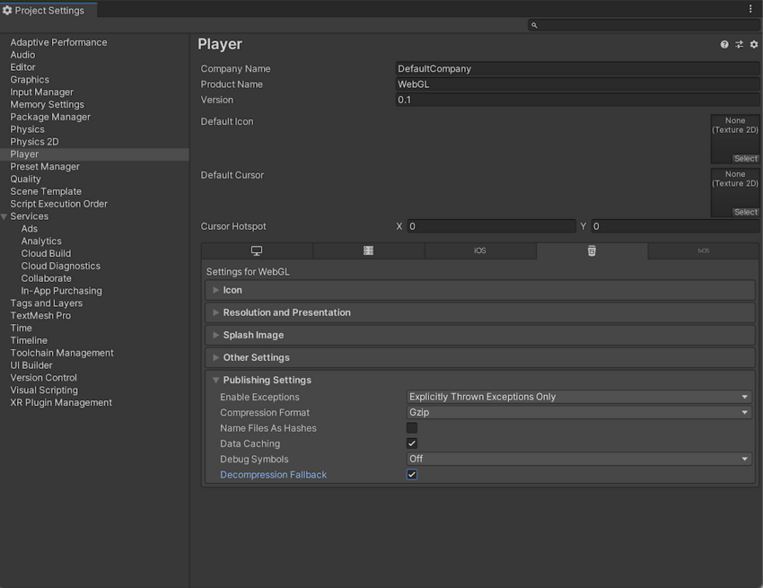
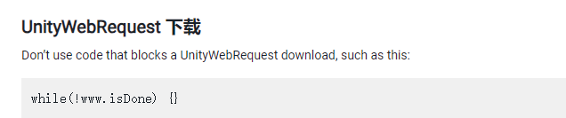
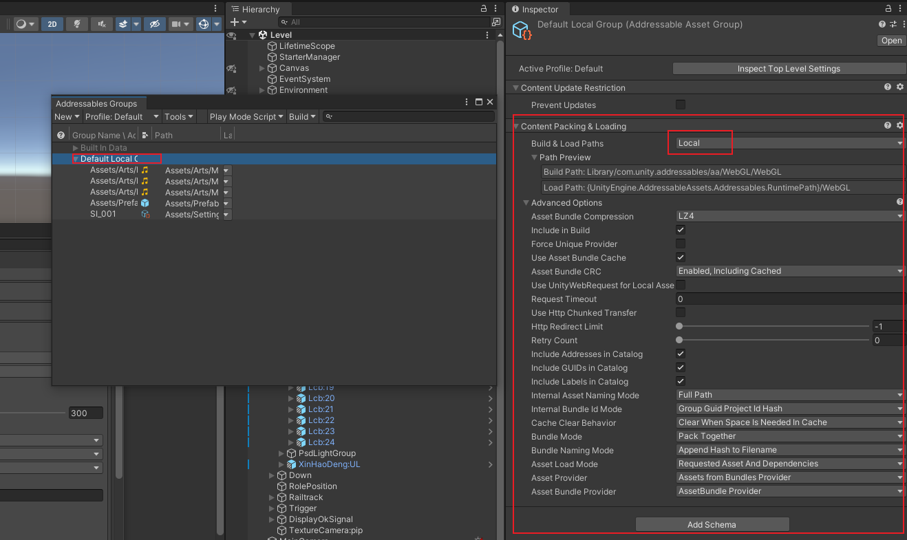
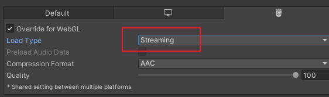

# 发布 WebGL 平台

## 模板

## 压缩

**参考：**

[官网压缩设置手册](https://docs.unity3d.com/cn/current/Manual/webgl-deploying.html)

[服务器配置手册](https://docs.unity3d.com/cn/current/Manual/webgl-server-configuration-code-samples.html)

### 压缩格式

从 WebGL Player Settings 窗口（菜单：**Edit** > **Project Settings** >  **Player** ），然后选择 **WebGL** 并展开 **Publishing Settings** 部分）,一般选压缩格式 ` Gzip` ：



| 压缩方法 | 描述                                                                                                                                                             |
| -------- | ---------------------------------------------------------------------------------------------------------------------------------------------------------------- |
| gzip     | 这是默认选项。gzip 文件比 Brotli 文件更大，但构建速度更快，且所有浏览器都基于 HTTP 和 HTTPS 实现此格式的本机支持。                                               |
| Brotli   | Brotli 压缩提供最佳压缩比。Brotli 压缩文件小于 gzip，但需要更长的压缩时间，因此会增加发布版本的迭代时间。Chrome 和 Firefox 仅原生支持基于 HTTPS 的 Brotli 压缩。 |
| Disabled | 禁用压缩。如果要在后期处理脚本中实现您自己的压缩，请使用此选项。如果计划在托管服务器上使用静态压缩，也应该使用此选项。                                           |

有关浏览器对所选压缩方法的支持的更多信息，请参阅有关 [WebGL 浏览器兼容性](https://docs.unity3d.com/cn/current/Manual/webgl-browsercompatibility.html)的文档。


### **Web 服务器配置**

 **[参考](https://docs.unity3d.com/cn/current/Manual/webgl-server-configuration-code-samples.html)**

文档上提供了服务器配置示例，但是未设置成功，还是提示要配置gzip


### 解压缩回退

解压缩回退选项使 Unity 能够自动将 JavaScript 解压缩器嵌入到您的构建中。该解压缩器与您选择的压缩方法相对应，它在浏览器无法解压缩内容时执行解压缩。

#### Enable decompression fallback

从 **Player Settings** 窗口启用解压缩回退（菜单：**Edit** > **Project Settings** >  **Player** ，然后选择 **WebGL** 并展开 **Publishing Settings** 部分）：

如果启用解压缩回退，Unity 会向构建文件添加一个 `.unityweb` 扩展名。 如果不熟悉服务器配置，或者无法使用服务器配置，应考虑使用  **Decompression Fallback** 。

 **Note** : Enabling decompression fallback results in a large loader size and a less efficient loading scheme for the build files.

#### Disable decompression fallback

The **Decompression Fallback** option is disabled by default. Therefore, by default, build files include an extension that corresponds to the compression method you select.

有两种压缩方法可供选择：gzip 或 Brotli。有关更多信息，请参阅[压缩格式](https://docs.unity3d.com/cn/current/Manual/webgl-deploying.html#content_encoding_header)部分。

To enable browsers to natively decompress Unity build files while they’re downloading, you need to configure your web server to serve the compressed files with the appropriate HTTP headers. This is called native browser decompression. It’s faster than the JavaScript decompression fallback, which can reduce your application’s startup time.

原生浏览器解压缩的设置过程取决于 Web 服务器。有关代码示例，请参阅[服务器配置代码示例](https://docs.unity3d.com/cn/current/Manual/webgl-server-configuration-code-samples.html)。


### 内容编码标头

Content-Encoding 标头告诉浏览器 Unity 用于压缩文件的压缩类型。这样，浏览器可以原生解压缩文件。

将 Content-Encoding 响应标头设置为在 Player Settings 中选择的压缩方法。

| 压缩方法 | 文件扩展名 | 响应标头                   |
| -------- | ---------- | -------------------------- |
| gzip     | .gz        | `Content-Encoding: gzip` |
| Brotli   | .br        | `Content-Encoding: br`   |

WebAssembly 串流（更高级别的标头）

WebAssembly streaming allows the browser to compile the WebAssembly code while it’s still downloading the code. This significantly improves loading times.

为了进行 WebAssembly 串流编译，服务器需要返回 `application/wasm` MIME 类型的 WebAssembly 文件。 要使用 WebAssembly 串流，需要使用带 `Content-Type: application/wasm` 响应标头的 WebAssembly 文件。 Content-Type 标头告诉服务器内容是什么媒体类型。对于 WebAssembly 文件，该值应该设置为 `application/wasm`。

| 文件扩展名                | 响应标头                           |
| ------------------------- | ---------------------------------- |
| .wasm、.wasm.gz、.wasm.br | `Content-Type: application/wasm` |

 **Note** : WebAssembly streaming doesn’t work together with JavaScript decompression when the Decompression Fallback option is enabled. The downloaded WebAssembly file must first go through the JavaScript decompressor because the browser can’t stream it during download.

### 附加标头

If your file contains JavaScript, you should add the `application/javascript` Content-Type header. Some servers might include this automatically, while others don’t.

| 文件扩展名         | 响应标头                                 |
| ------------------ | ---------------------------------------- |
| .js、.js.gz、js.br | `Content-Type: application/javascript` |


## UnityWebRequest

[https://docs.unity3d.com/cn/current/Manual/webgl-networking.html](https://docs.unity3d.com/cn/current/Manual/webgl-networking.html)

**下面错误的使用方式**

❌错误使用：在 **pc** 端可以，但是在 **webgl** 端要阻塞。

```csharp
while(!wwww.isDone){}

```




## 报错汇总

⭕ **GrpcWebSocketBridge**：插件只能使用 `.net standard.21`

---

⭕ <span style="color:red;font-weight:bold;"> Uncaught RuntimeError: null function or function signature mismatch </span>

**原因：**： 

**Addressables** 打包未成功，出现的原因是莫名奇妙的少了 `ContentPachking$Loading` 这部分，需要点击 **`Add Schema`**添加

打包后需要在本地选择 Use Exsiting build 模式下测试是否加载成功。



---

⭕ <span style="color:red;font-weight:bold;">Cannot create FMOD::Sound instance for clip "  " (FMOD error: An error occured that wasn't supposed to.  Contact support. )</span> 

**使用场景：**对音频资源使用Addressables打包，然后通过AssetReference 的方式引用。

**解决方式**：(未解决) 相关的音频需要设置为流式加载。 **补充：已经设置为Streaming 又出现相同的问题。**




