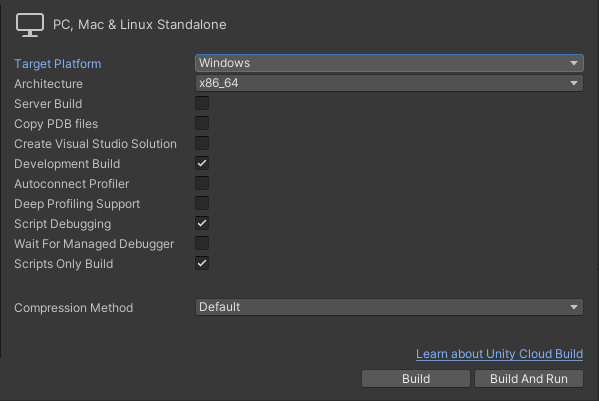
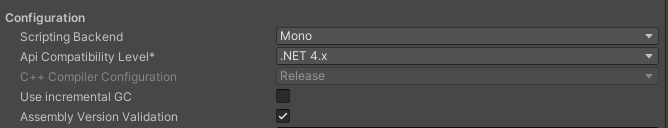
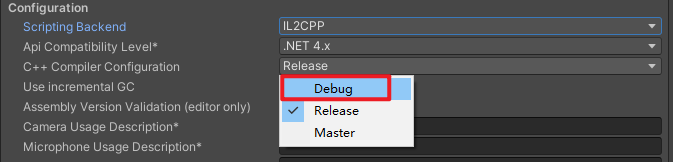

# 发布 Window 平台

## USB调试

Unity版本：`Unity2020.3.38`

**BuildSettings**

以Windows端为例

- `DevelopmentBUild`:勾选后激活下面的选项

- `ScriptDebugging`: 脚本调试，输入日志

- `ScirptsOnlyBuild`: 当你调试后想更新版本时，若只是更改了代码，那么勾选这个，并会出现两个选项 `patch` 和 `pathc and run` ,构建时相当于只更新代码那块，加快构建速度，在移动端，要取消 `strip unityEngine code`

**Playersettings**

- **Mono** 环境下，不用更改

    

- **IL2CPP** 环境下，需要切换成Debug，否则不能显示日志信息

    
