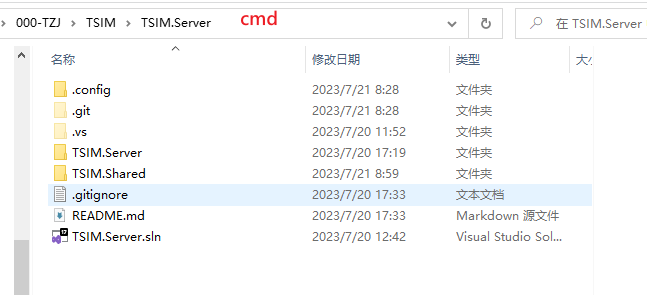
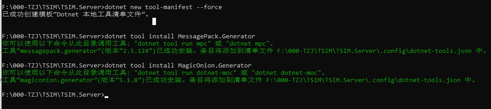
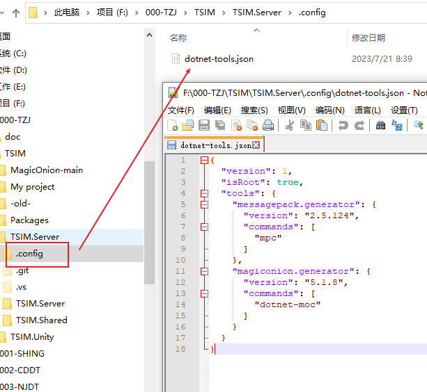
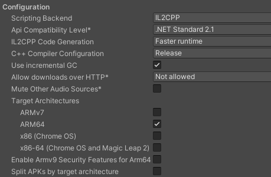
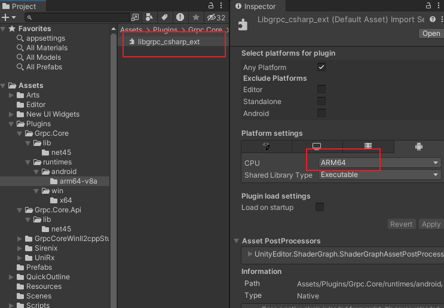

> 学习任何一个插件，最好的方式就是去仔细阅读它的官方文档，先原文（英语）阅读一遍，然后再阅读译文，一遍不够，再来一遍！！！

# MagicOnion

> 知识无国界，作者是一个日本大佬，非常崇拜，Unitask,MemoryPack 等都是它写的

官网：https://github.com/Cysharp/MagicOnion, 原为阅读和翻译阅读

我认为最合适的轻便服务器，提供RPC,实时通信，用在WPF unity上都不错，WPF或者.net的桌面端开发看官网文档就行了，下面主要记录Unity方面的开发


# Unity开发过程


## 项目说明

使用此框架实现一个 `CS` 架构的系统


1. 工程目录结构设计,项目文件夹结构如下，便于后期的插件注册

``` txt

- TSIM.Server //服务器解决方案
    TSIM.Server //服务器项目
    TSIM.Shared //共享接口库
+ TSIM.Unity //Unity项目

```

 **Server项目** 

1. 创建 AspNetCore.APP空项目(net7.0)

2. 在Nuget下载包：

- MagicOnion.Server

- Grpc.AspNetCore

3. 版本管理：gitee,国内最大的开源版本库（适合非游戏类型的工程管理）

 **Shared项目** 

1. 创建 库项目 (netstandard2.0)，2.1 grpc没有支持

2. 在Nuget下载包：

- MagicOnion.Abstractions

- MagicOnion.Shared

- MessagePack.UnityShims：这个是对Unity的支持，提供了Unity里面的结构类型

 **Unity项目** 

1. Unity 版本： Unity2022

2. 版本管理：svn,(群晖上自建的SVN服务器)


## 项目搭建过程

### MagicOnion UnityPackge 包使用

该包在发布版本下载UnityPackge ，导入到Unity项目中

https://github.com/cysharp/MagicOnion/releases


### Grpc library for Unity client

Grpc 在 netstandard2.0 时候，提供了对Unity的支持，但是当出现跨平台的 .net 之后，就移除对Unity的支持了，MagicOnion的作者正在实现这部分的支持。

目前的处理方式，通过MagicOnion 案例中的 Unity项目，复制拷贝过来

 **问题** 

- 开发环境：Mac M1，在Window上正常，mac上不正常

- Unity版本：2023.1.4f1c1 silicon

- 错误信息

```
DllNotFoundException: grpc_csharp_ext assembly:<unknown assembly> type:<unknown type> member:(null)
```
 **解决过程** 

- 相关问题的连接

https://github.com/grpc/grpc/issues/30068

https://github.com/grpc/grpc/issues/25223

- 简要说明：就是grpc 不支持 unity 了，他们觉得维护成本很高，不再支持， unity intel 版本不存在问题，但是 silicon 版本可能缺少本机库的支持

- nugetforunity 不是官方出品，即使使用这个插件将nuget里面的包倒入unity ，可能存在问题。

- 最好的状态：就是magiconion作者大佬，实现支持，期待中


### MessagePack

下载地址

https://github.com/neuecc/MessagePack-CSharp#unity

### MagicOnion code generator (for IL2CPP)

MagicOnion 默认仅支持UnityEditor 或者 非 IL2CPP，也就是不能发布：windows-il2cpp、 安卓、苹果这些版本，显然是不行的。如果要支持还需要做其他的工作，将我们的Shared项目生产客户端并且注册到Unity项目，生成客户端们这里分别对 MessagePack 和 MagicOnion 都要操作

 **准备工作** 

1. 安装 dotnetcore3 runtime,这里下载3.1就可以了

2. 使用vs 非预览版，在使用vs2022 preview版本时，出现错误，换成非预览版正常

 **操作过程** 

1. 安装 **MessagePack.Generator**

安装分全局安装和本地安装。

- 全局安装

``` shell
dotnet tool install --global MessagePack.Generator
```

- 本地安装，在服务器解决方案的根目录，打开cmd



- 执行下面的命令

``` cmd

dotnet new tool-manifest 
dotnet tool install MessagePack.Generator
dotnet tool install MagicOnion.Generator

```
- 若提示如下错误

```
C:\Users\ABYTE\AppData\Local\Temp\8e12065c-69cb-4bf3-92cf-7fbfc1dd389c\restore.csproj : error NU1301: 无法加载源 https://dot
net.myget.org/F/roslyn/api/v3/index.json 的服务索引。
无法还原工具包。
工具“messagepack.generator”安装失败。此故障可能由以下原因导致:

* 你尝试安装预览版，但未使用 --version 选项来指定该版本。
* 已找到具有此名称的包，但是它不是 .NET 工具。
* 无法访问所需的 NuGet 源，这可能是由于 Internet 连接问题导致。
* 工具名称输入错误。

有关更多原因(包括强制包命名)，请访问 https://aka.ms/failure-installing-tool
```
- 提示我们需要指定一个版本，通过 `dotnet tool search 包名` 来搜索包

``` cmd
F:\000-TZJ\TSIM\MagicOnion-main\samples\ChatApp>dotnet tool search messagepack.generator
包 ID                       最新版本         作者                  下载          已验证
---------------------------------------------------------------------------
messagepack.generator      2.5.124      neuecc,aarnott      100885
tapper.generator           1.8.3        nenoNaninu          6792
```

- 安装指定版本的包

``` shell
dotnet tool install messagepack.generator --version 2.5.124
```
- 查看命令信息

``` shell
dotnet mpc 
```

- 安装 `mpc` 和 `moc` 的截图信息



- json文件



1. 根据命令提示，配置Shared项目

```
<Project Sdk="Microsoft.NET.Sdk">

  <PropertyGroup>
    <TargetFramework>netstandard2.0</TargetFramework>   
  </PropertyGroup>

  <ItemGroup>
    <PackageReference Include="MagicOnion.Abstractions" Version="5.1.8" />
    <PackageReference Include="MagicOnion.Shared" Version="5.1.8" />
    <PackageReference Include="MessagePack.UnityShims" Version="2.5.124" />
  </ItemGroup>

	<Target Name="RestoreLocalTools" BeforeTargets="GenerateMessagePack;GenerateMagicOnion">
		<Exec Command="dotnet tool restore" />
	</Target>
	<Target Name="GenerateMessagePack" AfterTargets="Build">
		<PropertyGroup>
			<_MessagePackGeneratorArguments>-i ./TSIM.Shared.csproj -o ../../TSIM.Unity/Assets/Scripts/Generated/MessagePack.Generated.cs</_MessagePackGeneratorArguments>
		</PropertyGroup>
		<Exec Command="dotnet tool run mpc $(_MessagePackGeneratorArguments)" />
	</Target>
	<Target Name="GenerateMagicOnion" AfterTargets="Build">
		<PropertyGroup>
			<_MagicOnionGeneratorArguments>-i ./TSIM.Shared.csproj -o ../../TSIM.Unity/Assets/Scripts/Generated/MagicOnion.Generated.cs</_MagicOnionGeneratorArguments>
		</PropertyGroup>
		<Exec Command="dotnet tool run dotnet-moc $(_MagicOnionGeneratorArguments)" />
	</Target>
</Project>

```

注意：**TSIM.Unity/Assets/Scripts/Generated/MagicOnion.Generated.cs** 此路径要对应Unity项目和Shared项目的相对路径，应该也可以写绝对路径，目的就是将 Shared项目 生成到 Unity项目中


3. 上面将 Shared项目生成客户端，下面将注册到Unity中

在unity项目中新建脚本InitialSettings，下面的脚本包含了注册，以及Grpc的通道设置（且是必须的）


```
using System.IO;
using Grpc.Core;
#if USE_GRPC_NET_CLIENT
using Grpc.Net.Client;
#endif
using MagicOnion.Unity;
using MessagePack;
using MessagePack.Resolvers;
using UnityEngine;

namespace Assets.Scripts
{
    class InitialSettings
    {
        [RuntimeInitializeOnLoadMethod(RuntimeInitializeLoadType.BeforeSceneLoad)]
        static void RegisterResolvers()
        {
            // NOTE: Currently, CompositeResolver doesn't work on Unity IL2CPP build. Use StaticCompositeResolver instead of it.
            StaticCompositeResolver.Instance.Register(
                MagicOnion.Resolvers.MagicOnionResolver.Instance,
                MessagePack.Resolvers.GeneratedResolver.Instance,
                BuiltinResolver.Instance,
                PrimitiveObjectResolver.Instance
            );
        
            MessagePackSerializer.DefaultOptions = MessagePackSerializer.DefaultOptions
                .WithResolver(StaticCompositeResolver.Instance);
        }

        [RuntimeInitializeOnLoadMethod(RuntimeInitializeLoadType.BeforeSceneLoad)]
        public static void OnRuntimeInitialize()
        {
            // Initialize gRPC channel provider when the application is loaded.
            GrpcChannelProviderHost.Initialize(new DefaultGrpcChannelProvider(new GrpcCCoreChannelOptions(new[]
            {
                // send keepalive ping every 5 second, default is 2 hours
                new ChannelOption("grpc.keepalive_time_ms", 5000),
                // keepalive ping time out after 5 seconds, default is 20 seconds
                new ChannelOption("grpc.keepalive_timeout_ms", 5 * 1000),
            })));

            // NOTE: If you want to use self-signed certificate for SSL/TLS connection
            //var cred = new SslCredentials(File.ReadAllText(Path.Combine(Application.streamingAssetsPath, "server.crt")));
            //GrpcChannelProviderHost.Initialize(new DefaultGrpcChannelProvider(new GrpcCCoreChannelOptions(channelCredentials: cred)));

            // Use Grpc.Net.Client instead of C-core gRPC library.
            //GrpcChannelProviderHost.Initialize(new GrpcNetClientGrpcChannelProvider(new GrpcChannelOptions() { HttpHandler = ... }));
        }
    }
}

```


## Unity端使用共享库

服务端可以通过项目引用直接使用共享库，但是Unity端因为依赖不同不能直接使用共享库dll,需要直接使用共享库的源代码，官方的解决方案是，通过 源码链接来实现，没搞懂，直接将代码考本到Unity，作为一个本地包来导入

1. 在 Unity项目的 Pacakges 文件夹下，创建  **TSIM.Shared**  文件夹（TSIM 是我的项目名称），创建  **package.json**  和 程序定义文件  **TSIM.Shared.Unity.asmdef** 

package.json

```json
{
  "name": "com.abyte.tsim.shared.unity",
  "version": "1.0.0",
  "displayName": "TSIM.Shared.Unity",
  "description": "服务端-客户端共享源文件，由于MessagePack所依赖的库不同，不能使用dll，处理方式在服务端写完后，拷贝到Unity",
  "unity": "2020.3"
}
```


## 问题和处理


### 其他电脑连接服务器失败

确保服务器的配置为 0.0.0.0，表示监听所有IP的连接

```
{
  "Kestrel": {
    "Endpoints": {
      "Grpc": {
        "Url": "http://0.0.0.0:7000",
        "Protocols": "Http2"
      },
      "Https": {
        "Url": "https://0.0.0.0:7001",
        "Protocols": "Http1AndHttp2"
      },
      "Http": {
        "Url": "http://0.0.0.0:7002",
        "Protocols": "Http1"
      }
    }
  },
  "Logging": {
    "LogLevel": {
      "Default": "Information",
      "Microsoft.AspNetCore": "Warning"
    }
  },
  "AllowedHosts": "*"
}

```


### 安卓端打包错误 找不到grpc_csharp_ext.dll

- Unity版本：Unity2022 / Unity2023

- 设置：IL2CPP  ARM64




 **原因：** 

DLL文件设置需要根据项目设置同步调整




