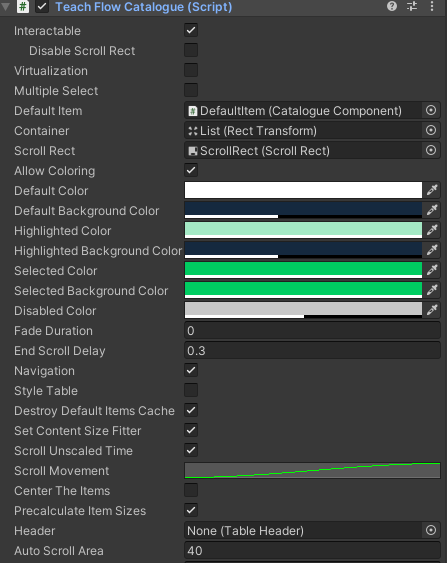

# New UIWidgets
> UI插件，功能模板非常强大
>
>- 提供了大量的容器组件，如列表，树等
>- 容器组件支持拖拽，但是此时鼠标按下内容区域无法滚动视图，若需要滚动，移除支持拖拽的组件
>- 支持定位，如打开面板的时候希望定位到某个位置，Unity内置功能里面很垃圾，搞了半天，效果不好，这个组件里提供了方便的接口，如定位到我选择的item的位置，定位到最后等，注意定位到最后的位置并不是1，需要求出最后一个item的位置


## TextMeshPro_UGUI的支持

若要对TMPRO_UGUI的支持，需要添加 脚本定义符号

```xml
UIWIDGETS_TMPRO_SUPPORT
```

## 添加自定义程序集


当项目定义了不同的程序集时，如对UI相关的功能自定义了程序集，此时需要使用New UI Widgets插件，需要为New UI Widgets 添加程序集，包含运行时和编辑器两个。

1. 添加运行时程序集
   
   - 运行时程序集文件

    
   
   - 运行时程序集属性，需要添加相应的依赖

    


2. 添加编辑器程序集

    - 编辑器程序集
  
    
    
    - 编辑器程序集属性
    
    


## 部件生成器(Widgets Generator)

[官方文档](https://ilih.name/unity-assets/UIWidgets/docs/generator.html?spm=wolaidingtalk.workspace.0.0.3d622714p3RBiF#list-of-generated-widgets)

### 操作说明

**创建一个数据类，如果不需要执行数据更新，普通类即可，若需要数据更新，需要实现`INotifyPropertyChanged` 或` IObservable`，其中`IObservable`具有更少的内存分配，脚本模板如下：**

继承 `INotifyPropertyChanged` 接口示例脚本：
```C#
public class ListViewIconsItemDescription : INotifyPropertyChanged
{
   [SerializeField]
   string name;
   public string Name
   {
      get
      {
         return name;
      }
      set
      {
         if (name != value)
         {
            name = value;
            Changed("Name");
         }
      }
   }
   public event PropertyChangedEventHandler PropertyChanged;
   protected void Changed(string propertyName)
   {
      PropertyChanged?.Invoke(this, new PropertyChangedEventArgs(propertyName));
   }
   ...
}
```


继承 `IObservable` 接口示例脚本：
```C#
public class ListViewIconsItemDescription : IObservable
{
   [SerializeField]
   string name;
   public string Name
   {
      get
      {
         return name;
      }
      set
      {
         if (name != value)
         {
            name = value;
            Changed();
         }
      }
   }
   public event OnChange OnChange;
   protected void Changed()
   {
      OnChange?.Invoke();
   }
   ...
}
```

**右键脚本，创建>New UI Widgets>Widgets Gennerator 注意需要鼠标选中数据类右键**

### 自定义程序集时生成部件处理

当使用自定义程序集时，生成部件无法创建预制体和案例场景，因为缺少对 new ui widgets Editor的引用，处理方式：为我们的程序集添加相关依赖。

程序集`TSIM.View` 是项目中的View层程序集，该程序集需要添加 `Nuw（new ui widgets 的 运行时程序集）`的依赖，如图所示：


当在生成部件时，由于还需要依赖编辑器里面的内容，所以还需要添加 `Nuw.Editor（new ui widgets 的 编辑器程序集）`的依赖，并在生成完成后，删除依赖，否则发布时存在问题。


**特别提醒：生成后删除依赖中的 Nuw.Editor**

### 表格中item添加不参与布局的子对象

在生成一个排名表格的需求中，需求将自己的排名item添加一个不同的背景，于是创建了一个子对象图片组件，不参与布局，当是自己时，显示这个对象。

运行时表格header报错找不到子对象，header下的子对象需要和item下的数量相同。

在header下添加一个不参与布局的对象即可，且他们的顺序要一致。


## 列表

1. 自动选择指定条目接口：

    ```
    void SelectNode(TreeNode<TItem> node)
    ```

2. 自动滚动显示选择的条目
   
   - 移这里是列表文本动到指定Item：`void ScrollTo(TItem item);`

   - 移动到指定Item(带动画)：`void ScrollToAnimated(TItem item);`

3. 移动到指定索引值:

    ```
    void ScrollTo(int index);
    ```

4. 移动到指定滚动位置：

    ```
    void ScrollToPosition(float position);
    ```

5. 移动到指定位置:

    ```
    void ScrollToPosition(Vector2 position);
    ```

## 树控件

注意：对于树控件，默认未展开的节点，不会被选择，所以如果需要选中，一种方式是先展开节点，另外一种是在属性面板取消勾选  ** Deselect Collapsed Nodes **

展开父级示例代码：
``` C#
 TreeNode<ICatalogueItem> pNode = node.Parent;                      
 while (pNode != null)
 {
     pNode.IsExpanded = true;
     pNode = pNode.Parent;
 }
```

在开发中遇到一个问题，用Timeline制作一个教学流程，然后根据时间节点设计了目录，使用树控件来显示目录，能够点击跳转。但是在这个流程中第 6 章节 和 第 3 章节的内容是一样的，配置Timeline 时就没配置 第6章节的，但是在目录中需要有，点击第6章节，跳转到第3章节的内容，这个时候就导致了 节点的id相同，所以自动选择的时候出现错乱，需要做特殊处理

## 虚拟化

开启比较好，否则，在树控件中，如果大量节点导致拖动很卡顿


## EasyLayout

> 布局组件，对应引擎自带的 VerticalLoayout 和 HorizontalLayout

插件自带使用的这个，不使用这个会导致代码更新滚动视图位置无效


- Main Axis: 搞不懂这个属性，似乎没影响
- Sikp Inactive: 勾选时，被隐藏的子对象不会参加布局，此时和引擎自带的功能一直，否则即使隐藏，也会占位置


--- 

## 输入框组件


- Character Limit: 设置字符的个数，用于在设置密码、或者激活码等，可以显示个数
- Content Type: 数据类型： 如激活码，只能输入整数 Integer Number
- Caret Blink Rate: 光标闪烁的频率
- Caret Width: 光标宽度： 默认的宽度比较小，基本看不见，建议这里设置大点
- Custom Caret Color: 光标颜色


## ListViewCustomBase
这个基类当中有一个属性：ListType ， 当你对面板进行布局的时候，可能需要重写这个变量的值来满足布局要求
 **ListViewCustom<TComponent, TItem>** 继承于它。
也就是基本上所有的容器都可以使用这个功能

```
 public class TaskCatalogueTreeView : TreeViewCustom<CatalogueComponent, ICatalogueItem>
 {
    //需要重写
    public override ListViewType ListType { get =>ListViewType.ListViewWithVariableSize; }
    //..
}
```
---

**已知问题**：在某些Unity版本的命名空间中，无法使用结构（Strcut）或接口(Interface)类型,需要使用Class

---

## TreeViewCustom<TComponent, TItem>

- 树形控件视图，一一般我们要编写自己的组件来继承此组件
- TCompoenet: 树形控件中每个节点上挂载的 monobehavior组件，需要继承：TreeViewComponentBase<ICatalogueItem>
- Item: TCompoenet对应的数据接口，需要继承 INotifyPropertyChanged
- 根据插件自带的例子，参照实现接口和组件

---

## INotifyPropertyChanged Support
> 插件使用的ObservableList提供了对数据类型的INotifyPropertyChanged接口的支持，因此如果属性更新并引发PropertyChanged事件，那么视图将被更新。

> 如果您想在项目数据更改时自动更新集合小部件(如ListView、TileView、Table)，那么你需要添加 `INotifyPropertyChanged` 实现到你的数据类型。

- 例子
```
public class ListViewIconsItemDescription : INotifyPropertyChanged
{
    [SerializeField]
    string name;
    public string Name
    {
        get
        {
            return name;
        }
        set
        {
            name = value;
            Changed("Name");
        }
    }
    public event PropertyChangedEventHandler PropertyChanged = (x, y) => { };
    protected void Changed(string propertyName)
    {
        PropertyChanged(this, new PropertyChangedEventArgs(propertyName));
    }
    ...
}
```
- 通过这种方式，界面的第一个将被更新为新的名称
```
ListView.DataSource[0].Name = "New name";
```
- 可以通过属性 ObserveItems 来禁用通知行为
``` 
ListView.DataSource.ObserveItems = false;
// name displayed with the widget will be not changed
ListView.DataSource[0].Name = "New name";
```


## 案例
 
### 制作目录章节的树形案例


- 存在节点嵌套
- 当节点是一个组（类似文件夹）节点时，应显示 三角图标，打开时，箭头向下，关闭时，箭头向右
- 当节点是一个数据（类似文件）节点时，不显示图标


TeachFlowCatalogue 脚本：

数目录组件

```
 public class TeachFlowCatalogue : TreeViewCustom<CatalogueComponent, ICatalogueItem>
    {
        public override ListViewType ListType { get => ListViewType.ListViewWithVariableSize; }//布局需要
    }

```



## FAQ
### ListView中修改Item的显示状态（文本颜色）失败
> 答：ListView 使用的 DataSource 来绑定数据并显示，如果要改变状态的显示，那么你要改变DataSource的源数据，需要注意两点

- 数据类型不能是Struct 和 interface,必须是class
- 需要提供 INotifyPropertyChanged 支持,详见 INotifyPropertyChanged 的介绍
- **提示：通过单独修改Item的Color是无效的，因为源数据没改变**


