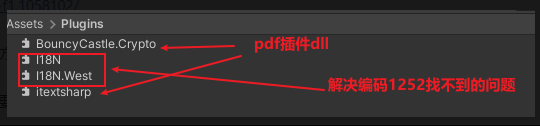

# 生成PDF的插件
列举了几个在.net下使用的插件，但是最后只有ItextSharp使用成功了
## iTextSharp
### 说明
进入官网的时候，提示itextsharp已经停止维护，请使用itext7,然后又去了解itext7,，但是最后发现要使用itext7需要很多dll，并且还报错，没成功，最后还是使用iTextSharp，主要是在网上可以找到使用列子。

-  **官网** ：https://github.com/itext/itextsharp 
-  **教程** ：http://t.zoukankan.com/springsnow-p-13156025.html （实用）https://cloud.tencent.com/developer/article/1013339


### 使用手册

#### 安装

1. 使用vs nuget安装 ITextsharp后，在工程的packages文件夹下拷贝 BouncyCastle.Crypto.dll 和 itetshrp.dll到Pluins 文件夹下

2. 拷贝Unity对应版本下的 I18N.dll 和 I18.West.dll(这两个没有在安卓端报错)，对应路径（假设为Unity2019.3.15f）：   Unity\Hub\Editor\2019.3.15f1\Editor\Data\MonoBleedingEdge\lib\mono\unityjit 下的i18N dll

3. 最后的dll如下图




#### 字体

itextsharp 需要配置字体，使用file读取字体的，在PC IOS 上，直接将字体丢在 stremingassets下就可以了，但是 android 下  不支持 file 读取 stremingassets，解决办法是将 字体复制到 persentAssets下 


### 报错处理

1. Encoding 1252 data could not be found

    打包安卓端（确保路径正确），发现报错 `NotSupportedException: Encoding 1252 data could not be found `
在百度或者国内找了一辈子没解决问题，还是google：https://forum.unity.com/threads/notsupportedexception-encoding-1252-data-could-not-be-found-2020-2-3-f1.1058102/ . 解决方法：https://answers.unity.com/questions/1756912/invalid-il-code-in-build.html ，就是要添加 I18n ，按照以下的方式添加（就是要使用 Unity\Hub\Editor\2019.3.15f1\Editor\Data\MonoBleedingEdge\lib\mono\unityjit 下的i18N dll,最后要添加的dll如下:）：

```
Okay nevermind, just had to snoop around a little more. The I18N dlls that I was using came from the Unity\Hub\Editor\2019.3.15f1\Editor\Data\MonoBleedingEdge\lib\mono\unity folder, and using the ones in the Unity\Hub\Editor\2019.3.15f1\Editor\Data\MonoBleedingEdge\lib\mono\unityjit worked. I don't understand why but it works anyways !

```


2. 打包安卓时，未生成PDF，导致程序未执行后续逻辑

    - 没有显示生成的PDF，确定PDF有问题
    
    - 通过手机USB连接电脑，在电脑上查看手机的文件夹，定位到 包文件夹，找到生成的 pdf ，打不开，说明 未成功生成 pdf

    - 对每次 document.Add(element); 进行try 捕获错误，得到 ` 1.not.found.as.a.resource？ `，定位是哪个 element 出现问题发现在下面语句时出现错误，

```
//绘制一条横线
elements.Add(new Chunk(new iTextSharp.text.pdf.draw.LineSeparator(0.0F, 100.0F, BaseColor.BLACK, Element.ALIGN_LEFT, 1)));

```

删除了这条语句

未清除的地方：第一次会报错，但是后续有时候又不报错


## itext7

-  **官网** ：https://github.com/itext/itext7-dotnet/releases/tag/7.2.2

-  **Unity教程(失败)** ： https://www.ngui.cc/article/show-124951.html

-  **官方手册**  https://kb.itextpdf.com/home/it7kb/examples/itext-7-jump-start-tutorial-chapter-2

-  **绘图教程，易懂** https://blog.csdn.net/u012397189/article/details/76726576

注意：需要安装

- itext7

- itext7.bouncy-castle-adapter(这个在编程的时候并没有体现出来需要，但是没有在加载文件的时候就会报错)


## Questpdf
 **官网** ：https://github.com/QuestPDF/QuestPDF

这个官方文档比较清楚，比较好用，但是在Unity端要报错，用不了，在.net端倒是比较好用，如在WPF上使用


## 渲染PDF的插件

### PDF Renderer

Unity 商店中的一款插件，收费较高，目前最新版本 5.51，自己目前最新为 5.30

注 在 csdn上有个资源为 5.51 是假的

#### 新输入系统（new input system）报错

1. 若项目使用新输入系统， PDFViewerPage.cs 脚本会报错，原因是插件默认使用的是旧输入系统的输入方式

2. 在PDF Renderer 文件夹的程序集定义文件中，添加 InputSystem 的依赖

3. 打开 PDFViewerPage.cs，修改脚本

``` C#

    //添加新输入系统的命名空间
    using UnityEngine.InputSystem;
    //....


    //大概在265行
    //Vector2 pointerPosition = Input.mousePosition;//注释
    Vector2 pointerPosition = Mouse.current.position.ReadValue();

```

#### 构建

1. 先确认build平台相关的文件是否存在，不存在需要重新导入，或者拖入文件夹

2. 其他平台的文件可能会影响构建，需要暂时删除


