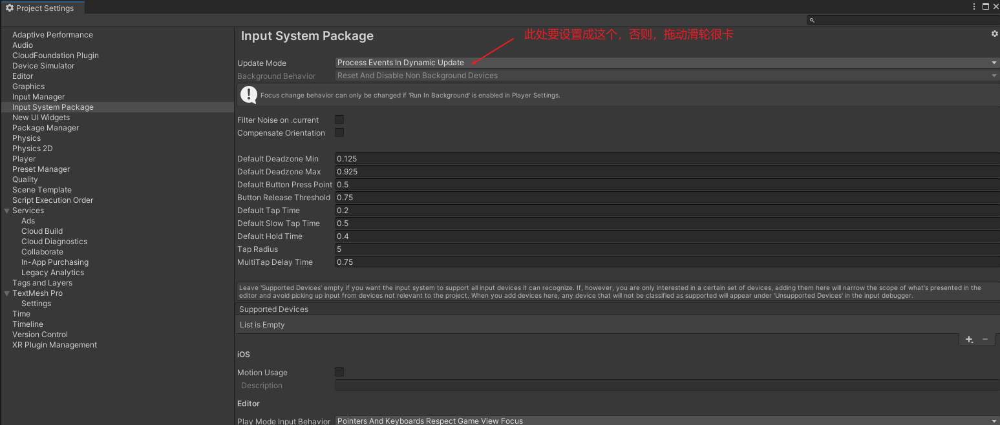
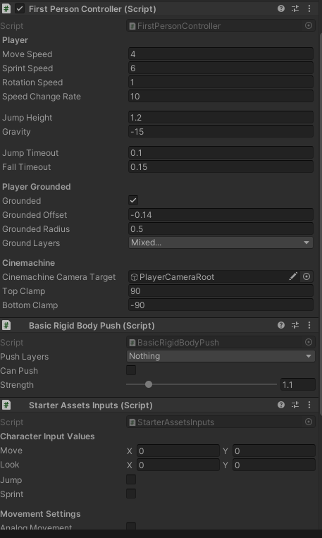

> Unity 新的输入系统

### 使用说明
#### 插件设置

（1） InputSystemPackage 设置界面，需要设置为 Dynamic Update模式，这样操作虚拟控件时才不卡顿

（2）FirstPersionController，第一人称控制器，目前

### 问题和解决方案

#### :bangbang: Type of instance in array does not match expected type

 **现象** 
当退出游戏的时候会出现这个报错

 **解决办法** 
[InputSystem社区](https://forum.unity.com/threads/type-of-instance-in-array-does-not-match-expected-type.1320564/)
回退到 1.3.0 版本
