# Timeline

## PlayableDirector
> 导演，挂在场景游戏对象上的一个组件

-  **Playable**  ：Timeline编辑的资源，类型为 “TimelineAsset”
-  **UpdateMethod**  ：更新方式，默认 GameTime
-  **PlayOnAwake**  ：在游戏对象Wake时，是否播放Timeline
-  **WrapMode**  ：循环模式
-  **InitialTime**  ：初始化时间，若设置了时间，会等待这个时间之后才播放
-  **Bindings**  ：绑定的轨道数据


## TimelineAsset
> 编辑时间线数据时，存储的数据

获取轨道集合

```csharp
timelineAsset.GetOutputTracks()
```

通过轨道获取timeline资源( `track.timelineAsset` )，但是可能返回null，导致异常，可能的原因是复制timeline导致的，如果出现异常，可以通过 遍历打印出每个轨道的名字来检测

```csharp
public TimelineAsset timelineAsset
{
    get
    {
        var node = this;
        while (node != null)
        {
            if (node.parent == null)
                return null;
            var seq = node.parent as TimelineAsset;
            if (seq != null)
                return seq;
            node = node.parent as TrackAsset;
        }
        return null;
    }
}
```


## TrackAsset(轨道)
> 编辑时间线数据时，存储的数据

-  **name** :轨道名称
-  **Start(float)**  ：开始时间
-  **End(float)**  ：结束时间
-  **duration(float)**  ：轨道长度
-  **muted(bool)**  ：是否静音，静音轨道从生成的PlayableGraph中被排除，所以应先静音，再 buildGraph
-  **timelineAsset(TimelineAsset)**  ：这个指向 时间线资源，实际上对应的是 轨道的 根 父节点
-  **parent（PlayableAsset）**  ：轨道的父节点（轨道的拥有者），轨道是可以嵌套的， TrackGroup 可以包含其他 轨道，所有轨道的最终父节点应为 TimelineAsset，即我们编辑的资源

-  **clips（TimelineClip[]）**  ：轨道片段数组

获取轨道绑定的对象

```csharp
var bind = director.GetGenericBinding(track);//需要使用Director来获取，  得到的是一个UnityEngine.Object  

```

重写CreateTrackMixer

```csharp
 public override Playable CreateTrackMixer(PlayableGraph graph, GameObject go, int inputCount)
 {
    //graph: timelineasset构建的图
    //go: 挂载 director 的游戏对象
    //inputCount: 片段数量
     return base.CreateTrackMixer(graph, go, inputCount);
 }
```

## 混合器
### 描述

根据片段的权重来控制某个参数的百分比，可用于解决以下需求：

（1）动画轨道（可以和controller 混合使用）

（2）解决淡进淡出问题

（3）解决监听播放一个片段结束问题（这里可以避免因暂停timeline导致误认为播发结束的问题）


### 淡进淡出案例

使用 `CanvasGroup` 组件来实现效果

```csharp
public class CanvasGroupTrack : TrackAsset
{
    public float easeduration = 0.5f;
    public bool useSettingForAllClips;
    public override Playable CreateTrackMixer(PlayableGraph graph, GameObject go, int inputCount)
    {
        //graph: timelineasset构建的图
        //go: 挂载 director 的游戏对象
        //inputCount: 片段数量
        if (useSettingForAllClips) UpdateEaseDuration();
        return ScriptPlayable<CanvasGroupMixerBehaviour>.Create(graph, inputCount);
    }

    private void UpdateEaseDuration()
    {
        foreach (var clip in GetClips())
        {
            clip.easeInDuration = easeduration;
            clip.easeOutDuration = easeduration;
        }
    }
}


/// <summary>
/// 注意事项：
/// 1 gameObject.activeSelf 必须为true 否则会导致 初次设置 淡进淡出 报错，提示就是获取不到 reacTransform 
/// 2 当淡出后，必须设置canvasgroup 不可交互，否则会挡住其他的交互
/// </summary>
public class CanvasGroupMixerBehaviour : PlayableBehaviour
{
    CanvasGroup canvasGroup;

    public override void ProcessFrame(Playable playable, FrameData info, object playerData)
    {
        if (canvasGroup == null)
        {
            MonoBehaviour bind = playerData as MonoBehaviour;
            if (bind == null) return;
            if (bind.gameObject.activeSelf == false)
            {
                bind.gameObject
                    .SetActive(true); //注意：滚到绑定的对象必须设置为 active 状态，否则会导致 初次设置 淡进淡出 报错，提示就是获取不到 reacTransform 
            }

            canvasGroup = bind.GetComponent<CanvasGroup>();
            if (canvasGroup == null)
            {
                Debug.LogWarning("CanvasGroupMixerBehaviour：轨道使用淡进淡出效果，但是缺少 CanvasGroup组件");
                return;
            }
        }

        int inputCount = playable.GetInputCount(); //这是当前轨道上所有片段的数量，注意不是当前帧

        //通过每个片段当前的权重和来设置 canvasGroup alpha值
        float inputWeight = 0;
        for (int i = 0; i < inputCount; i++)
        {
            float curWeight = playable.GetInputWeight(i);
            if (curWeight > 0)
                inputWeight += curWeight;
        }
        canvasGroup.alpha = inputWeight;
        var b = inputWeight > 0.05f; //设置使用0.05的阈值来设定而非0，避免极限情况的出现
        if (canvasGroup.blocksRaycasts != b)
        {
            canvasGroup.blocksRaycasts = b;
        }
    }
}
```

**注意事项**：在这个案例中，场景中对轨道绑定的CanvasGroup对象默认为“未激活”状态，每次运行的时候报错，最后在首次给CanvasGroup赋值时，将对象激活显示出来，解决问题。

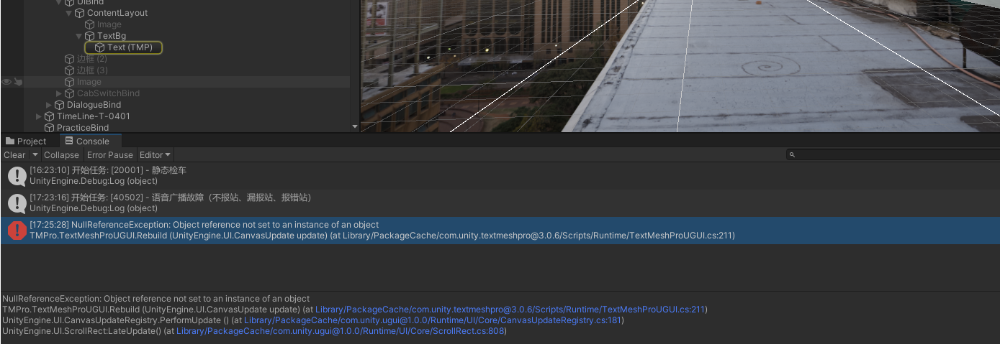


## 扩展功能
### 复制Timeline资源，解决绑定丢失

已在UKit中添加了工具处理，下面可作为原理参照。


 _ ** 应用场景：复制已经配置好的TimelineA,改为TimelineB,发现B上的轨道绑定丢失 **_ 

配置 **TimelineA** 

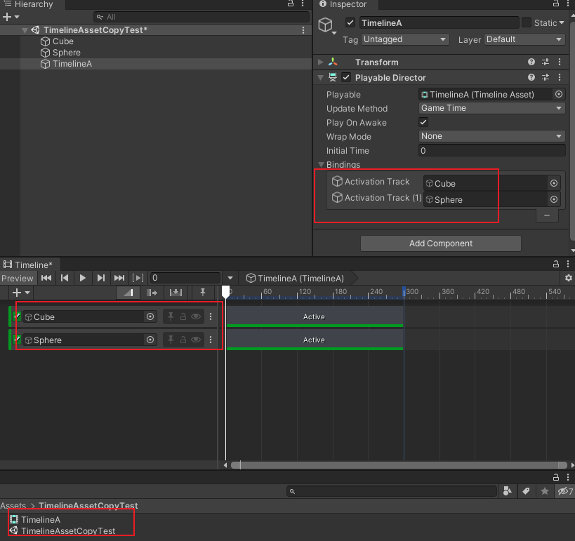

在场景中复制TimelineA，改为 TimelineB

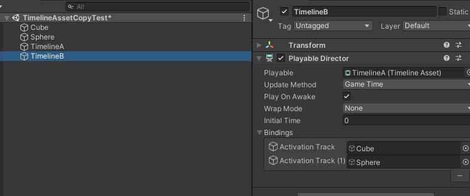

复制资源 TimelineA，改为 TimelineB，并托给场景中 TimelineB 的Director,此时发现绑定丢失

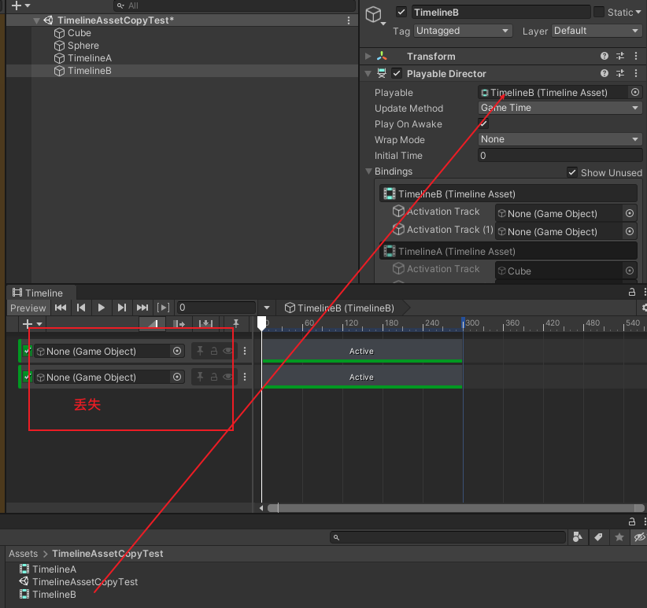

观看下图分析，它隐藏绑定了A的，且绑定正确，B上的丢失了，我们就要去找到这部分配置，修改，使用Notepad++工具

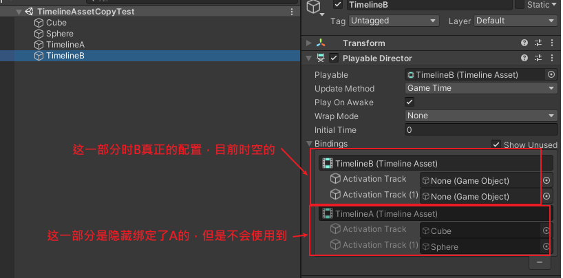

- 通过  **TimelineA.playable.meta** 文件找到 TimelineA 资源文件的 `guid:56b3a74b657957d4cae6622c4a199001`
- 通过  **TimelineB.playable.meta** 文件找到 TimelineB 资源文件的 `guid:c4cdb66148603ca4080d5eeb2b49d526`

- 打开 TimelineAssetCopyTest.unity 场景文件，然后找到 `c4cdb66148603ca4080d5eeb2b49d526的位置`

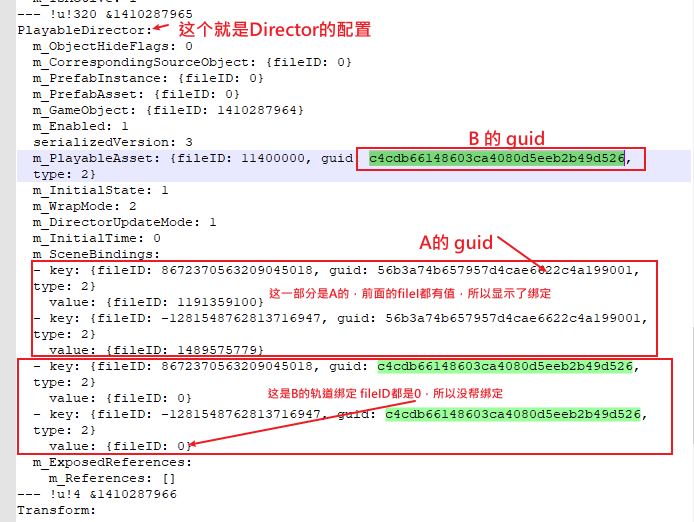


- 我们只需要将下方的B的 guid 替换上方的A的 guid,并删除下方 fileID 为 0 的绑定，就可以了

```
PlayableDirector:
  m_ObjectHideFlags: 0
  m_CorrespondingSourceObject: {fileID: 0}
  m_PrefabInstance: {fileID: 0}
  m_PrefabAsset: {fileID: 0}
  m_GameObject: {fileID: 1410287964}
  m_Enabled: 1
  serializedVersion: 3
  m_PlayableAsset: {fileID: 11400000, guid: c4cdb66148603ca4080d5eeb2b49d526, type: 2}
  m_InitialState: 1
  m_WrapMode: 2
  m_DirectorUpdateMode: 1
  m_InitialTime: 0
  m_SceneBindings:
  - key: {fileID: 8672370563209045018, guid: c4cdb66148603ca4080d5eeb2b49d526, type: 2}
    value: {fileID: 1191359100}
  - key: {fileID: -1281548762813716947, guid: c4cdb66148603ca4080d5eeb2b49d526, type: 2}
    value: {fileID: 1489575779}
  m_ExposedReferences:
    m_References: []
--- !u!4 &1410287966
```


- 改后截图

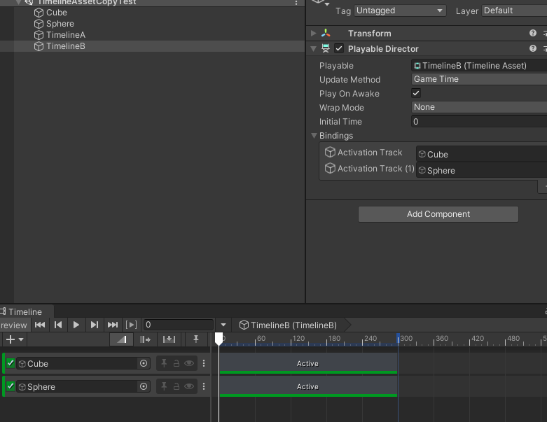


## 注意事项
> 开发过程中的经验总结

- 冗余绑定，复制Timeline会将原有的轨道绑定复制过来，需要删除掉不必要的信息
- Timeline资源最好不要复制
- 编辑器模式下正常，发布后若出现Timeline不能播放，有可能是某些轨道有问题（track.timelineAsset == null）,编写测试找到轨道，然后新建相同的轨道功能，删除原有轨道

## 问题与解决方案
> 此处的问题解决后会将解决方案加入的注意事项中
 

### 发布后Timeline不播放

- 版本 Unity2020.3.40f
- Timeline版本是最新的
- 问题详情：在编辑器模式下，播放正常，发布后Timeline不播放（无论是安卓端还是PC端）

#### 第1次处理

- 删除Timeline的冗余
- 隐藏其他Timeline

未找到根本的原因，使用下面的方式可以正常播放，但是总是不靠谱
1. 在发布前，将timeline的播放针头托到起始位置
2. 有种情况是即使在起始位置，也会有问题，需要再次打开这个场景，然后再发布，不知道到底什么原因


#### 第2次处理
**调试处理过程记录** 

1. 开始发布的是安卓版本，不是很好调试，后面发布PC端的 Debug 版本来查看下报错信息

2. 报错信息是TimelinePlayable(插件内置类)中的 下面165行 存在 null 引用，判断是 timelineasset 为 null

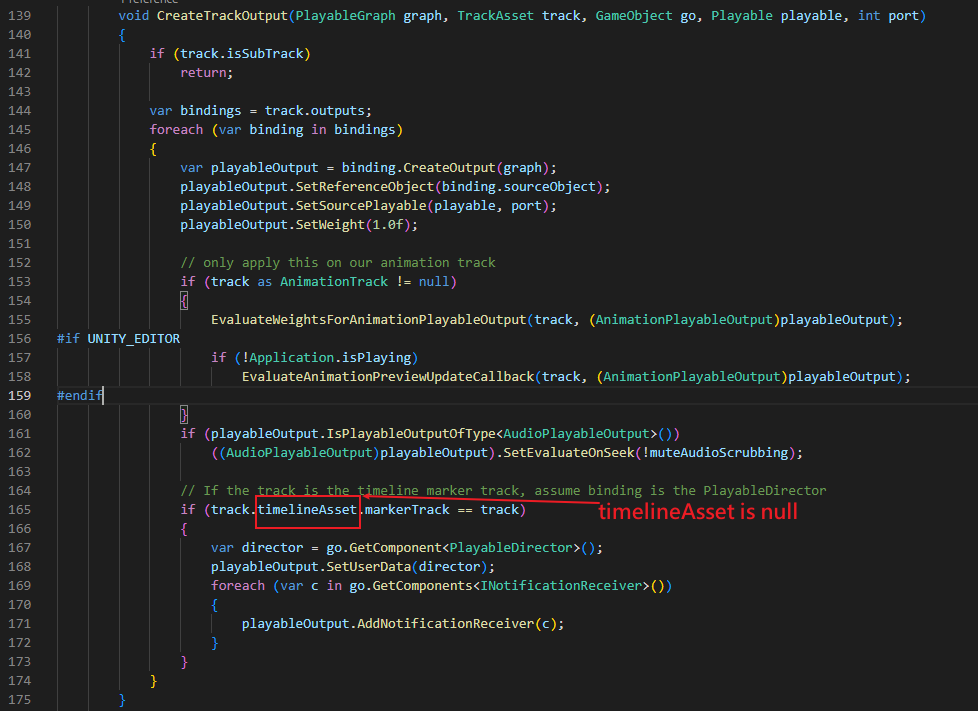

3. 从截图看出是某个 **Track** 的 **TimelineAsset** 为空， TimelineAseet 是创建的timeline资源

4. 现在就是要找到是哪个轨道的 TimelineAsset 为 null,编写测试代码

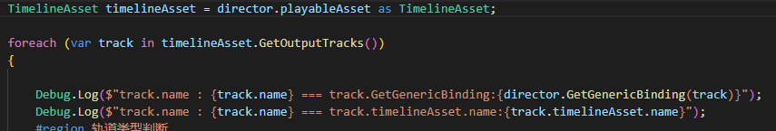

第一行是打印测试的名字，第二行如果为空会报错

5. 打包运行后日志如下，是一个  **Teach_模式选择开关高亮** 的轨道 为 null,且两个不能播放Timeline的都是因为这个同名的轨道

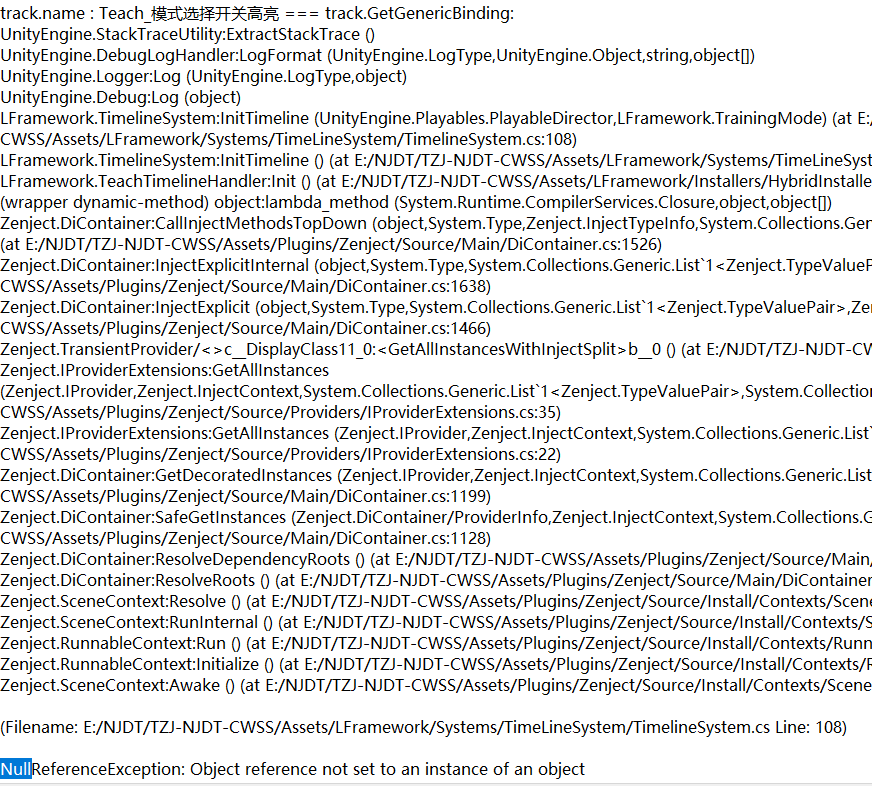

6. 查看轨道，该轨道是内置的 PlayableTrack, 自己扩展编写的 Asset 和 behaviour

轨道

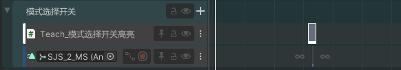

属性

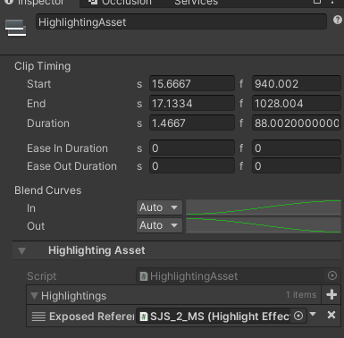


7. 检查是否是因为这个轨道有问题引起的，发现其他使用了此轨道的Timelien正常，排除这个原因
8. 修改轨道名称，将中文改为英文，看看是不是因为轨道名称引起的， **发现正常了** 
9. 修改轨道名称，将中文改为英文，播放针头托离起点，发布后运行， **还是报错** 
10. 新建（ **不要复制** ）相同功能的轨道，并新建（ **不要复制** ）对应片段，删除原有轨道，针头拖离起点， **发布运行正常** 
11. 总结： 有可能是这个轨道创建的时候，脚本未编写完成，导致这个轨道异常


#### 第3次处理
**使用第二次的方式还是为解决，通过调试代码找不到错误轨道** 

通过构建时，勾选 “development build” 得知是在 track.TimelineAsset 获取为空时，出现问题

- 当前Timeline上应该有GroupTrack，将组内的轨道拖动到组外，有可能的异常，如果拖到的是异常的轨道，会连带其他正常的轨道一起到组外，需要逐个的尝试

- 逐个的删除轨道，一般也是组内的轨道，若异常会出现图情况

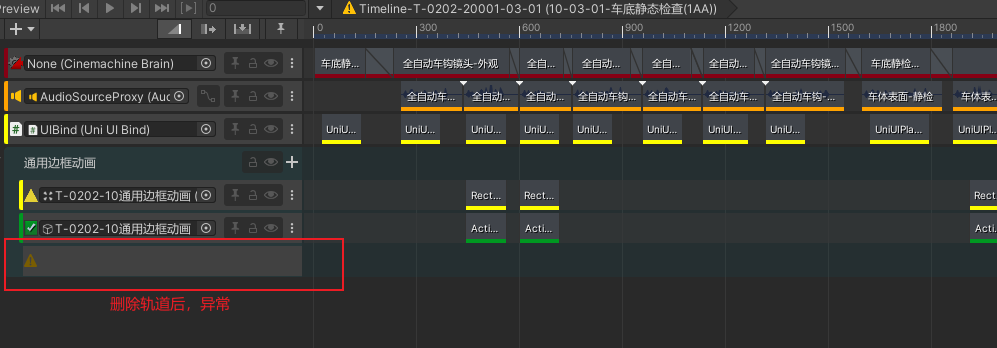

 错误信息如下

```
MissingReferenceException: The object of type 'AnimationTrack' has been destroyed but you are still trying to access it.
Your script should either check if it is null or you should not destroy the object.
UnityEngine.Object.get_name () (at <c7a29af87eea4c208ef711c9671e7831>:0)
UnityEditor.Timeline.TimelineTrackErrorGUI.DrawMissingTrackHeader (UnityEngine.Rect headerRect, UnityEditor.Timeline.WindowState state) (at Library/PackageCache/com.unity.timeline@1.4.8/Editor/treeview/TrackGui/TimelineTrackErrorGUI.cs:76)
UnityEditor.Timeline.TimelineTrackErrorGUI.Draw (UnityEngine.Rect headerRect, UnityEngine.Rect contentRect, UnityEditor.Timeline.WindowState state) (at Library/PackageCache/com.unity.timeline@1.4.8/Editor/treeview/TrackGui/TimelineTrackErrorGUI.cs:46)
UnityEditor.Timeline.TimelineTreeView.OnRowGUI (UnityEngine.Rect rowRect, UnityEditor.IMGUI.Controls.TreeViewItem item, System.Int32 row, System.Boolean selected, System.Boolean focused) (at Library/PackageCache/com.unity.timeline@1.4.8/Editor/treeview/TimelineTreeView.cs:185)
UnityEditor.IMGUI.Controls.TreeViewController.DoItemGUI (UnityEditor.IMGUI.Controls.TreeViewItem item, System.Int32 row, System.Single rowWidth, System.Boolean hasFocus) (at <43587c69e7d54192b46754a593b0061f>:0)
UnityEditor.IMGUI.Controls.TreeViewController.IterateVisibleItems (System.Int32 firstRow, System.Int32 numVisibleRows, System.Single rowWidth, System.Boolean hasFocus) (at <43587c69e7d54192b46754a593b0061f>:0)
UnityEditor.IMGUI.Controls.TreeViewController.OnGUI (UnityEngine.Rect rect, System.Int32 keyboardControlID) (at <43587c69e7d54192b46754a593b0061f>:0)
UnityEditor.Timeline.TimelineTreeViewGUI.OnGUI (UnityEngine.Rect rect) (at Library/PackageCache/com.unity.timeline@1.4.8/Editor/treeview/TimelineTreeViewGUI.cs:152)
UnityEditor.Timeline.TimelineWindow.DrawTracksGUI (UnityEngine.Rect clientRect, UnityEditor.Timeline.TimelineModeGUIState trackState) (at Library/PackageCache/com.unity.timeline@1.4.8/Editor/Window/TimelineWindow_TrackGui.cs:183)
UnityEditor.Timeline.TimelineWindow.TracksGUI (UnityEngine.Rect clientRect, UnityEditor.Timeline.WindowState state, UnityEditor.Timeline.TimelineModeGUIState trackState) (at Library/PackageCache/com.unity.timeline@1.4.8/Editor/Window/TimelineWindow_TrackGui.cs:47)
UnityEditor.Timeline.TimelineWindow.TrackViewsGUI () (at Library/PackageCache/com.unity.timeline@1.4.8/Editor/Window/TimelineWindow_Gui.cs:178)
UnityEditor.Timeline.TimelineWindow.SequencerGUI () (at Library/PackageCache/com.unity.timeline@1.4.8/Editor/Window/TimelineWindow_Gui.cs:270)
UnityEditor.Timeline.TimelineWindow.DoLayout () (at Library/PackageCache/com.unity.timeline@1.4.8/Editor/Window/TimelineWindow_Gui.cs:153)
UnityEditor.Timeline.TimelineWindow.OnGUI () (at Library/PackageCache/com.unity.timeline@1.4.8/Editor/Window/TimelineWindow.cs:227)
UnityEditor.HostView.InvokeOnGUI (UnityEngine.Rect onGUIPosition, UnityEngine.Rect viewRect) (at <43587c69e7d54192b46754a593b0061f>:0)
UnityEditor.DockArea.DrawView (UnityEngine.Rect viewRect, UnityEngine.Rect dockAreaRect) (at <43587c69e7d54192b46754a593b0061f>:0)
UnityEditor.DockArea.OldOnGUI () (at <43587c69e7d54192b46754a593b0061f>:0)
UnityEngine.UIElements.IMGUIContainer.DoOnGUI (UnityEngine.Event evt, UnityEngine.Matrix4x4 parentTransform, UnityEngine.Rect clippingRect, System.Boolean isComputingLayout, UnityEngine.Rect layoutSize, System.Action onGUIHandler, System.Boolean canAffectFocus) (at <033e99bd4b59428a814373dfbafe317f>:0)
UnityEngine.GUIUtility:ProcessEvent(Int32, IntPtr, Boolean&)

GUI Error: You are pushing more GUIClips than you are popping. Make sure they are balanced.
UnityEngine.GUIUtility:ProcessEvent (int,intptr,bool&)

```

- Ctr+Z 后如下图所示

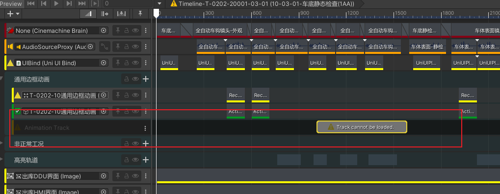

- 总结办法：1. 随意的将轨道在组外和组内拖动，查看是否正常;2. 逐个删除轨道，查看是否异常， 将出现的异常的组轨道以及异常轨道删除重新制作


