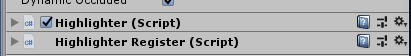
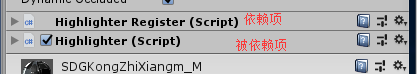

# Unity

> 临时记录，未分类

## 多场景加载

异步加载时，需要设置 `asyncOp.allowSceneActivation = false;`

加载完成后，需要设置 `asyncOp.allowSceneActivation = true;`

注意，此时被加载的场景并不是活跃场景，我们一般都是需要把被加载的场景设置为活跃场景

```csharp
//...
  SceneManager.sceneLoaded += SceneLoadHandler;
//...

private void SceneLoadHandler(Scene scene, LoadSceneMode mode)
{
    Debug.Log("激活场景: " + scene.name);
    SceneManager.SetActiveScene(scene);
}
//...
  SceneManager.sceneLoaded -= SceneLoadHandler;
//...
```

## 证书问题崩溃

查看崩溃日志：`C:\Users\ABYTE\AppData\Local\Temp\Unity\Editor\Crashes`,找到最近一次崩溃的文件夹，查看 `Editor.log` 文件，若出现 `[Licensing::Client] Error: Code 10 while verifying Licensing Client signature` 这种错误信息。

删除 `C:\ProgramData\Unity\Unity_lic.ulf` ，重新激活即可。


- 注意，在使用 "+="时，要匹配使用 “-=”,否则响应会叠加


激活场景的目的：多场景时，引擎会使用活跃场景的天空盒


## Dictionary的key 为 null导致报错

ArgumentNullException: Value cannot be null.

```
Parameter name: key
  at System.Collections.Generic.Dictionary`2[TKey,TValue].FindEntry (TKey key) [0x00008] in <695d1cc93cca45069c528c15c9fdd749>:0 
  at System.Collections.Generic.Dictionary`2[TKey,TValue].ContainsKey (TKey key) [0x00000] in <695d1cc93cca45069c528c15c9fdd749>:0 
```

Dictionary 的 key 值不能为null.

查看代码追踪 key 的来源，进行修改

**注意此问题**：
在编辑模式下，应该也会报错，但是有些时候莫名不会提示你错误，但是在发布后会报错
所以在使用 字典 时，最好对key进行判断** 


 ## 挂载脚本顺序导致依赖失败
 
**Unity版本**：Unity2017.3.0

**使用情景**：组件依赖问题，自定义了两个脚本，其中A依赖B，但是当停止Play时，报错：`CAN'T REMOVE HIGHLIGHTER (SCRIPT) BECAUSE HIGHLIGHTERREGISTER (SCRIPT) DEPENDS ON IT。`

**解决办法**：更改两个脚本的组件顺序，先是依赖项，后为被依赖项。



改为



 ## FAILED TO LOAD MONO

**Unity版本**：Unity2017.1.0

 **解决办法**：文件夹不能包含中文名，之前发现有的版本在中文路径下可以，所以觉得后面的版本也应该可以，导致花了很多时间，最后还是中文路径的问题。


 ## Unity打包后画面灰色、重影、带错误的彩色现象。

Unity版本：Unity2017.1.0

 **解决办法**：更新显卡

 ## Unity编译时间过长

可能有很多问题导致的

- 项目过大，资源过多，没办法，或者优化资源（不要有重复的资源）

- VS 影响的，关闭VS ,删除 .vs文件夹，打开VS时，重新生成


