# Steam VR

## 1 安装

[Steamworks 文献库](https://partner.steamgames.com/doc/features/steamvr/enterprise)

## 2 按键绑定

将自己的配置设置为默认配置。

1. Unity中 Window->SteamVR Input,打开设置面板

2. 点击 open binding ui

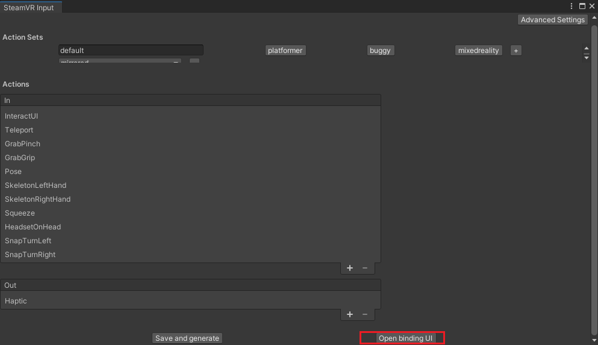

3. 如果显示 “这些是此游戏开发这发布的官方案件设置”，那么说明使用的不是你的配置

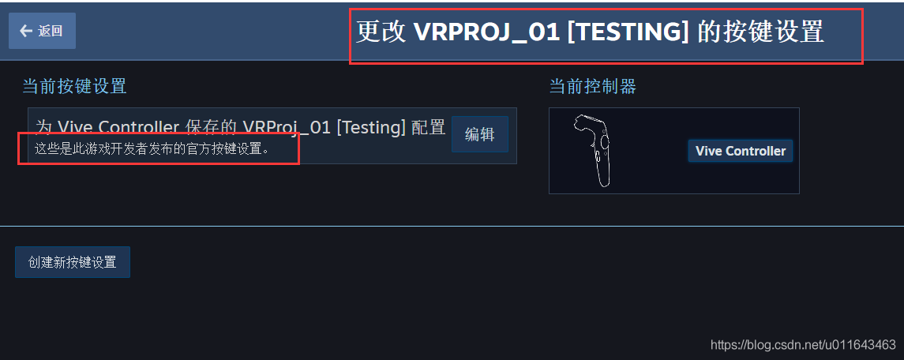


4. 点击 编辑，弹出面板后，点击 替换为默认配置

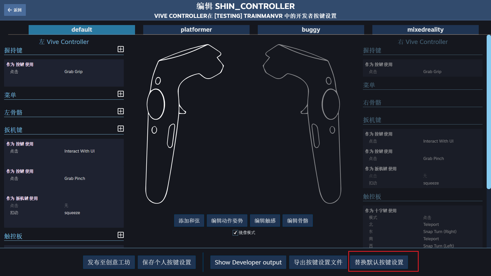

5. 填写你的信息，点击保存

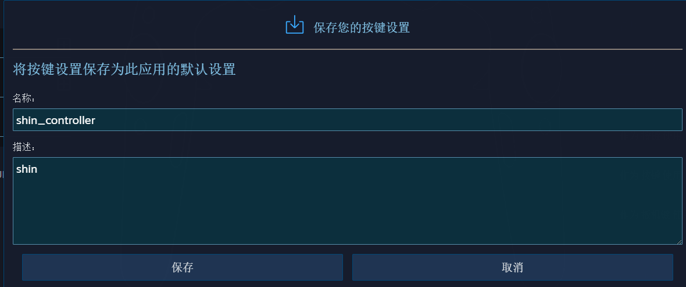

6. 最后显示为你的配置，此时发布可以了

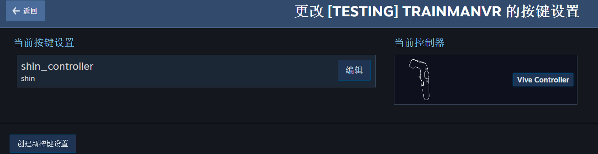

## 3 组件说明

无论是与模型还是UI的交互，无论是直接使用手柄还是射线的交互方式，交互对象(如果对象本身没有，那么子级上要有)需要有Collider，一般为BoxCollider，交互分手势交互和射线（手柄发送射线）交互两种情况，一般情况下，我们都用射线来交互，如和UI交互，大部分模型（如，仿真检查设备操作），手势操作的包含如：拉动滑块，转动轮盘等情况。

手势交互

### 3.1 Interactable

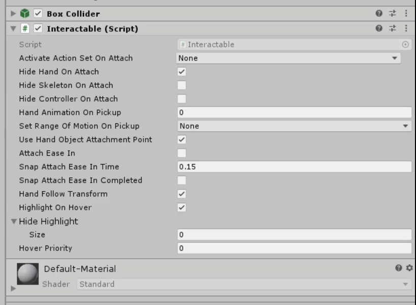


- 标识对象是可交互的

- 当手柄触碰到对象时，显示轮廓高亮

- 不能实现抓取和投掷等功能

- **通过继承该组件重写OnPointerClick函数来写自己的业务逻辑，或者直接注册 PointerClick 事件来写自己的业务逻辑**


### 3.2 Throwable

**投掷功能组件**：添加这个组件时，会自动添加依赖组件Interactable(可交互的) 和 Rigibody（释放时，物理重力）


### 3.3 SteamvR_LaserPointer

官方提供的，在CameraRig预制体上的一个组件，用于实现激光交互，我们可以迁移到Player上

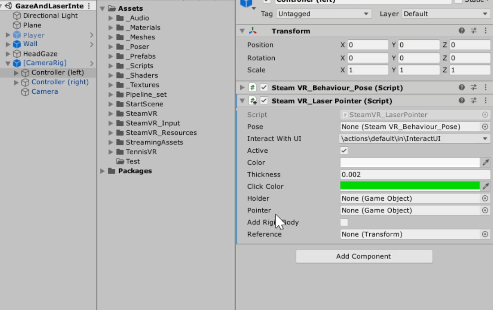

**用于射线交互**

- Pose 保持默认，会自动关联

- InteractWithUI: 默认

- Active: 设置无效（源代码未使用）

- Color: 射线默认颜色，这里设置为白色，透明度注意设置为255

- Thickness: 射线宽度，默认

- Click Color: 点击颜色

- Holder: Pointer的父级， 设置无效，源代码中会自动创建

- Pointer: 设置无效，源代码中会自动创建一个Cube

- AddRigidBody: 射线上添加刚体属性，默认

- Reference: 设置无效，源代码中未使用 


### 3.4 SteamVR_LoadLevel

**属性面板**

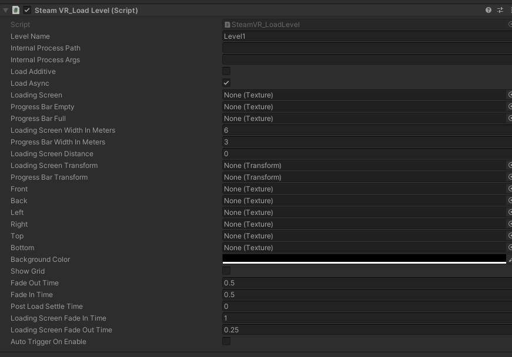

所有用到的贴图，检查是否被压缩，全部改为不压缩

- LevelName:场景名称

- InternalProcessPath:加载时要启动的进程（不用写）

- InternalProcessArgs:进程参数

- Load Addtive:场景是否是添加模式，不勾选就是从当前场景切换到目标场景

- LoadAsync: 是否为异步加载，一般勾选

- LoadingScreen: 加载背景

- ProgressBarEmpty:加载进度条的背景

- ProgressBarFull:加载进度条的进度

- LoadingScreenWidthInMeters:加载背景的宽度（单位m）

- ProgressBarWidthInmeters:加载进度条的宽度(单位m)

- LoadingScreenDistance: 加载背景的距离，0代表无限远的地方，这里可以不设置，而采用下面两个来设置

- LoadingScreenTransform：在场景中创建一个空对象，位置代表背景的位置

- ProgressBarTransform:在常见中创建一个空对象，摆放和背景一个相对的位置，方便调整进度条在背景的某个位置，避免遮挡背景上的文字

- Front:这6张图，代表天空盒的6个面

- Back:

- Right:

- Top:

- Bottom:

- BackgroundColor:背景颜色

- ShowGrid:是否显示网格

- Fade Out Time:淡出时间

- Fade In Time:淡进时间

- Post Load Settle Time: 场景载入后，还需要等待的时间，为了能够很好的观看加载界面

- Loading Screen Fade In Time: 加载背景淡入的时间 保持默认

- Loading Screen Fade Out Time: 加载背景淡出的时间 保持默认

- Auto Trigger On Enable: 脚本激活就触发加载


**注意事项**

 **（1）组件一直处于Loadind状态，导致无法加载** 

启动launch场景，自动加载 Hall 场景，这个时候如果在加载其他场景时，无效，代码查看是因为 static laoding 一直为 true
 
 **解决方案** 

加载Hall直接使用SceneManager.LoadScene("Hall",Mode.Addtive)来加载

另外使用组件时，使用的是异步加载，不知道换同步是否存在问题


### 3.5 Teleport


#### 3.5.1 配置规则

传送涉及到两个预制体和一个组件

- **Teleporting(预制体)** ：必要的预制体，拖到场景，没有不行，提供传送的机制逻辑等

- **TeleportPoint(预制体)** ：传送点，定位传送

- **TeleportArea(组件)** ：传送区域，区域传送

```diff
- 注意：TeleportPoint 预制体的碰撞体默认是属于UI Layer，所以 Teleporting 检测的层级一定要包含 UI 层，或者你自定义
```

#### 3.5.2 Teleporting

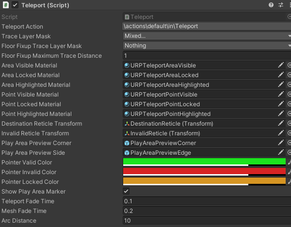

主要关注图上属性配置，其他的是特效，声音以及调试的配置

- **TeleportAction** : 动作配置

- **TraceLayerMask** : 检测的图层，如：手柄发送射线传送时，射线被某个物体遮挡，此时，可以将这个物体设置一个独立的图层，然后，这里不勾选这个图层，射线就会穿过这个物体

- **FloorFixupTraceLayerMask** : 将哪些图层识别为地面，和下面的Distace属性共同使用

- **FloorFixupMaximunTraceDistance** ：一个容差，用于角色在传送后，角色始终在地面上而不是在传送区域所在的平面上，举例：传送区域高于地面0.5,若 **FloorFixupTraceLayerMask** 设置的是nothing,那么传送后，角色就会高于地面0.5 ；若 **FloorFixupTraceLayerMask**设置了地面图层，那么会根据这里的distace，假设为1，会在1这个范围内查找地面，如果找到，就设置角色到地面上，这里1>0.5所以，会找到地面图层，会将角色传送到地面上

 **URP材质替换** 

在URP渲染模式下：`DestinationReticle` 对象的材质，默认是 `TeleportPointHighlighted`,在编辑模式下还正常，但是发布后会出现无线显示传送位置标记的问题，需要替换为URP的材质，如下图：

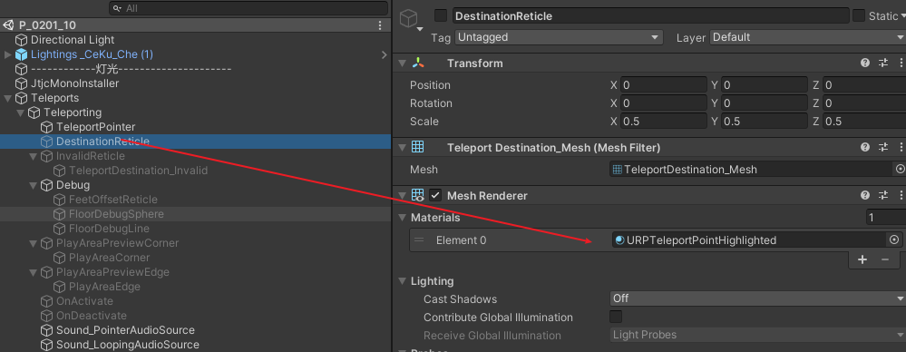

#### 3.5.3 TeleportPoint

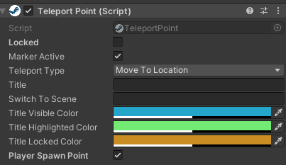


- **Lockked** ：勾选，将无法传送到此区域，可通过代码来控制此变量，动态解锁传送区域

- **MarkerActive** ：勾选，运行时，传送区域不会显示，当按下传送健的时候才显示出来，否则，一开时就显示

- **TeleportType** ：传送到本地或者是切换场景

- **Title** ：传送的名称，在游戏当中显示

- **SwitchToScene** ：场景名称，需要“TeleportType” 为 “SwitchToNewScene”

- **PlayerSpawnPoint** ：角色初始点，勾选，角色最开始会出现在这个位置


## 4 Player

角色组件

- 这是一个单例，场景中仅能存在一个，因此该对象在场景切换时不会不销毁，会一直存在

- 使用技巧：现在一个空场景放置一个Player,启动空场景后立刻加载场景，这样切换场景时，Player一直存在

- 或者若你的初始场景是一直存在，加载场景是以“Addtive”的方式，那么可将Player放置在初始场景


## 5 组件扩展

### 5.1 激光交互响应组件（LaserHand）

该组件依赖 `SteamVR_LaserPointer`,并监听其的 `PointerIn`、`PointerOut`、`PointerClick` 三个事件，以实现对对象的指针移入、移出和点击三种交互事件的处理

**代码** 


```
using UnityEngine;
using UnityEngine.EventSystems;
using Valve.VR.Extras;

namespace LFramework
{
    /// <summary>
    /// 激光射线交互，挂手柄上
    /// </summary>
    [RequireComponent(typeof(SteamVR_LaserPointer))]
    public class LaserHand : MonoBehaviour
    {
        // LaserPointer组件
        private SteamVR_LaserPointer _laser;
        // 是否开启激光指针交互
        public bool isEnabled = true;

        private void Awake()
        {
            // 获取到LaserPointer组件
            _laser = GetComponent<SteamVR_LaserPointer>();
            // 如果不为空
            if (_laser != null)
            {
                // 如果不开启激光指针交互
                if (!isEnabled)
                {
                    // 激光指针不显示
                    _laser.enabled = false;
                    return;
                }
                else // 如果开启激光指针交互
                {
                    _laser.PointerIn += LaserOnPointerIn;
                    _laser.PointerOut += LaserOnPointerOut;
                    _laser.PointerClick += LaserOnPointerClick;
                }
            }
        }

        private void LaserOnPointerIn(object sender, PointerEventArgs e)
        {

            IPointerEnterHandler _pointerEnterHandler = e.target.gameObject.GetComponent<IPointerEnterHandler>();
            if (_pointerEnterHandler != null)
            {
                _laser.color.a = 1;// showColor;
                _pointerEnterHandler.OnPointerEnter(new PointerEventData(EventSystem.current));
            }
        }

        private void LaserOnPointerOut(object sender, PointerEventArgs e)
        {
            IPointerExitHandler _pointerExitHandler = e.target.gameObject.GetComponent<IPointerExitHandler>();
            if (_pointerExitHandler != null)
            {
                _laser.color.a = 0;
                _pointerExitHandler.OnPointerExit(new PointerEventData(EventSystem.current));
            }
        }

        private void LaserOnPointerClick(object sender, PointerEventArgs e)
        {
            IPointerClickHandler _pointerClickHandler = e.target.gameObject.GetComponent<IPointerClickHandler>();
            if (_pointerClickHandler != null)
            {
                Debug.Log("点击了..." + e.target.gameObject.name);
                _pointerClickHandler.OnPointerClick(new PointerEventData(EventSystem.current));
            }
        }

        private void OnDestroy()
        {
            if (_laser != null && isEnabled)
            {
                _laser.PointerIn -= LaserOnPointerIn;
                _laser.PointerOut -= LaserOnPointerOut;
                _laser.PointerClick -= LaserOnPointerClick;
            }
        }
    }
}

```


 **对UI的交互** 

- 和普通开发模式一样，是对Button组件的交互

- Button按钮上添加BoxCollider组件，用于射线检测

- 注意交互对象所在的Layer(层级),是否在射线检测的层级设置里面

 **对模型的交互** 

- 模型对象上添加BoxCollider组件，用于射线检测

- 注意交互对象所在的Layer(层级),是否在射线检测的层级设置里面

- 在模型上挂载一个组件，该组件根据需求实现：`IPointerEnterHandler IPointerExitHandler IPointerClickHandler` 三个接口

代码忽略。


## 6 UI

### 6.1 设置

1. 将Canvas 设置为 World Space 模式

2. Scale 均设置为 0.001,长宽都设置为1（这个没什么影响）

3. 其他和普通的UI设置一样

### 6.2 UI被模型遮挡

1. 使用网上的 uioverlay shader制作材质，赋给 image text rawimage 等

2. 对于 TextmeshProUGUI, 它有自己的 overlay shader，我们主要将我们制作的字体材质复制一份，作为ovlerlay材质，将shader换为 Distance filed Overlay shader

3. 问题：玩家的手部模型，和射线也会被 设置了Overlay的UI覆盖，导致 无法操作 这种UI，目前还没解决，网上的人很狗屎，没人提这个问题

## 7 问题汇总

### 7.1 HTC VIVE 定位器更新固件后闪烁红灯

#### 7.1.1 官方回复（失败）

首先联系官方，根据回复指导操作后，未解决问题，以下是官方的回复：

```
以下是1.0 定位器重置固件的详细操作步骤。

1. 从电源插座上拔下电源适配器。

2. 从基站背面拔下电源适配器。

3. 使用官方自带 USB 线缆（手柄充电线）将基站与计算机连接。

4. 按住“频道键”不放。

5. 将电源适配器连接到基站背面，然后将另一端插入电源插座。

6. 在计算机上，您将看到一个新设备显示为CRP DISABLD.

7. 打开它并删除文件 firmware.bin.

8. 在计算机上，转到SteamVR的安装文件夹。

9. 找到到固件版本为436的文件夹。文件夹路径如下： VIVE\Steam\steamapps\common\SteamVR\tools\lighthouse\firmware\lighthou setx\archive\htc2.0

10. 复制 lighthousetxhtc_2.0-436-2016-09-20.bin 到 CRP DISABLD 中。

11. 等候约 1分钟，然后拔下USB线缆。
```

#### 7.1.2 网友方法(成功)

注意：若修复成功，定位器会显示一个感叹号，提示更新，千万不要更新，就是因为更新出现的问题，我们的操作就是回退固件。
{.is-warning}


在SteamVR安装目录下找到以下两个文件，安装目录：D:\Program Files (x86)\Steam\steamapps\common\SteamVR\tools\lighthouse\firmware\lighthouse_tx\archive\htc_2.0

lighthouse_tx_htc_2_0-calibration-rescue-244.bin
lighthouse_tx_htc_2_0-244-2016-03-12.bin

附件根据自己的具体路径查找


1. 将好的定位器先断电

2. 在基站未通电情况下，将其通过micro-B USB（手柄充电线）传输线连接到PC。

2. 按住基站背后的模式键并插入电源线.

3. 一旦PC端确认为USB大容量存储设备(USB mass storage device)，才可以释放模式键。

4. 被连接的基站储存设备名为“CRP_DISABLED”，打开后包含一个文件“firmware.bin”，删除它。

5. 将“lighthouse_tx_htc_2_0-calibration-rescue-244.bin”文件复制到基站的储存空间上。

6. 复制完成后，拔掉电源线。

7. 等几秒，然后再次插上电源。在此过程中不要按模式键。几秒后基站应该会快速的闪烁绿灯或者红灯。绿灯表示修复成功。

9. 如果它闪烁红灯，这表示不能自动修复，请您送修。

10. 再此拔下电源。

11. 重复步骤1到7，但第5步复制文件改为“lighthouse_tx_htc_2_0-244-2016-03-12.bin"。

12. 完整后基站就恢复正常了，讲其频道设置为“A”并单独跟踪（另一个基站不通电）来确认运行情况。一旦确认工作正常，再打开另一个基站。

其他：

- 若单独使用一个定位器：设置为A模式

- 若使用两个定位器（有线连接）：AB模式

- 若使用两个定位器（无线连接）：BC模式

### 7.2 URP渲染模式发布后无法显示传送位置

需要手动替换下 DestinationReticle 的 材质，具体见 Teleporting章节

### 7.3 发布后手柄无响应

1. 发布位置不能有中文

2. 按键配置需要替换为默认的配置，操作见 相应章节

### 7.4 左右眼渲染不同，视野模糊

通过 Edit->ProjectSettings->XR Plug-in Managerment 下的 openvr设置为多通道

通过设置这个解决问题，但是，项目报错  “IsMatrixValid（matrix）”

以下是一个解决方案，待测试

https://forum.unity.com/threads/ismatrixvalid-matrix-error-spam-when-splitting-up-steamvr-eyes.425474/

新建一个脚本，挂在初始场景上

```
using System.Collections;
using System.Collections.Generic;
using UnityEngine;
using UnityEngine.XR;
using UnityEngine.XR.Management;
using Valve.VR;

namespace LFramework
{

    public class XRFix : MonoBehaviour
    {
        List<XRDisplaySubsystem> displays = new List<XRDisplaySubsystem>();

        private void Awake()
        {
            //StartXR();
            //SteamVR.Initialize();
        }


        public void StartXR()
        {

            XRGeneralSettings.Instance.Manager.InitializeLoaderSync();
            XRGeneralSettings.Instance.Manager.StartSubsystems();
        }

        private void Update()
        {
            EnforceStereoTexture();
        }


        void EnforceStereoTexture()
        {
            displays.Clear();

            SubsystemManager.GetInstances(displays);
            foreach (var displaySubsystem in displays)
            {
                if (displaySubsystem.running)
                {
                    displaySubsystem.textureLayout = XRDisplaySubsystem.TextureLayout.SeparateTexture2Ds;
                }
            }
        }
    }
}


```


