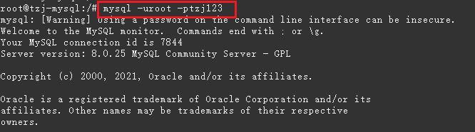

# 群晖

## 1 Putty连接

### 1.1 登录群晖

1. 使用SSH，输入地址，端口（22） 打开命令窗口
2. 输入群晖账户和密码
3. 输入 sudo -i 切换到root 下，提供权限，此时，再次输入账号的密
4. 输入: cd /volume1 切换到容器1，这里根据你的容器名称
5. 然后使用 ls 查看内容列表

### 1.2 运行Python 程序

需要先安装Python，直接在套件中安装即可。

运行python，切换到对应文件夹下，python3 test.py

## 2 操作Mysql

浏览器登录DSM，进入Mysql容器，选择终端机，点击新增，选择新增的 `bash`（不能使用默认的控制台，需要新增一个控制台
）

```bash
  #这里不知道为什么不能输入123，是复制的
  mysql -uroot -ptzj123
```



使用help 命令查看
