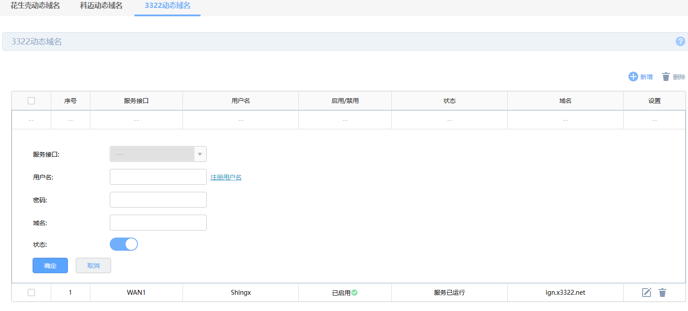
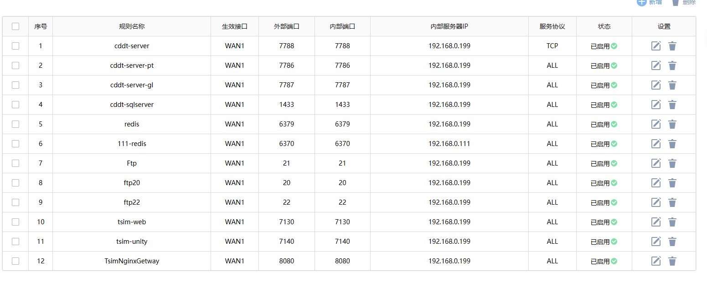

# 自建服务器

本文介绍自己搭建服务器步骤。

## 服务器主机

准备一台主机作为服务器，开发的程序在这个主机上运行，然后通过公网IP访问，如果在访问量不大的情况下，可将服务程序、数据库等都运行到此主机上。

## 域名

可以在网上找一些免费域名来使用，也可以在阿里云等网站上购买域名，购买域名后，需要将域名解析到公网IP，这样就可以通过域名来访问服务器了。此处介绍通过公云获取免费域名，并配置域名动态解析的过程。

### 获取公云上的免费域名

[管理页面-公云pubyun](https://www.pubyun.com/user/ "管理页面-公云pubyun")

- 提供免费域名
- 提供动态域名解析
- 在华为路由器中可使用3322的动态域名解析功能
- 我们可以根据这个来创建自签名证书（开发），这个证书在访问时会提示警告，甚至禁止访问

**缺点**

不能使用它来创建 生产证书，因为需要 在域名的控制台添加 TXT 记录解析，这个免费的无法访问控制台。因此在访问的时候有警告提示。

### 在路由器上配置公云的DNS

根据使用的解析服务商，使用注册它们的用户，可以使用它们的免费域名，但是无法通过它们的域名生产证书，因为无法进入域名控制台配置解析记录

**新增**

**列表**

### 路由器配置虚拟服务器

配置端口映射，配置完成后需要 **重启**！

### NAT-DMZ

设置哪些主机（IP）对外开放

### UPnP

这个要打开，群晖Nas要使用到。

## Nginx 作为代理服务器

详细见: [Nginx](../nginx/Nginx.md)
