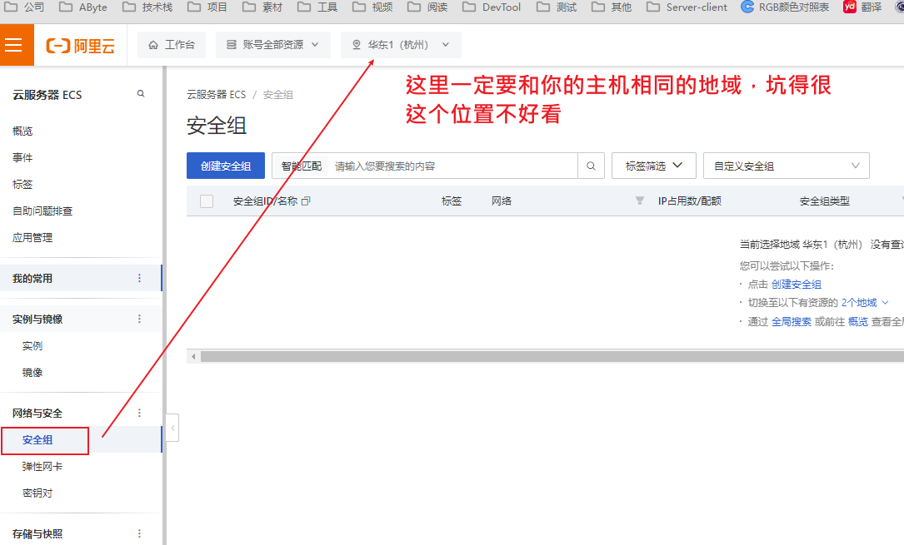
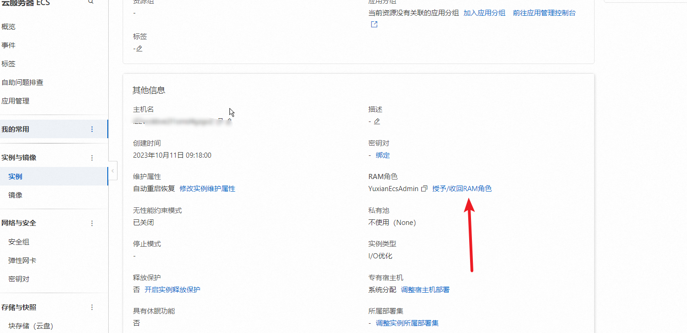
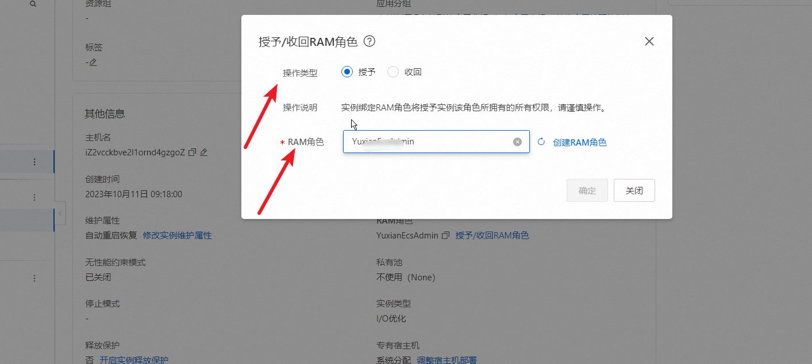
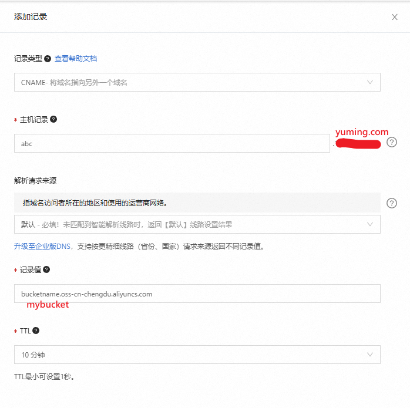
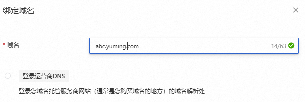
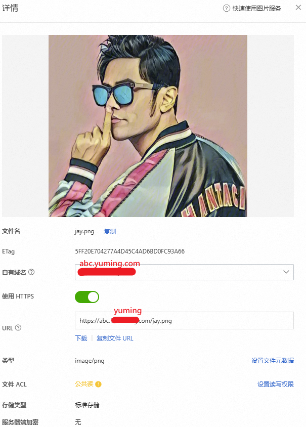

# 阿里云

## 购买域名

根据官网来操作，可以个人/企业方式购买，购买域名后还需要认证（可能之前没认证过需要验证）

## 云解析

将域名和云主机绑定，添加记录时，把 `@（主域名,如 baidu.com）` 和 `wwww（www前缀的域名，如www.baidu.com）` 都添加上。

## 购买免费证书

- 先购买免费证书（一年20个免费的）
- 创建证书
- 填写域名，并根据提示设置，自动Dns验证等
- 提交审核，注意这里点击下验证，是否成功，可以看到 需要填写 TXT 记录（注意这里有可能是CNAME记录），在我们的云解析里面看下是否有相关的一条 记录，没有就加上，我第一次操作的时候没自动加上，审核失败，然后第二次看这里自动多了条记录。如下图：


- **审核通过** 后出现了下载按钮，可根据选项下载


- **证书的更新** ：免费证书仅3个月的有效期，在将要过期前，我们可以再申请一个证书，替换将要过期的证书。

## 阿里云ECS配置Nginx

[ 如何下载并在服务器上安装SSL证书\_数字证书管理服务（原SSL证书）(SSL Certificate)-阿里云帮助中心 通过数字证书管理服务购买并签发SSL证书后，您需要将已签发的SSL证书安装至服务器，才能使SSL证书生效。本文介绍如何下载及安装SSL证书。 https://help.aliyun.com/zh/ssl-certificate/user-guide/installation-overview?spm=a2c4g.11186623.0.0.7e0a3359kkfStu](https://help.aliyun.com/zh/ssl-certificate/user-guide/installation-overview?spm=a2c4g.11186623.0.0.7e0a3359kkfStu " 如何下载并在服务器上安装SSL证书_数字证书管理服务（原SSL证书）(SSL Certificate)-阿里云帮助中心 通过数字证书管理服务购买并签发SSL证书后，您需要将已签发的SSL证书安装至服务器，才能使SSL证书生效。本文介绍如何下载及安装SSL证书。 https://help.aliyun.com/zh/ssl-certificate/user-guide/installation-overview?spm=a2c4g.11186623.0.0.7e0a3359kkfStu")

详细看文档，注意以下几点：

- 设置安全组，注意这里一定要选择地域，之前找不到这个地域在哪里，看半天才看到。



- 主机的防护墙可以关闭

## 出现有的浏览器能访问有的不能

**部署环境**

- Nginx 代理
- 阿里云ECS
- 阿里云上的域名
- 阿里云云解析
- 阿里云上申请的免费证书

**售后回复**

由于网站未备案导致，访问被拦截，详细内容：

网站托管在中国内地（大陆）的服务器上，您需根据所在省市的管局规则进行备案申请。当您使用阿里云中国内地（大陆）节点服务器时，您可以在PC端或移动端的阿里云ICP代备案系统中提交ICP备案申请，审核通过便可开通网站访问服务。
https://help.aliyun.com/document_detail/61819.html

**其他文章相关说明**

https://www.z01.com/help/tech/3441.shtml


## 云存储(OSS)


### 配置访问凭证


[官方文档](https://help.aliyun.com/zh/oss/developer-reference/configure-access-credentials?spm=5176.smartservice_service_create_ticket_step_2.0.0.31d077e2SPdvF6#5d6da9395f3tm)

官网中存在多种访问凭证，此处介绍两种：**使用AK**(开发调试时使用)和**使用ECSRAMRole**（部署到阿里云ECS上后使用）

#### 使用AK

> ⚠️ 警告 阿里云账号拥有资源的全部权限，AK一旦泄露，会给系统带来巨大风险，不建议使用。推荐使用最小化授权的RAM用户的AK。


如果您的应用程序部署运行在安全、稳定且不易受外部攻击的环境中，需要长期访问您的OSS，且不能频繁轮转凭证时，您可以使用阿里云主账号或RAM用户的AK（Access Key ID、Access Key Secret）初始化凭证提供者。需要注意的是，该方式需要您手动维护一个AK，存在安全性风险和维护复杂度增加的风险。如何获取AK，请参见[CreateAccessKey - 创建主账号或RAM用户访问密钥](https://help.aliyun.com/zh/ram/developer-reference/api-ims-2019-08-15-createaccesskey?spm=a2c4g.11186623.0.0.4de87787xx3cMl)。

**步骤:**

1. 创建用户：进入[RAM 访问控制](https://ram.console.aliyun.com/users)

2. 添加创建用户，填写登录名称，访问方式必须勾选 “OpenAPI调用访问”

3. 若勾选了“控制台访问”，会出现“设置密码”等多个选项（此处可不勾选）

4. 确定有弹出安全验证，要求输入手机验证码

5. 验证通过后，显示账号，记录ID和Sercret(后面将不会再显示)

6. 如果使用失败，给账户添加访问OSS的权限

**SDK使用示例：**

```c#
using Aliyun.OSS;
using Aliyun.OSS.Common;
using Aliyun.OSS.Common.Authentication;

// 从环境变量中获取访问凭证。运行本代码示例之前，请确保已设置环境变量ALIBABA_CLOUD_ACCESS_KEY_ID和ALIBABA_CLOUD_ACCESS_KEY_SECRET。
var accessKeyId = Environment.GetEnvironmentVariable("ALIBABA_CLOUD_ACCESS_KEY_ID");
var accessKeySecret = Environment.GetEnvironmentVariable("ALIBABA_CLOUD_ACCESS_KEY_SECRET");

var credentialsProvider = new DefaultCredentialsProvider(new DefaultCredentials(accessKeyId, accessKeySecret, ""));

//  填写Bucket所在地域对应的Endpoint。以华东1（杭州）为例，Endpoint填写为https://oss-cn-hangzhou.aliyuncs.com。
const string endpoint = "https://oss-cn-hangzhou.aliyuncs.com";

// 填写Bucket所在地域对应的Region。以华东1（杭州）为例，Region填写为cn-hangzhou。
const string region = "cn-hangzhou";

var conf = new ClientConfiguration();

var client = new OssClient(endpoint, credentialsProvider, conf);
client.SetRegion(region);
```

#### 使用使用ECSRAMRole

如果您的应用程序运行在ECS实例、ECI实例、容器服务Kubernetes版的Worker节点中，建议您使用ECSRAMRole初始化凭证提供者。该方式底层实现是STS Token。ECSRAMRole允许您将一个角色关联到ECS实例、ECI实例或容器服务 Kubernetes 版的Worker节点，实现在实例内部自动刷新STS Token。该方式无需您提供一个AK或STS Token，消除了手动维护AK或STS Token的风险。如何获取ECSRAMRole，请参见CreateRole - 创建角色。


**创建角色步骤:**


1. 创建角色，打开[RAM 访问控制-角色](https://ram.console.aliyun.com/roles)

2. 点击“创建角色”，选择“阿里云服务”，下一步

3. 选择“普通服务角色”，填写角色名称、备注（可选）、选择受信服务为：“云服务器”，点击完成

4. 在角色列表，点击新增的角色名称，在授权管理中，点击新增授权，添加“AliyunOSSFullAccess”和“	
AliyunECSFullAccess”的授权，创建角色完成。


**授予实例RAM角色给ECS实例：**

1. 登录[ECS管理控制台](https://ecs.console.aliyun.com/?spm=a2c4g.11186623.0.0.50b674b2edu4Ke)。

2. 在左侧导航栏，选择实例与镜像 > 实例。

3. 在页面左侧顶部，选择目标资源所在的资源组和地域。地域

    

4. 找到要操作的ECS实例，选择图标 > 实例设置 > 授予/收回RAM角色。

    

5. 在对话框中，选择创建好的实例RAM角色，单击确定。

    


**SDK 使用示例**

```c#

using Aliyun.OSS;
using Aliyun.OSS.Common;
using Aliyun.OSS.Common.Authentication;

class CredentialsProviderWrapper : ICredentialsProvider
{
    private Aliyun.Credentials.Client client;
    public CredentialsProviderWrapper(Aliyun.Credentials.Client client)
    {
        this.client = client;
    }

    public ICredentials GetCredentials()
    {
        var accessKeyId = client.GetAccessKeyId();
        var accessKeySecret = client.GetAccessKeySecret();
        var token = client.GetSecurityToken();
        return new DefaultCredentials(accessKeyId, accessKeySecret, token);
    }

    public void SetCredentials(ICredentials creds)
    {
    }
};

var config = new Aliyun.Credentials.Models.Config()
{
    Type = "ecs_ram_role",
    // 选填，该ECS角色的角色名称，不填会自动获取，但是建议加上以减少请求次数
    RoleName = "<RoleName>"     
};
var credentialsClient = new Aliyun.Credentials.Client(config);

var credentialsProvider = new CredentialsProviderWrapper(credentialsClient);

//  填写Bucket所在地域对应的Endpoint。以华东1（杭州）为例，Endpoint填写为https://oss-cn-hangzhou.aliyuncs.com。
const string endpoint = "https://oss-cn-hangzhou.aliyuncs.com";

// 填写Bucket所在地域对应的Region。以华东1（杭州）为例，Region填写为cn-hangzhou。
const string region = "cn-hangzhou";

var conf = new ClientConfiguration();

var client = new OssClient(endpoint, credentialsProvider, conf);
client.SetRegion(region);
```


总参考：[通过ECS实例RAM角色授权ECS访问其他云资源](https://help.aliyun.com/zh/ecs/user-guide/attach-an-instance-ram-role-to-an-ecs-instance#f70b99c15efar)


### OSS绑定自定义域名

> 绑定自己的域名

https://oss.console.aliyun.com/bucket/oss-cn-chengdu/tzj-tsim/configuration/domain

默认域名仅能下载，无法预览，也就是是无法在线查看图片，播放视频（原因是默认的链接头部强制性的定义了触发下载操作）。通过绑定自定义域名来实现预览图片或者播放视频。


#### 创建域名并绑定

1. 说明域名必须备案，一个域名只能绑定一个 Bucket，假设为 名为 “mybucket” 的Bucket绑定域名
2. 如果使用了阿里云的 ECS 云服务器，那么可以使用 ECS 云服务器的域名，来解析一个二级域名，比如当前注册的域名为 yuming.com,目前可以通过 `yuming.com` 或者 `www.yuming.com` 访问 ECS 云服务器上部署的网站，同时可以添加解析 `abc.yuming.com` 来绑定 oss 的 bucket.
3. 在域名控制台添加解析，这里选择 `CNAME`，并添加一个二级域名 `abc`（这步优先在OSS绑定域名）

    

4. OSS 绑定域名 `abc.yuming.com`，注意不是绑定 `yuming.com`（现在域名控制台添加解析后，再操作这步）

   


5. 为资源设定 自有域名，然后通过URL地址可预览，注意只有在公共读的权限下才可以使用这个地址预览，否则要使用签名

    

6. 关于签名获取地址，通过 [官网文档](https://help.aliyun.com/zh/oss/developer-reference/ddd-signatures-to-urls?spm=a2c4g.11186623.0.0.15c93bb91D6GFD#section-4lx-3kk-upk) 获取各语言的接口

#### 设置Https证书


> 现在的网站都是需要 `https`  来访问，如果不配置，将无法获取到资源，并提示： `net::ERR_CERT_COMMON_NAME_INVALID`

1. 现在[证书管理页面](https://yundun.console.aliyun.com/?spm=5176.8466032.0.dapply_ssl.420c1450gvTGt4&p=cas&domain=abc.11training.com&from=OSS#/certExtend/free/cn-hangzhou),选择“个人测试证书”
2. 点击 “创建证书”，填写域名名称，这里填写 `OSS` 下 指定 `Bucket` 的域名，如：`abc.domain.com`，勾选“快捷签发”，选择所在地，选择你的服务所在的区域，提交审核，一般1分钟左右就通过了
3. 回到OSS的[域名管理页面](https://oss.console.aliyun.com/bucket/oss-cn-chengdu/tzj-tsim/configuration/domain)，点击“证书托管”，点击“证书名称”下拉框选择证书，选择当前创建的证书即可。
4. 注意证书有效期3个月，到期后，再来申请更新


### 设置防盗链（禁止使用链接下载）

**使用场景**

- 禁止未经授权的使用：保护图片、视频、音频等敏感或有版权的文件不被未经授权的网站下载或访问。

- 节省带宽和资源消耗：通过防止盗链，避免其他网站直接链接到自己的资源文件，减少了非法访问带来的带宽消耗和服务器资源压力。

- 付费内容保护：在提供付费内容的场景中，防盗链可以确保只有购买者才能访问和使用付费内容，防止非法传播和盗版。

- 合作伙伴授权访问：某些情况下，需要与合作伙伴网站共享资源或数据，通过防盗链可以限制只有特定合作伙伴可以访问和使用共享资源。


[aliyun-oss-防盗链](https://help.aliyun.com/zh/oss/user-guide/hotlink-protection/?spm=a2c4g.11186623.0.0.45a6415dGUVXSc)
