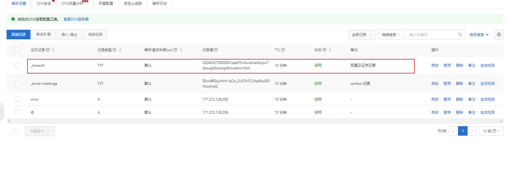

# 阿里云

## 购买域名

根据官网来操作，可以个人/企业方式购买，购买域名后还需要认证（可能之前没认证过需要验证）

## 云解析

将域名和云主机绑定，添加记录时，把 `@（主域名,如 baidu.com）` 和 `wwww（www前缀的域名，如www.baidu.com）` 都添加上。

## 购买免费证书

- 先购买免费证书（一年20个免费的）
- 创建证书
- 填写域名，并根据提示设置，自动Dns验证等
- 提交审核，注意这里点击下验证，是否成功，可以看到 需要填写 TXT 记录（注意这里有可能是CNAME记录），在我们的云解析里面看下是否有相关的一条 记录，没有就加上，我第一次操作的时候没自动加上，审核失败，然后第二次看这里自动多了条记录。如下图：

- **审核通过** 后出现了下载按钮，可根据选项下载

- **证书的更新** ：免费证书仅3个月的有效期，在将要过期前，我们可以再申请一个证书，替换将要过期的证书。

## 阿里云ECS配置Nginx

[ 如何下载并在服务器上安装SSL证书\_数字证书管理服务（原SSL证书）(SSL Certificate)-阿里云帮助中心 通过数字证书管理服务购买并签发SSL证书后，您需要将已签发的SSL证书安装至服务器，才能使SSL证书生效。本文介绍如何下载及安装SSL证书。 https://help.aliyun.com/zh/ssl-certificate/user-guide/installation-overview?spm=a2c4g.11186623.0.0.7e0a3359kkfStu](https://help.aliyun.com/zh/ssl-certificate/user-guide/installation-overview?spm=a2c4g.11186623.0.0.7e0a3359kkfStu " 如何下载并在服务器上安装SSL证书_数字证书管理服务（原SSL证书）(SSL Certificate)-阿里云帮助中心 通过数字证书管理服务购买并签发SSL证书后，您需要将已签发的SSL证书安装至服务器，才能使SSL证书生效。本文介绍如何下载及安装SSL证书。 https://help.aliyun.com/zh/ssl-certificate/user-guide/installation-overview?spm=a2c4g.11186623.0.0.7e0a3359kkfStu")

详细看文档，注意以下几点：

- 设置安全组，注意这里一定要选择地域，之前找不到这个地域在哪里，看半天才看到。

- 主机的防护墙可以关闭

## 出现有点浏览器能访问有的不能

**部署环境**

- Nginx 代理
- 阿里云ECS
- 阿里云上的域名
- 阿里云云解析
- 阿里云上申请的免费证书

**售后回复**

由于网站未备案导致，访问被拦截，详细内容：

网站托管在中国内地（大陆）的服务器上，您需根据所在省市的管局规则进行备案申请。当您使用阿里云中国内地（大陆）节点服务器时，您可以在PC端或移动端的阿里云ICP代备案系统中提交ICP备案申请，审核通过便可开通网站访问服务。
https://help.aliyun.com/document_detail/61819.html

**其他文章相关说明**

https://www.z01.com/help/tech/3441.shtml
